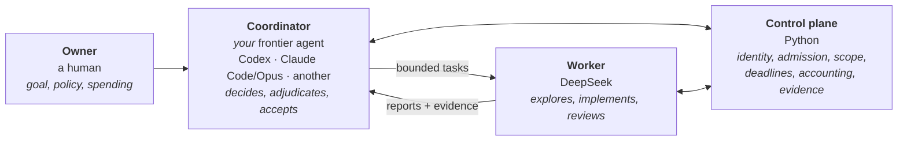

# Proofbound

**Keep engineering intent, accepted requirements, the change itself, its review and its evidence in
alignment — while an agent does the work.**

Proofbound carries a goal through proposed requirements, a fresh challenge to those requirements,
controlled implementation, independent review, deterministic checks and an inspectable handoff.
Python checks what is objectively checkable — identity, provenance, scope, lifecycle, accounting.
People and agents judge whether the change is any good.

It is a supervised workflow. It is not a correctness proof and not an autonomous developer.

- **[Concepts](docs/concepts.md)** — what the pieces mean and why
- **[Operator guide](docs/operator-guide.md)** — running a change, step by step
- **[Installation](docs/installation.md)** — the worker backend, credentials, recovery
- **[Coordinator protocol](docs/coordinator-protocol.md)** — the contract any frontier host satisfies
- **[Evaluation](evals/README.md)** — how claims here are measured

## The problem it addresses

Agentic coding is fast at producing diffs and poor at keeping a project coherent across many of
them. Four specific failures:

| Failure | What it looks like |
|---|---|
| **Drift** | The code no longer does what the accepted requirements say, and nothing notices |
| **Lost decisions** | A tradeoff was settled in week one; by week six nobody can find it, and it is silently re-decided |
| **Self-approval** | The agent that wrote the change also declares it good |
| **Unmeasured harness changes** | The tooling around the work changes, and whether that helped is never established |

Proofbound targets these. **It does not claim to have eliminated them.** What it does today is make
authority explicit, keep review structurally separate from production, refuse acceptance when
prerequisites are missing, and retain evidence you can re-check afterwards. Whether that yields
better software over months is an open question with an evidence gate, not a feature.

## The cost-aware architecture

**There is no default frontier orchestrator.** You choose it.



| Layer | Does | Selection |
|---|---|---|
| **Owner** | Goal, consequential policy, resource authorization | You |
| **Coordinator** | Decomposition, contracts, tradeoffs, adjudication, escalation, acceptance | **Your** frontier host. No product default |
| **Worker** | Repository discovery, proposed requirements, implementation, repair, fresh review | DeepSeek by default; a worker profile names another configuration, fixed per run |
| **Control plane** | Identity, admission, lifecycle, scope, deadlines, accounting, deterministic checks | Shared Python helpers |

**Why the coordinator need not redo the worker's investigation.** The worker explores the repository
in its own context and returns a bounded report plus mechanical evidence — gates, scope diffs,
contracts, accounting. The coordinator reads the *state surface* and the smallest evidence the
current decision needs, not the transcript. That is what keeps frontier consumption down.

**The economics are a measurement, not a promise.** Delegation can *increase* total tokens — more
DeepSeek tokens may be entirely worthwhile — so frontier tokens, worker tokens, total cost and
output quality are measured separately. No savings figure is claimed here, because none has been
measured. See [evaluation](evals/README.md).

## What works today

One bounded goal-to-change workflow: **goal → proposed requirements → fresh challenge → accepted
authority → admitted implementation → independent review → deterministic checks → sealed delivery.**

- Workers run on **macOS arm64** under a `sandbox-exec` boundary, using pinned **OpenCode 1.18.29**
  with **`deepseek/deepseek-v4-flash`, variant `high`** — the default **worker profile**. Since
  2026-09-10 the provider documents that it serves **V4.1 Flash** for that name. Live runs on
  2026-09-24 sent that request; each run records the requested id only, not which model answered.
- A run's worker configuration is fixed at `start` (`--worker-profile`) and recorded with a digest.
  A **local OpenAI-compatible** profile is optional: loopback-only, no credential, no assumed
  price. Its mechanics are tested offline; **no local model has been qualified**
  ([installation](docs/installation.md#optional-a-local-worker-profile)).
- The delivery is a retained directory: the patch, the authority, the evidence and a handoff record.
  `verify-delivery` applies it to a fresh checkout of the recorded baseline and reruns the checks.
- A fresh coordinator resumes any run with one `status` command.

This guided path is deliberately narrower than the underlying machinery. The artifact graph, ledger,
freeze/candidate identity and consistency acceptance support richer structures than the three-stage
path exposes; the broader architecture is described in
[docs/architecture/proofbound/](docs/architecture/proofbound/README.md).

## First use

Python **3.10+**, standard library only. Install the worker backend once
([details](docs/installation.md)):

```bash
python3 scripts/install_worker_backend.py     # pinned build, verified by hash, nothing global touched
~/.proofbound/executors/opencode-1.18.29-darwin-arm64/opencode auth login    # choose DeepSeek
python3 scripts/pb_workflow.py doctor         # readiness; makes no provider request
```

Then, with **either** coordinator — the commands are identical:

```bash
PB=/absolute/path/to/proofbound
PROJECT='/absolute/path/to/your project'      # clean Git worktree with an initial commit

python3 "$PB/scripts/pb_workflow.py" start --project "$PROJECT" --change CH-001 \
  --goal 'Describe the desired change and its public compatibility constraints.' \
  --check 'python3 -m unittest discover'

RUN="$PROJECT/DeepSeekAndDestroy/plans/CH-001/runs/first"
python3 "$PB/scripts/pb_workflow.py" status   --run "$RUN"      # the next permitted action
python3 "$PB/scripts/pb_workflow.py" continue --run "$RUN"      # mechanical steps + worker
```

`--change CH-001` is an identifier you choose; `first` is the run `start` creates under it, so the
run path is `<project>/DeepSeekAndDestroy/plans/<change>/runs/first`. Use `--goal-file <path>`
instead of `--goal` for a longer goal.

`start` preserves existing files, creates **unaccepted** requirements, and grants **zero** spending
authority. `continue` performs one derived step, or returns the judgment it needs from you.

<details>
<summary><b>Starting with Codex</b></summary>

> Use Proofbound at `/absolute/path/to/proofbound` on my project at `/absolute/path/to/project`.
> Read `CODEX.md` and `docs/coordinator-protocol.md`. You are the coordinator; DeepSeek workers do
> the routine technical work through `pb_workflow.py continue` — do not use multi-agent for that.
> Check readiness, start from my goal and compatibility constraints, and drive `status` / `continue`
> / `decide`. Propose and freshly challenge requirements before accepting authority. Adjudicate
> routine decisions within scope; escalate to me for goal or policy changes. Preserve evidence and
> return the delivery patch or a precise blocker. Do not spend beyond my explicit authorization.

</details>

<details>
<summary><b>Starting with Claude Code / Opus</b></summary>

> Use Proofbound at `/absolute/path/to/proofbound` on my project at `/absolute/path/to/project`.
> Read `CLAUDE.md` and `docs/coordinator-protocol.md`. You are the coordinator; DeepSeek workers do
> the routine technical work through `pb_workflow.py continue` — do not use subagents for that.
> Check readiness, start from my goal and compatibility constraints, and drive `status` / `continue`
> / `decide`. Propose and freshly challenge requirements before accepting authority. Adjudicate
> routine decisions within scope; escalate to me for goal or policy changes. Preserve evidence and
> return the delivery patch or a precise blocker. Do not spend beyond my explicit authorization.

</details>

<details>
<summary><b>Another agent host</b></summary>

Any host that can read files, run a command and follow a decision protocol can coordinate. It needs
no hooks, no native subagents and no proprietary memory. Give it the goal, the run root and
[docs/coordinator-protocol.md](docs/coordinator-protocol.md). **Not live-qualified** — see the
support matrix.

</details>

The [ordinary example](examples/csv-summary/README.md) is a reproducible project to try it on.

## What "proof" means here

Proofbound separates what a program can check from what only judgment can settle. Both appear in the
evidence, labelled, and neither is allowed to stand in for the other.

| Mechanically checked | Judged |
|---|---|
| Content identity, scope of changes, contract binding, admission, lifecycle, deadlines, accounting completeness, the project's own checks | Whether requirements capture the goal, whether a review is adequate, whether the change is good |

Three limits, stated once:

- **A content hash is not authenticated authorship.** It establishes that bytes did not change
  between two points, within a trust boundary that includes everyone who can write those records.
- **A fresh context is not proven independence.** A reviewer in a clean context has a different
  view; that is valuable and it is not a statistical claim.
- **A clean integrity gate is not a good change.** It means the permitted process occurred.

Deeper: [concepts](docs/concepts.md) ·
[core model](docs/architecture/proofbound/core-model.md) ·
[what a freeze does not prove](docs/architecture/proofbound/freeze-and-binding.md#a46-what-a-freeze-does-not-prove)

## Evaluation is part of the product

Different questions need different evidence, and conflating them is how tools come to be believed
without cause:

| Question | Answered by |
|---|---|
| Do the mechanisms hold? | Credential-free regressions in the canonical suite |
| Can real agents do this at all? | Recorded live runs, one observation per condition |
| Can this configuration do the job here? | `evals/pb_qualify.py`: a frozen plan through the production path — replayed with stand-ins, or live under explicit authorization |
| Is it better than the agent alone? | A matched direct-agent comparison, same coordinator both arms |
| Does it reduce frontier cost? | Frontier tokens, worker tokens and total cost, measured apart |
| Does architectural quality hold up? | Repeated changes to the same project over time |

Rules for reading any of it are in **[evals/README.md](evals/README.md)**.
Past runs are in [evidence](docs/architecture/proofbound/evidence/README.md) — including the ones
that found real defects.

## Support matrix

Separating what is implemented from what has been observed:

| | Implemented | Offline-tested | Live-observed |
|---|---|---|---|
| Goal-to-change workflow | yes | yes, credential-free stand-ins; a first-use recipe rehearsed through fresh-checkout verification | **once** (2026-09-24): the public CSV task under Claude Code/Opus. An accepted delivery was verified on a fresh checkout, but its first handoff needed manual intervention ([evidence](docs/architecture/proofbound/evidence/qualification-and-first-use-2026-09-24.md)) |
| DeepSeek worker path | yes | yes | yes: in `pb-handoff-2` (seeded authority), and in the 2026-09-24 qualification and first use |
| Codex as coordinator | yes | yes | **no** |
| Claude Code/Opus as coordinator | yes | yes | **once**: the 2026-09-24 qualification and first use, including two fresh headless handoff sessions ([evidence](docs/architecture/proofbound/evidence/qualification-and-first-use-2026-09-24.md)) |
| Another host as coordinator | protocol documented | **no** | **no** |
| Deadline enforcement + teardown | yes | yes, macOS only | **no**: no live attempt reached its deadline |
| Launch supervision after the caller exits, and `recover` | yes | yes, macOS: the real executor against a scripted endpoint, and a scripted-caller rehearsal ([evidence](docs/architecture/proofbound/evidence/launch-supervision-2026-09-24.md)) | **no**: repaired after the manually recovered first-use handoff |
| Evidence export / replay | yes | yes | yes, in `pb-handoff-2` |
| Local OpenAI-compatible worker profile | yes | yes, scripted endpoint through the real pinned executor and boundary | **no** |
| Configuration qualification and comparison | yes | yes, replay | **once per cell, DeepSeek only**: the tool loop (revision `2026-09-23`, carried forward by a request-equivalence bridge); both requirements challenges and the dispatch implementation (revision `2026-09-24`). The contradiction was **verification** of a finding the author stated, not independent discovery ([evidence](docs/architecture/proofbound/evidence/qualification-and-first-use-2026-09-24.md)). No comparison has been run |
| Attempt containment (request cap, incomplete responses, derived spend during an attempt) | yes | yes, real executor against a scripted endpoint | active in the 2026-09-24 live runs; **never triggered** |
| Frontier-cost comparison | protocol frozen | — | **no** |

"Offline-tested" means credential-free stand-ins exercised the mechanics. **A stand-in never
establishes agent quality.** Nothing here is yet *comparatively beneficial*: no comparison has
shown a configuration or the workflow to be better at acceptable effort.

## Direction

Goals with evidence gates, not a roadmap of features:

1. **Sustained architectural coherence** — does quality hold across a *second* change to the same
   agent-produced code? Gate: repeated fresh tasks in one project.
2. **Useful handoff** — can a different coordinator resume without loss? Gate: a controlled handoff
   that alters no accepted candidate, worker backend or remaining budget.
3. **Durable implementation provenance** — today, binding lives in the run tree and dies with it.
   Gate: an invariant that actually consumes a durable record.
4. **Demonstrated quality/effort improvement** — gate: matched comparisons with predeclared outcome
   checks, reporting the tradeoff rather than a composite score.

[Operator roadmap](docs/operator-roadmap.md) — staged capabilities, each with its evidence gate ·
[architecture](docs/architecture/proofbound/README.md)

## Contributing

[CONTRIBUTING.md](CONTRIBUTING.md) for the interpreter and canonical test command;
[AGENTS.md](AGENTS.md) for the policy every coding agent here follows.

Derived from DeepSeek-and-Destroy (MIT, © FrozenPepper); not affiliated with or endorsed by it.
