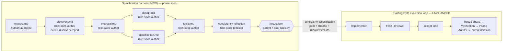
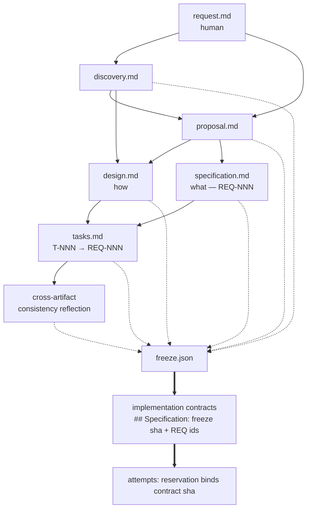

# RFC: Specification & Reflection Harness for DeepSeek and Destroy

- **Status:** Draft for review
- **Type:** Architecture RFC (evolutionary change to an existing harness)
- **Scope:** Adds a pre-implementation specification/reflection lifecycle in front of DSD's existing execution loop
- **Baseline:** `c292eb5` (fresh fork of `frozenpepper/deepseek-and-destroy`, `CHANGELOG.md` v15.5.5;
  the upstream commit SHA is unrecoverable — see the implementation plan §0 for the full provenance
  record, validation environment, and canonical test command)
- **Non-goal:** rewriting DSD, renaming the project, or building a general workflow engine

---

## 0. Project identity boundary

**Proofbound** is this project's public identity — *from engineering intent to verified
implementation*; *specify, challenge, execute, prove*. Proofbound is derived from
DeepSeek-and-Destroy (MIT, © FrozenPepper) but is **not affiliated with or endorsed by** that
project. The inherited MIT license and copyright notice are preserved unchanged in `LICENSE`.

The identity boundary is deliberate and load-bearing:

- **Proofbound** names the project and new project-facing material: the repository, contributor
  documentation, architecture documents when they discuss *this* system rather than inherited
  implementation, and any genuinely new Proofbound-specific concept.
- **DeepSeek-and-Destroy-derived internal identifiers remain compatibility-sensitive
  implementation details until an explicit migration milestone.** That includes the
  `DeepSeekAndDestroy/` workspace root, `dsd_*.py` helpers and their CLI surface, persisted
  workspace paths, protocol and manifest format strings, snapshot formats, state keys,
  environment variables, adapters, and existing role names.

These are **wire and protocol identifiers**, not branding. Renaming them changes durable
artifacts that installed projects and historical runs depend on, so it requires its own
milestone with its own migration evidence — never a cosmetic pass bundled into feature work.

---

## 1. Executive summary

DeepSeek and Destroy (DSD) is a **mature execution harness**. It already solves, with deterministic
mechanisms and tests, most of what a "reflection harness" needs: immutable task contracts, per-attempt
immutable authority + hash binding, terminal lifecycle proof, content-based scope observation, hard
write restrictions, fresh-independent-reviewer provenance enforced in Python, role specialization with
mechanical read-only capability, evidence gating that refuses to interpret prose, durable orchestration
state with a single `next_action`, and checkpoint/resume across context loss.

What DSD does **not** have is any notion of *the plan being wrong*. Its authority is an externally
supplied plan (`state.plan_reference`, contract `## Authority`). Everything downstream is machinery for
executing that plan correctly. The failure mode this RFC targets is **correctly implementing a bad
plan**.

The central architectural claim of this RFC is:

> **The specification lifecycle is not a new kind of process. It is DSD's existing
> writer → fresh-independent-reviewer → fix → re-review → accept loop, applied to
> documents instead of code.**

Therefore the recommended design is *not* a parallel subsystem. It is:

1. **Spec artifacts are ordinary project files** in a configurable `specs/<change-id>/` tree, so DSD's
   already-tested scope observation, `Allowed source changes` hard boundaries, and
   `_assert_fresh_reviewer` provenance apply to them **without modification**.
2. **Two new roles only** — `spec-author` (project writer) and `spec-reflector` (project read-only) —
   registered in the existing `scripts/_roles.py` registry, which automatically grants them correct
   write capability, read-only scope enforcement, prompt rendering, and gate support.
3. **The specification stage is a derived function, not stored routing state.** DSD deliberately forbids
   routing counters and barrier state machines in `state.json`
   (`WORKSPACE.md` "Minimal state"; `tests/test_v15_5_adversarial.py::test_new_phase_state_does_not_create_barrier_machine`).
   The lifecycle stage is computed from the change ledger's accepted artifact revisions and their
   dependency hashes. Staleness — the thing that routes a failure back upstream — falls out of hash
   mismatch, exactly like DSD's existing "later mutation invalidates phase evidence" rule.
4. **Spec freeze is a hash manifest, and binding is free.** An implementation contract embeds the freeze
   file's path *and* SHA-256 in its own text. Because the contract is itself hash-frozen into every
   attempt's `launch-reservation.json` and verified by `evidence_gate.py`, "which spec revision was this
   task implemented and reviewed against" becomes a mechanical fact with no new protocol.

Net new deterministic code is small and localized: one parent-only helper (`dsd_spec.py`), one
deterministic evidence collector (`evidence_bundle.py`), two role skills, one generalization of the
fresh-review predicate, one contract field, and one runtime-routing seam. Everything else is reuse.

Three concrete blockers found in the code must be handled **before** any of this (see §17, §19):

- **Adding roles breaks existing worker-rules snapshots.** `scripts/_rules_snapshot.py:29` computes
  `protocol_fingerprint()` from the *current* module's `PROTOCOL_NAMES`, so any pre-existing immutable
  revision fails `verify_snapshot()` with "worker protocol snapshot is incomplete" the moment a role is
  added. This breaks in-flight runs on upgrade.
- **There is no headroom in the hot documentation budget.** `SKILL.md` is exactly 7500 bytes against a
  7500-byte test cap; `OPENCODE.md` is 16 bytes under its cap, `WORKSPACE.md` 6, `worker/COMMON.md` 21
  (`tests/test_v15_4_consolidation.py::test_hot_instruction_surfaces_stay_small_and_role_local`). New
  doctrine must be a cold file, and even a one-line pointer in `SKILL.md` requires deleting text.
- **The test suite is not runnable on one interpreter, and its fixtures block role addition.** Of 82
  tests, 75 pass on the system Python 3.9; the remaining 7 never run because
  `tests/test_v15_4_lifecycle_regressions.py` omits `from __future__ import annotations` while using
  `Path | None` in a signature. There is no CI config, no packaging, and no lint/format/type
  configuration. Separately — measured, not estimated — adding two roles causes **17 failures across
  three test modules**, because those modules hard-code `PROTOCOL_NAMES` in their worker-rules fixtures.
  Deriving that tuple from `scripts/_rules_snapshot.py` in the fixtures reduces the failures to one
  error-message assertion.

---

## 2. Current DSD architecture relevant to this change

### 2.1 The three-layer trust model

```text
premium parent   authority, decomposition, role choice, acceptance, phase judgment
      │
cheap workers    repository-scale discovery/implementation/repair/review/verification/audit
      │
Python helpers   objective facts ONLY — hashes, lifecycle, source movement, explicit restrictions
```

`SKILL.md` states it directly: *"Python: objective facts only… Never infer engineering meaning from
prose."* This boundary is enforced by tests
(`test_v15_3_semantic_boundary.py::test_integrity_gate_does_not_adjudicate_worker_prose`,
`test_v15_4_consolidation.py::test_executable_semantic_parser_surface_is_absent`, which asserts that
retired prose-parsing modules stay deleted).

### 2.2 The attempt lifecycle (the load-bearing mechanism)

Every unit of worker work is one immutable, self-contained *attempt* directory:

```text
phases/<phase>/tasks/<task>/attempts/<role>-<n>/
  launch-reservation.json   immutable attempt authority (created O_EXCL before any worker starts)
  launch-prompt.txt         hash-bound tiny handoff
  scope-baseline.json       pre-work content baseline of the project worktree
  report.md                 pre-created byte-distinct placeholder, replaced by the worker
  worker.log
  attempt.json              running child facts
  terminal.json             real process end + terminal-bound report hash + frozen scope diff
  scope-diff.json           immutable, hash-bound into terminal.json
  evidence-gate.json        objective integrity result (created O_EXCL — immutable)
  supersession.json         exceptional terminal-less supersession boundary only
```

`scripts/run_worker.py:reserve_attempt()` creates the reservation with `O_EXCL` and refuses reuse.
`child_run()` binds the report bytes and freezes the scope diff **at the moment the process exits**
(`bind_report_at_terminal`, `freeze_scope_at_terminal`), so later worktree movement cannot retroactively
change an attempt's integrity result (`test_v15_integrity.py::test_terminal_bound_scope_is_stable_across_regate_and_hash_protected`).

### 2.3 The integrity gate

`scripts/evidence_gate.py` proves *only*: terminal lifecycle completed with exit 0; reservation binds
the exact prompt/contract/rules/baseline hashes; the worker-rules snapshot manifest still verifies; the
terminal-bound report still hashes correctly and is not the launcher skeleton; and the frozen scope diff
respects role capability and any explicit `## Allowed source changes` restriction. Its output states the
doctrine plainly: `integrity_ok` + `ready_for_interpretation` means **safe to interpret**, never PASS.

### 2.4 Role registry and mechanical capability

`scripts/_roles.py` is a 20-line single source of truth:

```python
ROLE_SKILLS = {"implementer": ..., "fixer": ..., "reviewer": ..., "verification": ...,
               "discovery": ..., "phase-surveyor": ..., "recovery": ...,
               "phase-auditor": ..., "evidence-clerk": ...}
ALWAYS_PROJECT_WRITER_ROLES  = {"implementer", "fixer"}
CONDITIONALLY_WRITING_ROLES  = {"verification"}
ALWAYS_READ_ONLY_ROLES       = ROLE_NAMES - writers - conditional     # computed complement
```

Everything else derives from it: `_contract.role_writes_project()`, the reservation's `writes_project`
flag, the gate's `READONLY-SCOPE-MOVED` hard failure, `--role` CLI choices in three scripts, the prompt
renderer's role-skill path, and the worker-rules protocol snapshot contents. **This registry is the
single cleanest extension point in the repository.**

### 2.5 Fresh independent review, enforced in Python

`scripts/dsd_state.py:accept_task()` does not trust the parent's judgment about provenance. It:

- re-verifies the source gate is clean and bound to `task.current_contract`;
- scans **cold attempt evidence** (`attempts/*/launch-reservation.json`) rather than hot state, keeping
  only attempts whose reservation binds the *current* contract revision hash;
- if any such attempt objectively moved project state, calls `_assert_fresh_reviewer()`, which requires
  the accepted gate's role to be `reviewer` and requires that Reviewer's `reserved_at` to be **after**
  every mutating attempt's terminal/supersession boundary.

Adversarial tests cover stale reviewers, tampered terminal scope, superseded writers, and revision
rollover (`test_v15_5_adversarial.py`).

### 2.6 Contracts and worker rules

`render_task_contract.py` turns one compact JSON spec into an immutable Markdown contract with a
`Contract revision: rNNNN` line, auto-assigned `AC-NNN` ids, and an optional `## Allowed source changes`
hard boundary. It has a strict field whitelist (`FIELDS`) and explicitly rejects retired Clerk-recursion
fields. `prepare_worker_rules.py` freezes run facts plus the entire worker protocol (COMMON, proof
patterns, all role skills) into `worker-rules/rNNNN/` with a cryptographic `MANIFEST.json`; the build is
staged in a `.tmp` sibling and atomically renamed so an interrupted copy cannot produce a
seemingly-valid partial revision.

### 2.7 Transport abstraction that already exists

Two transports finalize the *same* lifecycle:

- `run_worker.py` — external OpenCode CLI, detached monitor, `terminal.json` on process exit.
- `native_worker_attempt.py` — `reserve` before a harness-native subagent call, `finalize` after it
  returns; reuses `reserve_attempt`, `bind_report_at_terminal`, `freeze_scope_at_terminal` verbatim.

This is the provider-abstraction seam (§15). It already works; it is simply not reachable from the
high-level `dsd_attempt.py launch`, which hard-fails on any harness but OpenCode
(`dsd_attempt.py:opencode_runtime`).

### 2.8 State, waiting, and recovery

`state.json` holds execution status, exactly one `next_action`, worker-rules/runtime binding,
`orchestrator_wait`, `context_checkpoint`, and per-task `{current_contract, current_attempt,
last_attempt, accepted}`. `check_state.py` validates bindings, hashes, lifecycle consistency, and a
**turn-exit invariant** (never yield without a live worker, an active wait, or an active compaction).
Waiting is quiescent: `wait_worker.py` polls the filesystem in a cheap subprocess; timeout is
deliberately a non-event; `claude_worker_rewake.py` uses a `PostToolUse:Bash` async-rewake hook so an
idle parent is woken by `terminal.json` without model-level polling.

---

## 3. Existing invariants that must be preserved

These are load-bearing. Any proposal that violates one is wrong until proven otherwise.

| # | Invariant | Where it lives |
|---|---|---|
| I1 | Python proves only objective facts; it never adjudicates prose or assigns PASS/FAIL | `evidence_gate.py` docstring; `test_v15_3_semantic_boundary.py` |
| I2 | A clean gate means "safe to interpret", never "the engineering passed" | `SKILL.md`, `WORKSPACE.md`, `README.md` |
| I3 | One attempt = one immutable reservation; reservations/prompts/contracts/rules/gates never mutate after creation | `run_worker.py:reserve_attempt`, `evidence_gate.py` `open("x")` |
| I4 | Project mutation requires **fresh independent review provenance** before acceptance | `dsd_state.py:_assert_fresh_reviewer` |
| I5 | Read-only roles that move project state fail integrity, mechanically | `evidence_gate.py` `READONLY-SCOPE-MOVED` |
| I6 | `Allowed source changes`, when present, is a hard mechanical boundary; `NONE` means no writes | `_contract.py`, `evidence_gate.py` `WRITE-RESTRICTION` |
| I7 | Worker context = run facts + COMMON + exactly one role + one contract (+ proof patterns only if named) | `render_worker_prompt.py` |
| I8 | Worker reports are natural language; no machine grammar is required for acceptance | `README.md`, `PROMPTS.md`, `COMMON.md` |
| I9 | State stores facts, not routing heuristics, counters, or barrier machines | `WORKSPACE.md`; `test_v15_5_adversarial.py::test_new_phase_state_does_not_create_barrier_machine` |
| I10 | Exactly one `next_action`; resume reads live state first and never reconstructs the run | `SKILL.md`, `COMPACTION.md`, `check_state.py` |
| I11 | Waiting is quiescent; a timeout without terminal evidence is a non-event; no model-visible polling | `SKILL.md`, `wait_worker.py`, `claude_worker_rewake.py` |
| I12 | Scope-observed mutation is exclusive per checkout; writer + read-only concurrency needs worktrees | `WORKSPACE.md` |
| I13 | Phase evidence is frozen; any later mutation makes it stale and demands fresh verification + audit | `SKILL.md`, `WORKSPACE.md` |
| I14 | Hot doctrine surfaces stay small; detail is cold-loaded on demand | `test_v15_4_consolidation.py` byte caps |
| I15 | The Evidence Clerk is always project-read-only, never recursive, and cannot waive integrity failures | `_contract.py`, `dsd_attempt.py:interpret` |

---

## 4. Problem statement / gaps

DSD's authority chain begins with a plan it did not produce and does not question.

**G1 — No upstream reasoning artifact.** `state.plan_reference` and contract `## Authority` point at a
document. Nothing produces, critiques, or freezes that document. Decomposition quality is entirely the
premium parent's hot-context judgment, which is exactly the resource DSD is designed to conserve.

**G2 — Review is post-hoc only.** Every review role in the registry reviews *outcomes*: `reviewer`
(code vs contract), `verification` (one predicate), `phase-auditor` (frozen phase vs authority),
`recovery` (suspect changes). None reviews *intent* before work starts.

**G3 — Traceability stops at the contract.** A contract cites authority paths as free-form strings
(`render_task_contract.py:existing_paths` only checks existence). There is no requirement identity, no
requirement→task mapping, and no way to ask "is every accepted requirement implemented and reviewed?".

**G4 — Independence is doctrinal for documents, mechanical only for code.** `_assert_fresh_reviewer`
triggers on *project scope movement*. A read-only worker producing a document in the run tree moves no
project scope, so `accept_task` would happily accept the author's own report as its own evidence. The
independence property the reflection harness needs is not currently enforceable for run-tree artifacts.

**G5 — No human gate model.** DSD has a `human-blocked` terminal status and a `DECISION_REQUIRED`
escalation convention, but no way to declare in advance that a *class* of change requires human sign-off
before autonomous execution.

**G6 — Role and model are fused.** `state.worker_runtime.model` is per-run, not per-role
(`dsd_attempt.py:opencode_runtime`). A reflector cannot be routed to a different provider than the
implementer it is checking — losing the cheapest available form of reviewer independence.

**G7 — Deterministic evidence is not packaged.** `## Verification` commands are prose instructions to a
worker. Their exit codes and outputs are never captured as an immutable, hash-bound artifact that a
reviewer can be handed instead of trusting the implementer's account of them.

---

## 5. Proposed target architecture

### 5.1 Guiding decisions

- **D1 — Spec artifacts are project files, not run-tree files.** They live under a configurable
  `spec_root` (default `specs/<change-id>/`) inside the project worktree. This is the single most
  leveraged decision in this RFC: it makes spec authoring a *project mutation*, which means
  `scope_snapshot` observes it, `## Allowed source changes` confines it, `READONLY-SCOPE-MOVED` protects
  against reflectors editing what they review, and `_assert_fresh_reviewer` (I4) enforces independence —
  all with **existing, adversarially-tested code**. The alternative (run-tree artifacts) would require a
  second scope observer, because `evidence_gate.py:385` hard-codes
  `exclusions != ["DeepSeekAndDestroy"]` and the DSD tree is invisible to scope observation by design.
- **D2 — Two new roles, not nine.** `spec-author` and `spec-reflector`. Stage-specific behavior comes
  from the contract, exactly as DSD already does for `verification` and `discovery`.
- **D3 — No new state enum.** Stage is derived (§7). This preserves I9 and makes desynchronization
  structurally impossible.
- **D4 — Freeze is a hash manifest; binding is via contract text.** No new verification protocol (§10).
- **D5 — New doctrine is cold.** A new `SPEC-HARNESS.md` (cold-load) plus two role skills. `SKILL.md`
  gains at most one sentence, and only by trading bytes (I14).

### 5.2 Component map

```text
scripts/
  _roles.py                 (+) spec-author, spec-reflector; (+) INDEPENDENT_REVIEW_ROLES
  _contract.py              (+) spec_binding(text) -> {path, sha256, requirements}
  _rules_snapshot.py        (~) verify against the RECORDED manifest's protocol key set
  dsd_state.py              (~) _assert_fresh_reviewer accepts INDEPENDENT_REVIEW_ROLES
  render_task_contract.py   (+) spec_freeze / requirements fields -> "## Specification" section
  evidence_gate.py          (+) SPEC-BINDING-DRIFT objective check
  dsd_attempt.py            (~) resolve_runtime(state, role) dispatch (opencode | native)
  dsd_spec.py               (NEW) parent-only change ledger: init / record / freeze / approve / status
  evidence_bundle.py        (NEW) deterministic evidence collector -> immutable JSON artifact
worker/roles/
  dsd-spec-author/SKILL.md    (NEW)
  dsd-spec-reflector/SKILL.md (NEW)
SPEC-HARNESS.md               (NEW, cold) parent doctrine for the specification phase
docs/architecture/            (NEW) this RFC and successors
```

`(~)` marks a modification to an existing file; every one is a narrow, named seam chosen to minimize
upstream merge surface (§21).

### 5.3 Where the spec phase sits



Each artifact box is one ordinary DSD task with the ordinary attempt lifecycle. Each arrow into a
reflection is one `spec-reflector` attempt. Nothing about the right-hand side changes.

---

## 6. End-to-end workflow

```mermaid
sequenceDiagram
  autonumber
  participant P as Premium parent
  participant W as spec-author (writer)
  participant R as spec-reflector (read-only, different provider)
  participant Py as Python (dsd_spec / gate / state)

  P->>Py: dsd_spec.py init --change CH-001 (writes request.md scaffold + ledger)
  P->>W: task spec/CH-001/proposal, write_paths=[specs/CH-001/proposal.md]
  W-->>Py: attempt terminal + frozen scope diff (only proposal.md moved)
  P->>Py: dsd_attempt.py gate            (objective integrity only)
  P->>R: task spec/CH-001/proposal, role=spec-reflector, --input <author report>
  R-->>Py: findings report (read-only; any project movement = integrity failure)
  P->>Py: gate --surface                 (bounded prefix at a decision boundary)
  alt blocking findings
    P->>W: new contract revision (findings as exact input); resume same session
    Note over P,R: loop; round count is derivable from attempts/, never stored as a counter
  else clean
    P->>Py: dsd_state.py accept-task --evidence-gate <reflector gate>
    Note right of Py: I4 fires: author mutated specs/** → independent review required
    P->>Py: dsd_spec.py record --artifact proposal --gate <reflector gate>
  end
  Note over P,Py: repeat for design → specification → tasks (each reviewed against FROZEN upstream)
  P->>Py: dsd_spec.py freeze --change CH-001
  Note right of Py: refuses if any artifact stale, any human gate pending, or any hash drifted
  P->>P: generate implementation contracts from tasks.md, each binding freeze.json + requirement ids
```

**Sequential batch generation with progressive freeze** (the one idea worth importing wholesale from the
reference article): artifacts are produced and reflected **one at a time in dependency order**, and each
is frozen before the next is authored. This prevents the cascading-fix failure where resolving a finding
in the design invalidates an already-agreed proposal. DSD gives this for free — each artifact is a
separate task with a separate contract, and `write_paths` mechanically prevents a later task from
touching an earlier artifact.

### 6.1 Discovery reuse

Repository discovery is **not new work**. `discovery` and `phase-surveyor` already exist and produce
exactly the "current-state analysis" the lifecycle wants. The only change is that the discovery task's
output is promoted into `specs/<id>/discovery.md` (a project file) instead of remaining a run-tree
report, so downstream reflectors can be handed a stable path. That requires the `discovery` role to be
able to write one file — handled by giving that specific task `write_paths: ["specs/CH-001/discovery.md"]`
and adding `discovery` to `CONDITIONALLY_WRITING_ROLES`, *or* (preferred, zero registry churn) by having
`spec-author` transcribe the discovery report under review. **Recommendation: the latter** — it avoids
widening a read-only role's capability, and the transcription is itself reviewable.

---

## 7. State-machine design

### 7.1 Why not a stored enum

The candidate `NEW → DISCOVERING → … → COMPLETE` enum is a reasonable sketch, but storing it in
`state.json` would:

- violate I9 (`WORKSPACE.md`: *"State records facts, not routing heuristics… Do not store regex verdicts,
  routing counters, dependency prose"*), which is guarded by an explicit adversarial test;
- duplicate information already implied by task statuses and accepted-artifact hashes, creating a
  desynchronization surface after crash, compaction, or manual recovery — precisely the class of bug
  DSD's "read live state first" resume discipline (I10) exists to eliminate;
- add a second routing authority alongside `next_action`, whose singularity is a stated invariant.

### 7.2 Derived stage

Stage is a **pure function** over the change ledger and task statuses, exposed by
`dsd_spec.py status --change CH-001`:

```python
# Topological order over the DAG of §8.4; siblings may be authored in either order.
ORDER = ["discovery", "proposal", "specification", "design", "tasks", "consistency"]

def stage(ledger, tasks):
    for name in ORDER:
        entry = ledger["artifacts"].get(name)
        if entry is None:               return f"{name}:absent"        # author it
        if entry["status"] == "stale":  return f"{name}:stale"         # re-author from findings
        if entry["status"] != "accepted":return f"{name}:in-review"    # reflect / fix / re-reflect
    if ledger.get("pending_gates"):     return "awaiting-human-gate"
    if ledger.get("freeze") is None:    return "ready-to-freeze"
    return "frozen"
```

Staleness is **typed and carries its reason** (see §8.4). An artifact is `needs-revalidation` iff any
artifact in its `depends_on` map now has an accepted SHA-256 different from the one recorded there; it is
`invalid` iff its own file hash no longer matches its recorded accepted hash. This is the same staleness
rule DSD already applies to phase evidence (I13), expressed over documents — and it is content-based, so
a re-author that produces byte-identical content correctly does **not** invalidate a prior reflection
(verified against `scope_snapshot`'s content-based diff, §25).

```mermaid
stateDiagram-v2
    direction LR
    [*] --> discovery_absent
    discovery_absent --> discovery_review: spec-author attempt
    discovery_review --> discovery_accepted: reflector clean + accept-task
    discovery_review --> discovery_review: findings → new contract revision
    discovery_accepted --> proposal_absent
    proposal_absent --> proposal_review
    proposal_review --> proposal_accepted
    proposal_accepted --> design_absent
    design_absent --> design_review
    design_review --> design_accepted
    design_accepted --> specification_absent
    specification_absent --> specification_review
    specification_accepted --> tasks_absent
    specification_review --> specification_accepted
    tasks_absent --> tasks_review
    tasks_review --> tasks_accepted
    tasks_accepted --> ready_to_freeze
    ready_to_freeze --> awaiting_human_gate: policy match, no approval recorded
    awaiting_human_gate --> ready_to_freeze: dsd_spec.py approve
    ready_to_freeze --> frozen: dsd_spec.py freeze
    frozen --> [*]: hand off to existing DSD execution loop

    design_review --> proposal_accepted: finding invalidates the proposal (re-open upstream)
    specification_review --> design_accepted: finding invalidates the design
    frozen --> specification_absent: post-freeze discovery → amendment (§10.4)
```



### 7.3 Failure routing

Failure routes upstream **by construction, not by a routing table**. A reflector finding that a design
contradicts the accepted proposal is resolved by the parent binding a **new contract revision on the
proposal task**. Accepting a new `proposal.md` changes its SHA-256; every downstream artifact whose
`depends_on.proposal` no longer matches becomes `stale`; `stage()` returns `design:stale`; `freeze`
refuses. No enum transition is written anywhere.

This is strictly better than a stored transition table: the enum could be wrong, the hash cannot.

### 7.4 Recoverability

A fresh parent after compaction or crash reads live `state.json` (unchanged discipline), then runs
`dsd_spec.py status`, which reads only the ledger and re-hashes the accepted artifact files. No
conversation history, no reconstruction. If a spec file was hand-edited outside the harness, its hash no
longer matches the ledger and `status` reports `tampered`, which is a finding, not a silent resume.

---

## 8. Artifact model

### 8.1 Split: Markdown for reasoning, JSON for bindings

**Markdown, in the project tree** — everything a human or a downstream worker must *read*:

```text
specs/<change-id>/
  request.md          intent as stated (human-authored; the only artifact with no reflection)
  discovery.md        measured current state, with fact/inference/unknown separation
  proposal.md         problem, scope, non-goals, options considered, recommendation
  design.md           architecture, boundaries, failure semantics, migration, Classification (§14)
  specification.md    numbered requirements REQ-NNN with testable acceptance criteria
  tasks.md            ordered task units with dependencies, allowed paths, evidence needs
```

One canonical filename per artifact. Revision history is git plus the ledger's hash chain — *not*
`proposal/r0002.md`. Rationale: implementers and reviewers must have exactly one obvious path to read
(I7 context economy), and DSD's immutability requirement is already satisfied by (a) each attempt's
report being immutable and hash-bound, and (b) the ledger recording every accepted revision's hash.

**JSON, in the run tree** — everything that must be *bound and verified*:

The **manifest is a committed project artifact**, not run evidence. `WORKSPACE.md` states that run
files are "orchestration evidence, not project source", and the skill's own `.gitignore` excludes
`DeepSeekAndDestroy/`. If the manifest lived only in the run tree, a checkout could not establish what
was accepted. It therefore lives beside the artifacts it describes and references run evidence by path +
hash rather than copying it (§25, Objective B).

```jsonc
// specs/<change-id>/manifest.json  — COMMITTED; written ONLY by dsd_spec.py, never by a worker,
//                                    and never while any attempt is live (see §8.5)
{
  "format": "dsd-change-manifest-v1",
  "change_id": "CH-001",
  "spec_root": "specs/CH-001",
  "artifacts": {
    "proposal": {
      "revision": 2,
      "path": "specs/CH-001/proposal.md",          // project-relative
      "sha256": "…",
      "status": "accepted",                         // accepted | stale | tampered
      "depends_on": {"discovery": "<sha256>"},      // hashes at time of acceptance
      "authored_by": {                              // provenance = attempt evidence, not prose
        "role": "spec-author",
        "attempt": ".../attempts/spec-author-2",
        "gate": ".../evidence-gate.json",
        "gate_sha256": "…",
        "runtime": {"harness": "opencode-cli", "model": "…"}
      },
      "reviewed_by": {
        "role": "spec-reflector",
        "attempt": ".../attempts/spec-reflector-3",
        "gate": ".../evidence-gate.json",
        "gate_sha256": "…",
        "runtime": {"harness": "opencode-cli", "model": "<different model>"}
      },
      "accepted_at": "2026-09-03T…Z"
    }
  },
  "pending_gates": [],
  "freeze": null
}
```

```jsonc
// <run>/changes/<change-id>/freeze.json  — immutable, created O_EXCL
{
  "format": "dsd-spec-freeze-v1",
  "change_id": "CH-001",
  "freeze_revision": 1,
  "frozen_at": "…",
  "artifacts": {                       // exact bytes the whole implementation phase is bound to
    "request":       {"path": "specs/CH-001/request.md",       "sha256": "…"},
    "discovery":     {"path": "specs/CH-001/discovery.md",     "sha256": "…"},
    "proposal":      {"path": "specs/CH-001/proposal.md",      "sha256": "…"},
    "design":        {"path": "specs/CH-001/design.md",        "sha256": "…"},
    "specification": {"path": "specs/CH-001/specification.md", "sha256": "…"},
    "tasks":         {"path": "specs/CH-001/tasks.md",         "sha256": "…"}
  },
  "requirements": ["REQ-001", "REQ-002", "…"],     // parsed mechanically: ^REQ-\d+ line anchors
  "gates": [{"id": "public-api", "status": "approved", "approved_by": "human", "note": "…", "at": "…"}],
  "supersedes": null                                // set on amendment (§10.4)
}
```

### 8.2 What deliberately does **not** exist

- No status field inside the Markdown. Status lives in the ledger; duplicating it invites contradiction.
- No verdict string anywhere. I1/I8 hold: reflector reports stay natural language; the parent decides
  and `accept-task` records provenance without storing a verdict
  (`test_v15_3_semantic_boundary.py::test_acceptance_binds_semantic_evidence_without_storing_verdict`).
- No round counter. Rounds are `len(glob("attempts/spec-reflector-*"))`.
- No dependency graph engine. `depends_on` is a flat map of five known artifact names.

### 8.3 Requirement identity

`REQ-NNN` ids are assigned by the `spec-author` and validated **mechanically only for uniqueness and
line-anchoring** by `dsd_spec.py freeze` — the same posture as `render_task_contract.py` auto-assigning
`AC-NNN` without ever parsing their meaning. Whether a requirement is *good* is the reflector's job.

### 8.4 Dependency DAG and typed staleness

The lifecycle is a **DAG, not a chain**. `design` (how) and `specification` (what the system must do) are
**siblings**: both depend on the accepted proposal, neither depends on the other. That is precisely why a
cross-artifact consistency review exists — it is the step that reconciles two independent descendants
before freeze. Modelling them as a chain would either force design to precede behavioural requirements or
make every design edit invalidate the requirements, and DSD has no mechanism that wants either.

```text
request → discovery → proposal ─┬→ design ──────┬→ tasks → consistency → freeze
                                └→ specification ┘
```

Each artifact records `depends_on: {name: sha256-at-acceptance}`. Two distinct conditions, each carrying
its reason, replace a single boolean "stale":

| Condition | Trigger | Meaning | Resolution |
|---|---|---|---|
| `needs-revalidation` | a `depends_on` hash differs from that artifact's current accepted hash | content may still be right, but no accepted reflection exists **against the new upstream** | fresh reflection against the new upstream; re-author only if the reflection says so |
| `invalid` | the artifact's own file hash differs from its recorded accepted hash | acceptance is void — the file changed outside the harness | re-author and re-reflect; the prior acceptance is not reusable |

`dsd_spec.py status` reports the reason, not just the state: *"design needs-revalidation because proposal
moved a1b2… → c3d4…"*. The propagation rules follow directly and match the intended examples: a proposal
change revalidates design **and** specification; a design change revalidates tasks; a specification change
revalidates tasks **and every contract bound to a freeze containing it**; a tasks-only edit revalidates
nothing upstream.

Staleness is content-based because `scope_snapshot` is content-based: a re-author producing byte-identical
content is correctly not a mutation and does not invalidate a prior reflection (§25).

### 8.5 Who writes the manifest, and when

`dsd_spec.py` is parent-only, mirroring `dsd_state.py`. Two rules make that safe:

- **Workers never write it.** Every spec task's `## Allowed source changes` names only the artifact being
  authored (e.g. `specs/CH-001/proposal.md`), so `manifest.json` is outside the boundary and a worker
  touching it is a `WRITE-RESTRICTION` integrity failure.
- **The parent writes it only between attempts.** A parent write to the project tree while a read-only
  reflector is live would appear in that reflector's frozen scope diff and trip `READONLY-SCOPE-MOVED`.
  DSD already states that parent project edits count toward scope exclusivity (I12); this is that rule
  applied, not a new one.

---

## 9. Reflection / reviewer model

### 9.1 Two review classes, deliberately not collapsed

| | **Specification reflection** | **Implementation review** |
|---|---|---|
| Role | `spec-reflector` (new) | `reviewer` (existing, unchanged) |
| Subject | The *thinking*: request → artifact chain | The *code*: diff vs frozen spec/contract |
| Ground truth | Frozen upstream artifacts + repository reality | Frozen spec revision + contract + deterministic evidence |
| Primary question | "Would executing this plan produce the wrong thing?" | "Does this code satisfy the accepted contract?" |
| Output | Findings classified blocking / should-fix / suggestion | Defects + decisive evidence + unestablished predicates |
| Capability | Project read-only (`ALWAYS_READ_ONLY_ROLES`) | Project read-only (already) |
| Repair path | New `spec-author` revision, then fresh reflection | `fixer`, then fresh `reviewer` |

They are separate roles because their *doctrine* differs, not merely their inputs. Collapsing them would
force one skill file to carry both postures, violating I7's "exactly one specialist role" economy and
blunting both.

### 9.2 `spec-reflector` dimensions

The role skill enumerates the checks (kept terse to respect the ~1400-byte reviewer-skill budget
precedent; the full checklist lives in the task contract's `## Acceptance criteria`, which is where
per-artifact variation belongs):

- requirement fidelity vs `request.md`; unstated assumptions promoted to requirements;
- missing scenarios, edge cases, and negative/failure paths;
- contradictions with the repository's actual architecture (verified by reading source, not assumed);
- contradictions with frozen upstream artifacts;
- acceptance criteria that are untestable, unfalsifiable, or absent;
- architecture-boundary violations and ownership ambiguity;
- migration, backward compatibility, and rollback;
- failure semantics: partial failure, retry, idempotence, concurrency;
- security, authn/authz, data/PII handling;
- operability: observability, diagnosability, operational cost;
- missing dependencies and unowned prerequisites;
- **classification completeness** — whether the design correctly declares the human-gate triggers (§14).

Findings carry a severity the parent routes on; the parent, not Python, decides what blocks (I1).

### 9.3 Reviewer independence — what is mechanical and what is not

| Property | Enforcement | Status |
|---|---|---|
| Reflector cannot mutate what it reviews | `writes_project=false` in the reservation; `READONLY-SCOPE-MOVED` hard integrity failure on any project movement | **Mechanical, exists** (I5) |
| Reflector cannot edit the frozen upstream artifact | Same, plus `write_paths` confinement on the *author* side | **Mechanical, exists** (I6) |
| Reflector context is limited to named artifacts | `render_worker_prompt.py` emits only explicit paths (+ SHA-256 for `--input`); no manuals, no history, no prior reports unless the parent names them | **Mechanical, exists** (I7) |
| Reflector does not see the author's chain-of-thought | Default: the author's *report* is a separate file the parent must pass explicitly with `--input`. **Recommendation: do not pass it.** Pass the artifact and the repository only | **Doctrinal + default-safe** |
| Reflector is a fresh context | Role change starts a fresh session; `--resume-session` is same-role only | **Mechanical, exists** |
| Reflection precedes acceptance and post-dates authoring | `_assert_fresh_reviewer` timestamp comparison, once generalized (§17.2) | **Mechanical after a 1-line change** |
| Reflector uses a different model/provider | Per-role routing (§15) | **New, optional** |
| Limited shell access | **Not enforceable today.** OpenCode runs with `--auto`; DSD's model is *detect the mutation after the fact*, not sandbox the worker | **Detection, not prevention** |

The last row deserves honesty: DSD is a **detection** architecture, not a sandbox. A read-only worker
that runs `rm -rf` is caught by the frozen scope diff at terminal, not prevented. Extending to
prevention would mean per-role permission profiles in the transport layer (OpenCode permission flags,
Claude Code hook deny-rules, Kilo's existing read-only subagent wrapper in
`adapters/kilo/agents/dsd-readonly-worker.md`). That is a worthwhile Phase-4 item, not a prerequisite,
and it must never *replace* detection — the detection layer is what survives a transport that lies.

---

## 10. Specification freeze / version semantics

### 10.1 What "frozen" means

Freeze is **revision-based immutability with a hash manifest**, not filesystem immutability:

1. `freeze.json` is created `O_EXCL` (matching `evidence_gate.py`'s immutability idiom) and never edited.
2. It records the exact SHA-256 of every spec-root file at freeze time, `request.md` included.
3. Every implementation contract embeds `freeze.json`'s path **and its SHA-256** in its `## Specification`
   section. The contract is itself hashed into every attempt's `launch-reservation.json` and verified by
   `evidence_gate.py:authority_matches`. Therefore *"which spec revision did this attempt run against"*
   is already a cryptographic fact — **no new protocol is needed for version binding.**
4. `evidence_gate.py` gains one objective check: if the contract declares a spec binding, re-hash the
   named freeze file and the artifacts it names; a mismatch is `SPEC-BINDING-DRIFT`, an integrity error.
   This detects post-freeze edits to spec files, which are otherwise ordinary project writes.

### 10.2 What is frozen

All six files, `request.md` included. Freezing only `specification.md` would leave the design free to
drift out from under reviewers who must judge architectural conformance; freezing the request pins the
intent baseline a later reflector or auditor checks fidelity against.

### 10.3 How reviewers know the version

A `reviewer` attempt's contract carries the same `## Specification` binding as the implementer's. Both
sides therefore hash-bind the same freeze. `dsd_spec.py status` can list, for any freeze revision, every
attempt whose reservation binds a contract containing that hash — a mechanical traceability query with
no index to maintain.

### 10.4 Reopening after freeze

Post-freeze discovery is normal, not exceptional. Two paths:

- **Amendment (default).** `dsd_spec.py amend --change CH-001` returns the affected artifact to
  `absent`/`stale`, requiring re-authoring and fresh reflection, then produces `freeze.json` revision
  `n+1` with `supersedes: {revision: n, sha256: …}`. In-flight tasks bound to revision `n` are **not
  silently rebased**: their contracts still bind `n`, and `dsd_spec.py status` reports them as
  `bound-to-superseded`. The parent decides per task whether to let it complete against `n` (fine when
  the amendment is unrelated) or rebind a new contract revision against `n+1`.
- **Scope drift (rejected).** A finding that is genuinely a *new* change gets its own change id, not an
  amendment. `spec-reflector` explicitly checks whether a proposed amendment is in the accepted scope or
  is scope creep.

Scope drift prevention is thus three mechanisms, all pre-existing: `write_paths` confinement,
requirement ids in the task contract, and the reviewer judging code against the frozen spec revision.

---

## 11. Task-contract integration

### 11.1 Generation, not invention

`tasks.md` is authored by `spec-author` and reflected like any other artifact. It is **input to contract
generation, not a replacement for it.** The parent still renders each contract with
`render_task_contract.py` — preserving the immutable-revision, auto-`AC-NNN`, and field-whitelist
guarantees. The contract spec gains two fields:

```jsonc
{
  "run_root": "…", "phase_id": "impl-CH-001", "task_id": "T-004",
  "title": "…", "objective": "…",
  "spec_freeze": "/abs/run/changes/CH-001/freeze.json",   // NEW
  "requirements": ["REQ-007", "REQ-008"],                 // NEW
  "authority": ["specs/CH-001/specification.md"],
  "acceptance": ["…"],
  "verification": ["npm test -- media"]
}
```

which renders as:

```markdown
## Specification
- Freeze: `/abs/run/changes/CH-001/freeze.json` | sha256 `a1b2…`
- Requirements: REQ-007, REQ-008
```

`_contract.spec_binding(text)` parses exactly those two mechanical facts — a path, a hash, and a list of
ids. It does not parse requirement *text*. This stays inside I1: the parser reads control fields, never
semantics, exactly as `allowed_source_changes()` already does.

### 11.2 Traceability chain

```text
request.md
  └─ proposal.md         (ledger: authored_by / reviewed_by attempt gates)
      └─ design.md
          └─ specification.md :: REQ-007
              └─ tasks.md      :: T-004 declares REQ-007
                  └─ contract r0001 :: ## Specification (freeze sha) + REQ-007 + AC-001…
                      └─ attempt implementer-1 :: reservation binds contract sha
                          └─ scope-diff.json    :: exactly which files moved
                              └─ attempt reviewer-1 :: same contract sha, later reserved_at
                                  └─ accept-task :: source_gate + semantic_gate bindings
```

Every link is a hash or a path already recorded by existing code. The only new link is
`tasks.md :: T-004 → contract`, provided by the two new contract fields. `dsd_spec.py status
--traceability` walks this chain and reports requirements with **no bound accepted task** — the one
genuinely useful requirements-management query, and the boundary past which this RFC deliberately stops.

### 11.3 Task vs phase invariants

Unchanged. Task-level: one independently reviewable objective; mutation ⇒ fresh independent review.
Phase-level: freeze, post-freeze Verification, fresh Phase Auditor, parent decision (I13). The Phase
Auditor's contract additionally binds the freeze, so it audits against the frozen spec rather than
re-deriving intent — a clean, zero-mechanism win.

---

## 12. Context-isolation strategy

### 12.1 Minimal context per role

| Role | Receives | Explicitly does **not** receive |
|---|---|---|
| `discovery` | contract + repository | any proposal/design; prior worker reports |
| `spec-author` (proposal) | contract + `request.md` + `discovery.md` + repository | design/spec/tasks (they don't exist yet); prior reflection reports except the findings it is fixing |
| `spec-reflector` (proposal) | contract + `request.md` + `discovery.md` + `proposal.md` + repository | the author's report/narrative; prior reflection rounds |
| `spec-author` (design) | contract + **frozen** proposal + discovery + repository | earlier proposal revisions; reflection prose beyond named findings |
| `spec-reflector` (design) | contract + frozen proposal + `design.md` + repository | proposal-round findings (already resolved) |
| `implementer` | contract (incl. freeze binding + REQ ids) + `specification.md` + relevant code | proposal, design, discovery, reflection reports |
| `reviewer` | contract + `specification.md` + repository + `evidence-bundle.json` (diff, test/lint/build results) | implementer's report *by default*; author narrative |
| `phase-auditor` | frozen phase evidence + freeze binding | in-flight worker chatter |
| parent | ledger + `stage()` + bounded `--surface` prefixes + gate JSON | full artifacts, full reports, worker logs |

The mechanism is already built: `render_worker_prompt.py` emits an explicit ordered path list and hashes
every `--input`. Nothing is implicitly inherited. The *only* discipline required is that the parent not
over-supply `--input`.

### 12.2 Parent context economy

The parent's hot surface grows by one line in `SKILL.md` and one cold file. Per-change, the parent holds
`stage()` output (a single string), the ledger's artifact statuses, and bounded gate summaries. Full
artifacts are read only when the parent must exercise judgment on a specific finding — matching the
existing escalation ladder *mechanics → bounded surface → Clerk → targeted evidence → full report*.

The Evidence Clerk applies unchanged to reflection reports: a long reflection report at a parent decision
boundary is exactly the case `dsd_attempt.py interpret` exists for.

### 12.3 Compaction / checkpoint integration

`context_checkpoint.py:prepare()` already snapshots `state.json`, `HANDOVER.md`, `plan-reference.md`, and
`authority-index.json`, and hashes the effective configuration. Two additive changes:

- include `changes/*/ledger.json` and `changes/*/freeze.json` in `manifest.authority_paths` and hash them;
- have `verify-resume` re-check those hashes alongside the existing plan/authority drift checks.

Resume then restores the specification lifecycle with the same guarantee as execution: **live durable
state first, never conversation reconstruction** (I10). Because stage is derived, a resumed parent
computes it in one command rather than trusting a summary.

---

## 13. Evidence and provenance model

### 13.1 The rule, restated

> If a fact can be checked deterministically, do not ask an LLM to guess it — and do not ask Python to
> judge what the fact means.

Both halves matter. DSD's existing failure mode-avoidance is that Python collects `changed_count` but
never decides whether the change was appropriate.

### 13.2 `evidence_bundle.py`

A new deterministic collector, invoked by the parent after a writer's terminal and **before** launching
the reviewer. It runs the contract's `## Verification` commands plus a fixed deterministic set, and
writes one immutable JSON artifact into the attempt directory:

```jsonc
{
  "format": "dsd-evidence-bundle-v1",
  "attempt": ".../attempts/implementer-1",
  "launch_reservation_sha256": "…",          // binds the bundle to one exact attempt
  "collected_at": "…",
  "git": {"head_before": "…", "head_after": "…",
          "diff_stat": "…", "diff_sha256": "…", "changed_paths": ["…"]},
  "commands": [
    {"label": "tests",  "argv": ["npm","test","--","media"], "exit_code": 0,
     "duration_s": 41.2, "stdout_sha256": "…", "stdout_path": "…", "truncated": false},
    {"label": "types",  "argv": ["npx","tsc","--noEmit"],    "exit_code": 2, "…": "…"},
    {"label": "lint",   "…": "…"},
    {"label": "build",  "…": "…"}
  ],
  "dependencies": {"lockfile_changed": false, "lockfile_sha256": "…"},
  "generated_files": [{"path": "…", "sha256": "…"}]
}
```

Properties that keep it inside I1: it records **what ran and what exited**, never whether the result is
acceptable. Exit code 2 above is a fact; whether it blocks acceptance is the reviewer's and parent's
call. Output is stored to files with recorded hashes rather than inlined, preserving context economy.

**Side-effect caveat.** Build/test commands write caches and build outputs. The bundle must therefore run
**between attempts**, never while a worker is live (I12), and any git-ignored generated root it touches
must be declared through the contract's `## Extra scope inventory` so `scope_snapshot.py`'s compact
git-dirty baseline observes it deliberately rather than a later attempt discovering it as an unexplained
change. Bundle outputs themselves live in the attempt directory, which is outside scope observation.

### 13.3 How it feeds reviewers and audits

- The **implementation reviewer** receives `--input <evidence-bundle.json>` and is told, by role
  doctrine, to treat the bundle as the authoritative account of what was executed and the implementer's
  prose as claims. This closes a real gap: today a reviewer either trusts the implementer's narrative
  about test results or re-runs everything.
- The **final Phase Auditor** receives the bundles for every accepted task in the phase, giving it a
  deterministic cross-task view (did any task's test command regress? did the lockfile change in a task
  that shouldn't touch dependencies?) without re-running anything.
- The **freeze** may optionally record a baseline bundle so post-implementation verification can be
  compared against pre-implementation reality.

### 13.4 Provenance

Provenance is already attempt-shaped. The ledger's `authored_by` / `reviewed_by` blocks store *attempt
directory + gate path + gate hash*, not names or claims. "Who reviewed this and were they independent"
is answered by reading immutable evidence, exactly as `_assert_fresh_reviewer` already does for code.

---

## 14. Human approval gates

### 14.1 Model

Three pieces, each doing only what it can do honestly:

1. **Classification** — `design.md` must contain a `## Classification` section listing zero or more
   declared trigger tags from a closed vocabulary. Authored by `spec-author`; **completeness is an
   explicit reflection dimension** (§9.2), so a missing `public-api` tag is a blocking finding, not a
   silent bypass.
2. **Policy** — a repo-level `specs/gate-policy.json` (falling back to a run-level default), read by
   `dsd_spec.py`:

```jsonc
{
  "format": "dsd-gate-policy-v1",
  "default": "autonomous",
  "triggers": {
    "public-api":        {"gate": "human", "reason": "external contract change"},
    "authz":             {"gate": "human"},
    "security-boundary": {"gate": "human"},
    "data-migration":    {"gate": "human", "reason": "irreversible"},
    "destructive-op":    {"gate": "human"},
    "architecture":      {"gate": "human"},
    "deploy":            {"gate": "human"},
    "dependency-add":    {"gate": "notify"}
  }
}
```

3. **Enforcement** — `dsd_spec.py freeze` computes required gates as a **set intersection** of declared
   tags and policy keys (a purely objective operation), and refuses to freeze while any `human` gate
   lacks an approval record. Approval is recorded by the parent with
   `dsd_spec.py approve --gate public-api --approved-by human --note "<what the human said>"`.

### 14.2 Honest limits

Python cannot verify a human actually approved. It records provenance and refuses to proceed without a
record. This is the same honesty DSD already applies to worker reports: the record proves *what was
asserted and when*, not that the assertion was true. The parent must not record an approval it did not
receive — and that is doctrine, backed by DSD's existing rule that the parent asks a human for
"destructive/paid/live permission" (`SKILL.md`).

### 14.3 Default is autonomous

Routine implementation proceeds without gates after freeze. Gates are a property of the *change class*,
declared once, not a per-task interruption. This preserves DSD's core value proposition: long-horizon
autonomous execution.

---

## 15. Provider / harness abstraction

### 15.1 What exists

- **Parent harness** and **worker harness** are already independent (`HARNESS.md`). Four parent adapters
  ship (`CODEX.md`, `CLAUDE.md`, `KILO.md`, `OPENCODE.md`).
- **Two worker transports** already finalize the same lifecycle: external OpenCode (`run_worker.py`) and
  harness-native (`native_worker_attempt.py` reserve/finalize).
- **Roles are already model-neutral names.** `_roles.py` says `implementer`, `reviewer` — nothing in the
  role registry mentions DeepSeek.

### 15.2 What is missing

`dsd_attempt.py:opencode_runtime()` raises unless the harness is `opencode-cli`, and the model is a
single per-run value. So the high-level interface — the one `SKILL.md` tells the parent to use — cannot
reach the native transport and cannot route roles differently.

### 15.3 Proposed seam

Replace `opencode_runtime(state, db, model)` with:

```python
def resolve_runtime(state, role, *, db=None, model=None):
    """role → {harness, model, transport-specific config}. Objective lookup only."""
    routing = (state.get("role_routing") or {}).get(role, {})
    base    = state.get("worker_runtime") or {}
    harness = routing.get("harness") or base.get("harness") or "opencode-cli"
    return {"harness": harness,
            "model":   model or routing.get("model") or base.get("model"),
            **transport_config(harness, state, routing, db)}
```

and dispatch in `launch()` on `harness`: `opencode-cli` → `run_worker.py` (unchanged);
`*-native` → `native_worker_attempt.py reserve`, return a payload instructing the parent to invoke its
native subagent, then `finalize`. State grows one optional block:

```jsonc
"role_routing": {
  "spec-author":     {"harness": "opencode-cli", "model": "<economical strong writer>"},
  "spec-reflector":  {"harness": "opencode-cli", "model": "<different provider>"},
  "implementer":     {"harness": "opencode-cli", "model": "<economical implementer>"},
  "reviewer":        {"harness": "opencode-cli", "model": "<different provider>"},
  "evidence-clerk":  {"harness": "opencode-cli", "model": "<cheapest capable>"}
}
```

This is additive: absent `role_routing`, behavior is byte-identical to today. It gives reflectors and
reviewers **provider-level independence** — the cheapest meaningful defense against an author and its
reviewer sharing the same blind spot — and it directly implements the role/model separation the
reference article achieves informally by using a different LLM for its reviewer sub-agent.

### 15.4 Model-neutrality of the design

Nothing in this RFC names a provider. The lifecycle, ledger, freeze, and reflection semantics are
transport-agnostic; only `transport_config()` knows about OpenCode DBs or native subagents. Codex may
remain the preferred parent without the workflow depending on it.

---

## 16. Failure and recovery behavior

| Failure | Handling | New mechanism? |
|---|---|---|
| Reflection finds blocking issues | New `spec-author` **attempt on the same contract**, findings passed via `--input`; then a fresh reflector attempt. Identical to Implementer → Reviewer → Fixer → Reviewer; **no new contract revision** (verified, §25) | No — existing fix/re-review loop |
| Reflection loop does not converge | Round count derivable from `attempts/`; parent escalates to human after a policy cap (default 5, per the reference article) | No — policy, not stored state |
| Finding invalidates an upstream artifact | Re-author upstream ⇒ hash changes ⇒ downstream `stale` ⇒ `freeze` refuses | No — hash-derived staleness |
| `spec-author` mutates a frozen artifact | `WRITE-RESTRICTION` integrity failure (contract confines it to one path) | No (I6) |
| `spec-reflector` mutates anything | `READONLY-SCOPE-MOVED` integrity failure | No (I5) |
| Spec file edited outside the harness after acceptance | `dsd_spec.py status` reports `tampered`; if after freeze, `SPEC-BINDING-DRIFT` at the next gate | Yes — one gate check |
| Worker dies mid-authoring | Existing suspect-change path: preserve attempt, `recovery` role for disposition | No |
| Parent context lost / compaction | `state.json` first, then `dsd_spec.py status`; ledger + freeze hashes in the checkpoint manifest | Additive only |
| Post-freeze discovery | Amendment ⇒ freeze revision `n+1`; in-flight tasks reported `bound-to-superseded`, parent decides | Yes — `amend` subcommand |
| Human gate never approved | `freeze` refuses; run reaches `human-blocked` (existing terminal status) | No |
| Requirement has no implementing task | `status --traceability` reports it; `freeze` may optionally warn | Yes — one query |

The dangerous new failure mode is **silent rebasing**: quietly re-pointing an in-flight implementation
task at a newer freeze. The design forbids it — contracts are immutable, so rebasing *requires* a new
contract revision, which is visible and hash-bound.

---

## 17. Integration points with current DSD code

Ordered by risk. Each is a named seam, not a refactor.

### 17.1 `scripts/_rules_snapshot.py` — **blocker, fix first**

`protocol_fingerprint()` (line 29) iterates the *current* module's `PROTOCOL_NAMES` and raises
`worker protocol snapshot is incomplete` for any missing file. `verify_snapshot()` compares
`current_payload()` against the recorded manifest. Consequence: **adding any role to `_roles.py`
immediately breaks `verify_snapshot()` for every pre-existing immutable worker-rules revision**, which is
called on every launch (`run_worker.resolve_preflight`), every prompt render, every gate
(`evidence_gate.authority_matches`), and `check_state.py`. An in-flight run upgraded mid-flight becomes
unlaunchable.

**Verified, not inferred.** Creating a snapshot with today's registry and then verifying it with a
registry containing two extra roles fails with
`worker protocol snapshot is incomplete: …/protocol/roles/dsd-spec-author/SKILL.md`. Affected call sites
are exactly five: `render_worker_prompt.py:43`, `run_worker.py:130`, `evidence_gate.py:205`,
`check_state.py:92`, `native_worker_attempt.py:60`. `context_checkpoint.py` does **not** call it, so
checkpoint/resume is unaffected.

Fix (minimal, preserves the tamper-detection the tests demand): when *verifying*, derive the expected
protocol name set from the **recorded manifest's `protocol` keys**, not the module constant; keep the
module constant for *creation*. One ordering constraint is non-obvious and was measured: the manifest is
written with `sort_keys=True`, so its stored key order is **not** the order `protocol_fingerprint()`
hashed. Recomputing over the recorded keys in stored or sorted order reproduces the wrong fingerprint;
recomputing over `[n for n in PROTOCOL_NAMES if n in recorded]` reproduces it exactly, because roles are
appended to the registry. The fix must therefore (a) order by the current tuple restricted to the
recorded set, (b) hard-fail — never silently pass — if the recomputed fingerprint differs from the
recorded one, and (c) record an explicit ordered `protocol_names` list in a new manifest revision so
future reordering cannot recreate this coupling. A manifest listing a name whose file is missing, or a
file whose hash differs, still fails.

Three test modules hard-code `PROTOCOL_NAMES` in their fixtures; adding two roles produces 17 failures.
Deriving the tuple from `_rules_snapshot` in those fixtures reduces this to a single error-message
assertion in
`test_v15_3_semantic_boundary.py::test_mutating_task_acceptance_requires_fresh_reviewer_provenance_not_implementer`.

### 17.2 `scripts/dsd_state.py:_assert_fresh_reviewer` (line 490)

```python
if str(source_gate.get("role") or "").lower() != "reviewer":
```
becomes a membership test against a new `_roles.INDEPENDENT_REVIEW_ROLES = {"reviewer", "spec-reflector"}`.
The timestamp-freshness logic below it is already role-agnostic and needs no change. Without this,
accepting a `spec-author` mutation reviewed by a `spec-reflector` is rejected.

### 17.3 `scripts/_roles.py`

Add `spec-author` to `ROLE_SKILLS` and `ALWAYS_PROJECT_WRITER_ROLES`; add `spec-reflector` to
`ROLE_SKILLS` only (the read-only set is a computed complement, so it is correct automatically). Add
`INDEPENDENT_REVIEW_ROLES`. Everything downstream — CLI choices, capability, gate enforcement, prompt
rendering — follows. `test_v15_4_consolidation.py::test_role_capabilities_match_architecture` should gain
the two new roles.

### 17.4 `scripts/render_task_contract.py`

Add `spec_freeze` and `requirements` to `FIELDS` (unknown fields are rejected today) and emit the
`## Specification` section. Validate that the freeze path exists and, when `spec_freeze` is given, embed
its SHA-256 in the rendered text — that embedding is what makes version binding free.

### 17.5 `scripts/_contract.py`

Add `spec_binding(text)` returning `{path, sha256, requirements}` using the same `markdown_section`
helper as `allowed_source_changes()`. No semantic parsing.

### 17.6 `scripts/evidence_gate.py`

Add one objective check driven by `spec_binding`: `SPEC-BINDING-DRIFT` when the named freeze file is
missing, or its hash differs from the contract-embedded hash, or an artifact it names has drifted. Place
it beside the existing `WRITE-RESTRICTION` / `READONLY-SCOPE-MOVED` checks. Do **not** touch the
`exclusions != ["DeepSeekAndDestroy"]` guard (line 385) — this design deliberately avoids needing to.

### 17.7 `scripts/dsd_attempt.py`

Replace `opencode_runtime()` with `resolve_runtime()` and add transport dispatch (§15.3). Keep the
existing OpenCode path byte-identical when `role_routing` is absent.

### 17.8 `scripts/context_checkpoint.py`

Add ledger/freeze paths and hashes to the checkpoint manifest and `verify-resume`.

### 17.9 New files

`scripts/dsd_spec.py`, `scripts/evidence_bundle.py`, `worker/roles/dsd-spec-author/SKILL.md`,
`worker/roles/dsd-spec-reflector/SKILL.md`, `SPEC-HARNESS.md`, `docs/architecture/**`.

### 17.10 `SKILL.md` — budget problem

`SKILL.md` is **exactly 7500 bytes** against a 7500-byte cap. Any pointer to `SPEC-HARNESS.md` requires
either trimming existing prose or raising the cap. **Recommendation: trim.** The cap is a real
context-economy invariant (I14), and a raised cap invites erosion. Compressing a sentence or two of the
"Normal execution" paragraph without losing doctrine should fund the single sentence needed:
*"For specification-first changes, cold-load `SPEC-HARNESS.md` before authoring implementation tasks."*
If it cannot be funded honestly, that is itself a signal the pointer belongs only in `SPEC-HARNESS.md`'s
callers (the parent adapters), not in the hot skill.

---

## 18. What remains unchanged

Explicitly out of scope for modification:

- `scripts/run_worker.py` — attempt reservation, detached monitor, terminal binding, scope freeze.
- `scripts/native_worker_attempt.py` — reserve/finalize (it gains a *caller*, not a change).
- `scripts/scope_snapshot.py` — the content-based baseline/compare engine.
- `scripts/wait_worker.py`, `claude_worker_rewake.py` — quiescent waiting and async rewake.
- `scripts/report_surface.py` — bounded non-semantic prefix.
- `scripts/check_state.py` — apart from optional ledger validation, its invariant set is right.
- `scripts/prepare_worker_rules.py` — the immutable revision builder (it picks up new roles for free via
  `PROTOCOL_FILES`, which derives from `ROLE_SKILLS`).
- The Evidence Clerk in all its parts, including the anti-recursion guard.
- The `implementer` / `fixer` / `reviewer` / `verification` / `recovery` / `phase-auditor` /
  `phase-surveyor` / `discovery` role skills and their doctrine.
- Phase close semantics, staleness rules, concurrency rules, worker report freedom (I8), the
  `--surface` escalation ladder, and all four parent harness adapters.
- The project name, the `DeepSeekAndDestroy/` workspace root literal, and the default worker model.

---

## 19. Migration / implementation phases

Principle: **characterize, then extend, then generalize, then clean up.** Existing DSD behavior stays
testable and shippable after every milestone.

### M0 — Characterize and stabilize *(prerequisite; no behavior change)*

- Add `from __future__ import annotations` to `tests/test_v15_4_lifecycle_regressions.py` (7 tests that
  currently never run), or declare and document a minimum interpreter (recommend ≥3.10) and pin it.
- Add a runnable test entrypoint (`python3 -m unittest discover -s tests -t .` currently fails because
  `tests/` is not a package; add `tests/__init__.py` or a `Makefile`/`tox`-style runner) plus CI.
- Add characterization tests that pin behavior this RFC will lean on: role registry ↔ protocol snapshot
  coupling; `accept-task` rejecting a non-`reviewer` gate after mutation; `write_paths` confinement to a
  single file; `render_task_contract` unknown-field rejection.
- **Exit criteria:** one command runs all 82 tests green on a pinned interpreter, in CI.

### M1 — Make the role registry safely extensible *(the first real slice)*

- Fix `_rules_snapshot.verify_snapshot()` to verify against the recorded manifest's protocol key set
  (§17.1); make the three test modules' `PROTOCOL_NAMES` fixtures derived rather than hard-coded (this
  removes 17 measured failures); add a regression test that an
  older revision still verifies after a role is added.
- Add `INDEPENDENT_REVIEW_ROLES` and generalize `_assert_fresh_reviewer` (§17.2).
- Add `spec-author` + `spec-reflector` to `_roles.py` with their two role skills.
- **Exit criteria:** a `spec-author` attempt confined by `write_paths` to one file, reviewed by a fresh
  `spec-reflector`, is accepted by `accept-task`; a `spec-reflector` that touches the project fails
  integrity; a `spec-author` writing outside `write_paths` fails integrity; pre-existing worker-rules
  revisions still verify. **No new files, no new state, no new concepts.**

### M2 — The specification phase

- `scripts/dsd_spec.py` (`init`, `record`, `status`, `freeze`, `amend`) + ledger/freeze schemas.
- `spec_freeze` / `requirements` contract fields, `_contract.spec_binding`, `SPEC-BINDING-DRIFT`.
- `SPEC-HARNESS.md` cold doctrine + the `SKILL.md` byte trade (§17.10).
- Derived `stage()` with a full transition test matrix, including staleness and failure routing.
- **Exit criteria:** an end-to-end change from `request.md` to `freeze.json` on a scratch repository,
  using fake workers (the existing tests' fake-`opencode` pattern), with a forced upstream re-open
  producing correct downstream staleness.

### M3 — Deterministic evidence and human gates

- `scripts/evidence_bundle.py` + reviewer/auditor contract wiring.
- Gate policy, classification vocabulary, `approve`, freeze enforcement.
- Checkpoint manifest additions and `verify-resume` coverage.
- **Exit criteria:** a reviewer attempt receives a hash-bound bundle; freeze blocks on a pending gate and
  proceeds after an approval record; resume after simulated compaction reproduces the exact stage.

### M4 — Provider/role routing

- `resolve_runtime()` + `role_routing` + native transport dispatch from `dsd_attempt.py`.
- Adapter contract tests asserting both transports produce lifecycle-identical attempt evidence.
- **Exit criteria:** author and reflector run on different configured models with no other change;
  absent `role_routing`, behavior is unchanged.

### M5 — Optional cleanups (only if warranted by use)

- Transport-level permission profiles for read-only roles (prevention layered on detection).
- Run-tree scope observation, if run-tree artifacts ever become necessary.
- Model-neutral naming: introduce a `workspace_root()` helper before touching the ~10 files that
  hard-code the `DeepSeekAndDestroy` literal (`_contract.py:43`, `dsd_attempt.py:41,167`,
  `evidence_gate.py:385`, `render_task_contract.py:53,75`, `run_worker.py:110`,
  `prepare_worker_rules.py:71`, `native_worker_attempt.py:35,131`, `context_checkpoint.py:79`,
  `install_harness_adapter.py:20`, `scope_snapshot.py:333`). **Postpone until functionality is stable** —
  current naming does not block architectural clarity, and the literal is also a *wire format* that
  existing installations depend on.

---

## 20. Testing strategy

The orchestration system is production software. Follow the existing test idiom: subprocess-driven,
`tempfile` repositories, fake `opencode` executables on `PATH`, real hashes, adversarial cases.

**Characterization (M0).** Pin today's behavior before touching it: role capability matrix, manifest
tamper detection, accept-task provenance rejection, gate immutability, contract field whitelist.

**State transitions.** A table-driven test over `stage()`: every artifact status combination maps to
exactly one stage; unreachable combinations are rejected rather than silently defaulted.

**Failure routing.** Re-accepting an upstream artifact makes exactly the correct downstream set stale;
`freeze` refuses while anything is stale; an unrelated re-acceptance does *not* stale siblings.

**Recovery/resume.** Kill the parent mid-lifecycle; a fresh process derives the identical stage from
ledger + state alone. Corrupt a spec file; `status` reports `tampered` and refuses to freeze.

**Reviewer independence.** A `spec-reflector` attempt that writes any project file fails integrity. A
ledger entry whose `authored_by.attempt` equals its `reviewed_by.attempt` is rejected by
`dsd_spec.py record`. `accept-task` rejects a `spec-author` gate as its own evidence. A reflector
reserved *before* the author's terminal is rejected as stale.

**Freeze / version binding.** A contract's embedded freeze hash must match the file at gate time;
mutating a frozen artifact yields `SPEC-BINDING-DRIFT`; an amendment produces `n+1` with `supersedes`
set, and tasks bound to `n` are reported `bound-to-superseded` rather than silently rebased.

**Traceability.** Every `REQ-*` in a freeze either binds to an accepted task or is reported; a task
declaring an unknown `REQ-*` is rejected at contract render time.

**Adapter contracts.** OpenCode and native transports produce attempt directories that satisfy the same
`evidence_gate` assertions. `resolve_runtime` falls back exactly to today's behavior when
`role_routing` is absent.

**Evidence integrity.** A bundle whose `launch_reservation_sha256` does not match the attempt is
rejected; a bundle's recorded stdout hash must match the stored file.

**Regression.** All 82 existing tests continue to pass. Three modules' `PROTOCOL_NAMES` fixtures become
derived rather than hard-coded (a hygiene change that permanently removes the coupling), and one
error-message assertion changes wording; both are covered by dedicated regression tests.

---

## 21. Upstream compatibility

The fork tracks `frozenpepper/deepseek-and-destroy`, which is actively evolving (28 CHANGELOG entries
through v15.5.5, many of them *removing* mechanisms rather than adding). Divergence should be cheap to
rebase.

**Avoid heavy modification of** — high upstream churn, high conflict cost:
`SKILL.md`, `README.md`, `WORKSPACE.md`, `PROMPTS.md`, `COMMON.md`, and the existing role skills. Every
edit these files receive in this RFC is a single line or a compression, deliberately.

**Prefer extension points over edits.** The changes chosen are (a) additions to a small registry, (b) a
predicate generalized from a literal to a set, (c) two new optional contract fields behind a whitelist,
(d) one new gate check beside existing ones, (e) one function replaced by a superset function. Each is a
few lines at a stable location, and each is the *kind* of change upstream itself makes.

**Likely conflict sites, ranked:** `_roles.py` (tiny, but upstream may add roles too — trivial to merge),
`dsd_state.py:_assert_fresh_reviewer` (upstream hardened this repeatedly in v15.5 — expect conflicts,
keep the change to one expression), `evidence_gate.py` (large and actively edited — append the new check
at the end of the check sequence to minimize hunk overlap), `dsd_attempt.py:launch` (moderate), the four
test modules' `PROTOCOL_NAMES` (mechanical).

**Compatibility layer: no.** A shim layer would be speculative abstraction (an explicit non-goal) and
would itself conflict. The right insurance is (a) new behavior in new files, (b) upstream-shaped edits,
(c) a characterization test suite that tells you immediately whether a rebase broke an invariant.

**Divergence becomes justified** when upstream's semantics actively conflict with specification-first
operation — e.g. if upstream ever narrows `accept-task` to a literal `reviewer` role in a way that cannot
express independent reflection. Until then, prefer contributing the *generalizations* (the
`_rules_snapshot` verification fix and `INDEPENDENT_REVIEW_ROLES` are arguably upstream bug fixes and
should be offered as such) and keeping the specification layer as the fork's additive delta.

---

## 22. Risks and tradeoffs

**R1 — Spec phase cost.** Five artifacts × (author + reflector + fix rounds) is easily 15–25 worker
attempts before a line of code. *Mitigation:* cheap models for authoring, artifacts sized to the change,
and a documented escape hatch — small changes skip the spec phase entirely and use today's flow. The
harness must not make trivial work expensive.

**R2 — Reflection theater.** A reflector that always finds three medium issues adds cost, not safety.
*Mitigation:* provider-level independence (§15), an explicit "no findings is a valid outcome" clause in
the role skill, and treating a reflector that never blocks anything as a signal to change its routing.

**R3 — Non-convergence.** Author and reflector ping-pong. *Mitigation:* derivable round count, a policy
cap, escalation to human as a *finding*, not a retry.

**R4 — Spec files pollute the project diff.** Spec commits interleave with code commits. *Mitigation:*
configurable `spec_root`. Note the constraint if a team points it at a git-ignored directory:
`scope_snapshot.py`'s compact baseline hashes only dirty/untracked paths **plus explicitly named ignored
roots**, so an ignored `spec_root` must be declared via `## Extra scope inventory` on every spec task or
authoring becomes invisible to scope observation — losing D1's entire enforcement story. Committing the
spec root is strongly preferred; the diff noise is the price of mechanical enforcement.

**R5 — Concurrency regression.** Spec authoring is now a project write, so it takes the exclusive-mutation
constraint (I12). Spec work for change B cannot overlap implementation of change A in one checkout.
*Mitigation:* documented worktree usage — the same answer DSD already gives.

**R6 — Role proliferation.** Every added role enlarges every worker-rules snapshot and the protocol
fingerprint. *Mitigation:* two roles, hard-capped; stage differences live in contracts.

**R7 — Requirements-management creep.** `REQ-*` ids invite coverage matrices, statuses, and eventually a
tracker. *Mitigation:* the only supported query is "requirements with no bound accepted task". Explicit
non-goal beyond that.

**R8 — Upstream drift cost.** Real but bounded; see §21.

**R9 — Prevention gap.** Read-only enforcement remains detection-based (§9.3). A worker that ignores
doctrine is caught after the fact, not stopped. Accepted for now; M5 offers layering.

**R10 — Human gates depend on honest classification.** If `design.md` omits a trigger tag, no gate fires.
*Mitigation:* classification completeness is an explicit reflection dimension; the policy file can
declare a conservative default (`"default": "human"`) for high-risk repositories.

---

## 23. Open questions requiring human architectural input

> **Superseded by §25.5.** The validation pass answered most of these from repository evidence; §25.5
> carries the reduced set that genuinely needs a human decision. This section is kept for the reasoning.

1. **Spec root and commit policy.** Should `specs/<change-id>/` be committed to the repository (versioned
   with the code, OpenSpec-style) or generated into an ignored path? This changes review ergonomics and
   whether spec artifacts survive the run. *Recommendation: committed.*
2. **Worktree/branch strategy.** Should the specification phase run in the main checkout (simple,
   serializes with implementation) or a dedicated worktree (parallelism, more moving parts)?
3. **Gate policy ownership.** Repo-level `specs/gate-policy.json` (portable, reviewable) versus run-level
   configuration (flexible, easier to bypass)? *Recommendation: repo-level with run-level override that
   can only add gates, never remove them.*
4. **Reflection round cap and escalation.** Is 5 rounds right, and on exhaustion does the run go
   `human-blocked`, or does the parent make the call and record it in the major log?
5. **Upstream contribution.** Should the `_rules_snapshot` verification fix and `INDEPENDENT_REVIEW_ROLES`
   be offered upstream (reduces long-term divergence, invites upstream design opinions) or kept local?
6. **Discovery promotion.** Confirm the recommendation in §6.1 (`spec-author` transcribes discovery under
   review) over widening the `discovery` role's write capability.
7. **Amendment default for in-flight tasks.** Should tasks bound to a superseded freeze be reported and
   left to parent judgment (recommended) or automatically flagged as requiring rebinding?
8. **Minimum interpreter.** Pinning ≥3.10 is the low-friction fix, but the fork may want to preserve 3.9
   compatibility for constrained environments.

---

## 24. Recommended first implementation slice

**Ship M0 + M1 together.** Nothing else is safe to build first, and together they are small, testable,
and independently valuable even if this RFC is later rejected.

**Deliverables**

1. `tests/__init__.py` (or an equivalent runner) plus the `from __future__ import annotations` fix, a
   pinned interpreter, and CI running the full suite.
2. Characterization tests for the four couplings this RFC depends on (role registry ↔ protocol snapshot;
   accept-task provenance; `write_paths` single-file confinement; contract field whitelist).
3. `_rules_snapshot.verify_snapshot()` verifying against the recorded manifest's protocol key set, with
   a regression test proving an older revision still verifies after a role is added, and tamper detection
   preserved.
4. `_roles.INDEPENDENT_REVIEW_ROLES` and the one-expression generalization in `_assert_fresh_reviewer`.
5. `spec-author` and `spec-reflector` registered, with two role skills authored to the existing terse
   budget (existing role skills run 672–1395 bytes; the reviewer skill is 1373 against a 1400-byte cap).
6. The three test modules' `PROTOCOL_NAMES` fixtures derived, and `test_role_capabilities_match_architecture`
   extended to the new roles.

**Acceptance for the slice**

- The full suite is green on one pinned interpreter in CI.
- An integration test drives a real (fake-worker) `spec-author` attempt confined by
  `write_paths: ["specs/CH-001/proposal.md"]`, a fresh `spec-reflector` attempt, and `accept-task` using
  the reflector's gate — proving that the reflection loop's enforcement works **before any new
  subsystem exists**.
- A `spec-reflector` attempt that writes any project file fails integrity.
- A `spec-author` attempt that writes outside its `write_paths` fails integrity.
- Pre-existing worker-rules revisions created before the role addition still verify.

**Deliberately excluded from the slice:** `dsd_spec.py`, the ledger, freeze, contract fields, evidence
bundles, gates, and provider routing. If the slice lands and the enforcement test passes, the remaining
milestones are additive. If it does not, the RFC's central claim — that DSD's existing machinery already
enforces reflection-harness independence — is false, and the design should be revisited before more is
built on it.

### Dogfooding

Once M2 lands, this repository can develop itself through its own workflow: run the harness with
`spec_root = specs/`, target changes to `scripts/**` and `worker/**`, and require an independent
reflector on every design. Two safety conditions must hold first, and neither should gate M1:

- **Never let a run modify the skill it is currently executing.** The parent must execute a pinned copy
  of the skill (a separate checkout or a tagged install) while workers modify the working tree. Otherwise
  a mid-run edit to `evidence_gate.py` changes the rules that are judging that very edit.
- **Never let a run modify its own live run tree.** Already guaranteed: `DeepSeekAndDestroy/**` is
  excluded from scope observation and forbidden as a write target
  (`_contract.py:43`, `render_task_contract.py:75`).

The natural first dogfooded change is M3 (evidence bundles): self-contained, additive, and with
unambiguous acceptance criteria — a good test of whether the specification phase earns its cost.

---

## Appendix A — Artifact dependency DAG



One-way edges only. A cycle would defeat progressive freeze; `dsd_spec.py` rejects a `depends_on` entry
naming a later artifact in `ORDER`.

## Appendix B — Minimal `dsd_spec.py` surface

```text
dsd_spec.py init     --run-root R --change CH-001 [--spec-root specs]
dsd_spec.py record   --run-root R --change CH-001 --artifact proposal
                     --author-gate <gate.json> --review-gate <gate.json>
dsd_spec.py status   --run-root R --change CH-001 [--traceability] [--json]
dsd_spec.py approve  --run-root R --change CH-001 --gate public-api
                     --approved-by human --note "<verbatim human decision>"
dsd_spec.py freeze   --run-root R --change CH-001
dsd_spec.py amend    --run-root R --change CH-001 --artifact design --reason "<why>"
```

Parent-only, mirroring `dsd_state.py`'s posture: it serializes durable facts and refuses invalid
transitions. It never launches workers, never reads worker prose, and never decides whether a finding
blocks.

---

## 25. Validation pass (post-authoring review against the checkout)

This section records a second pass in which every load-bearing claim was re-tested against the code at
`c292eb5`, not re-read from documentation. Experiments were run against a scratch project with a fake
`opencode` binary, using the pattern in `tests/test_v15_helpers.py`.

### 25.1 Assumptions confirmed by execution

**C1 — The central thesis holds with no new orchestration.** A full slice was executed end to end:
`spec-author` (confined by `## Allowed source changes` to `specs/CH-001/proposal.md`) → integrity gate →
`spec-reflector` → integrity gate → `accept-task`. It works with exactly two role registry entries,
`spec-author` added to `ALWAYS_PROJECT_WRITER_ROLES`, and one expression changed in
`_assert_fresh_reviewer`. No new state, no new evidence format, no new lifecycle.

**C2 — Self-acceptance is already impossible.** Accepting the `spec-author`'s own gate is rejected by
unmodified `dsd_state.py`: *"recorded project mutation requires a fresh Reviewer integrity gate"*.

**C3 — Mutation confinement is already mechanical.** A `spec-author` that also wrote `src.py` produced
`WRITE-RESTRICTION: 1 path(s) outside explicit Allowed source changes: src.py`.

**C4 — Reflector read-only enforcement is already mechanical.** A `spec-reflector` that edited the
artifact it was reviewing produced `READONLY-SCOPE-MOVED: 1 project path(s)`.

**C5 — Reviewer freshness already covers the revise loop.** After a second `spec-author` attempt changed
the artifact, accepting the *first* reflector's gate failed with *"fresh Reviewer requirement violated:
accepted Reviewer predates later project mutation in spec-author-2"*; a second reflector attempt was
accepted.

**C6 — Role addition breaks historical snapshots.** Reproduced exactly (§17.1), with the five affected
call sites enumerated and `context_checkpoint.py` confirmed unaffected.

**C7 — Existing capability classification is undisturbed.** `role_writes_project` still returns
`implementer=True, fixer=True, verification=True/False by contract, evidence-clerk=False,
reviewer=False`, with `spec-author=True, spec-reflector=False` added.

**C8 — Hot-doc byte caps and the missing baseline.** `SKILL.md` remains exactly at its 7500-byte cap; no
CI, packaging, lint, format, or type configuration exists; only
`tests/test_v15_4_lifecycle_regressions.py` requires Python ≥3.10.

### 25.2 Assumptions corrected

**X1 — The fix loop needs no new contract revision.** The RFC implied a new `spec-author` contract
revision per reflection round. Verified wrong: the correct shape is the existing
Implementer → Reviewer → Fixer → Reviewer pattern — a new *attempt* on the **same** contract with the
reflector's report passed via `--input`. A new revision would additionally be harmful: attempts are
matched to acceptance by contract hash, so rebinding a revision drops earlier mutating attempts from the
freshness scan.

**X2 — The change manifest is a committed project artifact, not run evidence.** Corrected in §8.1/§8.5.
The run tree is explicitly not project source and is git-ignored, so a manifest living only there could
not establish what a checkout accepted.

**X3 — The artifact model is a DAG, not a chain.** Corrected in §8.4. `design` and `specification` are
siblings under `proposal`; this is what gives the cross-artifact consistency reflection a purpose.

**X4 — Staleness needed to be typed.** Corrected in §8.4: `needs-revalidation` (upstream dependency
moved) versus `invalid` (own content changed outside the harness), each reported with its reason.

**X5 — The test blast radius was understated.** Not "four `PROTOCOL_NAMES` constants" but 17 failures
across three modules; deriving the tuple from `_rules_snapshot` reduces it to one assertion (§17.1).

**X6 — The snapshot fix has a non-obvious ordering constraint.** The manifest stores protocol keys
sorted while the fingerprint hashes them in registry order; only ordering by the current tuple restricted
to the recorded set reproduces historical fingerprints (§17.1).

### 25.3 Decisions refined

**A1 — Derived stage, made an explicit invariant.** *Workflow status must be a function of authoritative
artifacts and evidence and must never be an independent source of truth that can disagree with them.*
Three things stay distinct and must not be merged: **execution state** (`state.json` — task/attempt
lifecycle, one `next_action`; DSD's, unchanged), **artifact status** (the committed manifest — accepted
hashes, dependency hashes, provenance references), and **derived workflow stage** (computed, never
stored). No persisted stage field is required.

**D — Freeze identity is the manifest hash, not `specification.md`'s.** Implementation contracts bind the
**aggregate** freeze-manifest hash. Binding `specification.md` alone would permit an inconsistent
combination — a spec revision paired with a drifted design — which is exactly the drift the freeze exists
to prevent. A freeze is immutable and is **superseded by a new freeze**, never edited; the consistency
reflection is a mandatory prerequisite because it is the only step that reconciles the DAG's two
independent branches.

**E — Three honest enforcement tiers.** (1) *Hard enforcement*: `## Allowed source changes` prefix
confinement and read-only capability, both proven above. (2) *DSD-level mutation detection*: the frozen
terminal-bound scope diff catches anything a worker did outside its boundary, after the fact. (3)
*Prompt-level policy*: role doctrine. Tier 1 covers what the harness can prevent at acceptance time; the
harness does **not** sandbox a worker's shell, and this RFC does not claim it does.

**F — The runtime seam is right, but is not M1.** `resolve_runtime(state, role)` replacing
`opencode_runtime(...)` remains the correct destination, with `native_worker_attempt.py` as the existing
generic transport. It is **not** needed for the vertical slice and moves to a later milestone.

**G — Monotonic policy.** `effective_policy ⊇ repository_minimum_policy`. Repository policy establishes
the minimum required gates; run configuration may add gates but never remove one. Explicit human
authorization satisfies a gate for the change it names — it does not lower the policy for later changes.
This matches DSD's existing precedence, where run worker-rules *narrow* but never contradict protocol.

**J — Do not reintroduce a Decision Packet.** DSD deleted `decision_packet.py` in v15.3–v15.4 and pins its
absence (`test_v15_4_consolidation.py::test_executable_semantic_parser_surface_is_absent`). The existing
equivalents are already correct and must be reused unchanged: `dsd_attempt.py gate --surface` for a
bounded non-semantic prefix, the read-only Evidence Clerk when that prefix is insufficient, and the
worker-side `DECISION_REQUIRED` prose convention for escalation. The parent's compact input for
specification work is therefore the manifest plus a bounded gate summary — never a reflection transcript.

**N — Project mutations serialize; worktrees are deferred.** Because spec authoring is a project mutation
it takes DSD's existing scope-exclusivity constraint (I12). The initial position is explicit:
**deterministic mutation provenance is preferred over concurrent spec-authoring and implementation in one
checkout.** Worktrees remain a documented later extension point and are out of scope for M0/M1.

**O — Upstream classification of every M0/M1 change.**

| Change | Class |
|---|---|
| Historical rules-snapshot verification fix | 1 — generic DSD correctness fix, should be offered upstream |
| Test fixtures deriving `PROTOCOL_NAMES` | 1 — generic hygiene, should be offered upstream |
| Interpreter pin, canonical test command, CI | 1 — generic, upstreamable |
| `INDEPENDENT_REVIEW_ROLES` | 2 — neutral extension point (any harness adding a review role needs it) |
| `resolve_runtime(state, role)` | 2 — neutral extension point (later milestone) |
| `spec-author` / `spec-reflector` roles and skills | 3 — project-specific |
| Change manifest, freeze, contract spec binding | 3 — project-specific |

### 25.4 M0 outcome (post-validation)

M0 has since been implemented against this baseline; the implementation plan §0 and §3 are authoritative
for what was built. Two findings in §25.2 were superseded by that work and are corrected here:

- **X5 (test blast radius)** was a *symptom*, not a separate problem. After the historical-snapshot fix,
  adding two roles causes **zero** test failures, so the planned fixture-derivation change was dropped.
- **The interpreter claim in §1** conflated the development machine's system `python3` (3.9.6) with the
  supported interpreter. The inherited suite is 82 tests green and unmodified on Python 3.10–3.14; the
  supported minimum is now declared ≥3.10 and no test module needed repair.

### 25.5 Unresolved architectural questions

Reduced from §23 to those repository evidence genuinely cannot answer (the interpreter question
was since decided in M0):

1. **Committed spec root path and naming** — `specs/<change-id>/` versus an existing convention the target
   repositories already use. Everything else in this design is path-agnostic.
2. **Gate policy vocabulary ownership** — who curates the closed classification tag set, and whether a
   repository may define its own tags.
3. **Reflection round cap and its escalation** — a policy number, plus whether exhaustion is
   `human-blocked` or a recorded parent decision.
4. **Whether generic fixes are offered upstream** — a project-direction decision (§25.3, Objective O),
   not a technical one.

Questions 1–3 do not block M0. Question 1 blocks the *end* of M2, not its start.
