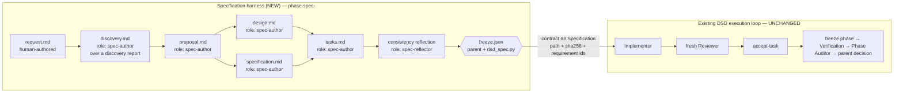
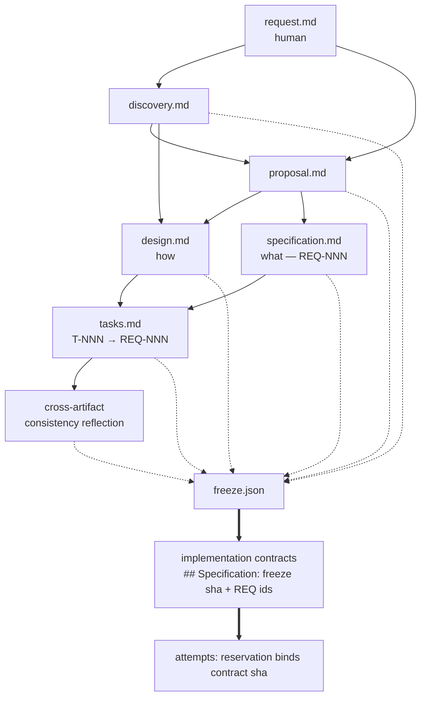

# RFC: Specification & Reflection Harness for DeepSeek and Destroy

- **Status:** Draft for review
- **Type:** Architecture RFC (evolutionary change to an existing harness)
- **Scope:** Adds a pre-implementation specification/reflection lifecycle in front of DSD's existing execution loop
- **Baseline:** `c292eb5` (fresh fork of `frozenpepper/deepseek-and-destroy`, `CHANGELOG.md` v15.5.5;
  the upstream commit SHA is unrecoverable — see the implementation plan §0 for the full provenance
  record, validation environment, and canonical test command)
- **Non-goal:** rewriting DSD, renaming the project, or building a general workflow engine

---

## 0. Project identity boundary

**Proofbound** is this project's public identity — *from engineering intent to verified
implementation*; *specify, challenge, execute, prove*. Proofbound is derived from
DeepSeek-and-Destroy (MIT, © FrozenPepper) but is **not affiliated with or endorsed by** that
project. The inherited MIT license and copyright notice are preserved unchanged in `LICENSE`.

The identity boundary is deliberate and load-bearing:

- **Proofbound** names the project and new project-facing material: the repository, contributor
  documentation, architecture documents when they discuss *this* system rather than inherited
  implementation, and any genuinely new Proofbound-specific concept.
- **DeepSeek-and-Destroy-derived internal identifiers remain compatibility-sensitive
  implementation details until an explicit migration milestone.** That includes the
  `DeepSeekAndDestroy/` workspace root, `dsd_*.py` helpers and their CLI surface, persisted
  workspace paths, protocol and manifest format strings, snapshot formats, state keys,
  environment variables, adapters, and existing role names.

These are **wire and protocol identifiers**, not branding. Renaming them changes durable
artifacts that installed projects and historical runs depend on, so it requires its own
milestone with its own migration evidence — never a cosmetic pass bundled into feature work.

---

## 1. Executive summary

DeepSeek and Destroy (DSD) is a **mature execution harness**. It already solves, with deterministic
mechanisms and tests, most of what a "reflection harness" needs: immutable task contracts, per-attempt
immutable authority + hash binding, terminal lifecycle proof, content-based scope observation, hard
write restrictions, fresh-independent-reviewer provenance enforced in Python, role specialization with
mechanical read-only capability, evidence gating that refuses to interpret prose, durable orchestration
state with a single `next_action`, and checkpoint/resume across context loss.

What DSD does **not** have is any notion of *the plan being wrong*. Its authority is an externally
supplied plan (`state.plan_reference`, contract `## Authority`). Everything downstream is machinery for
executing that plan correctly. The failure mode this RFC targets is **correctly implementing a bad
plan**.

The central architectural claim of this RFC is:

> **The specification lifecycle is not a new kind of process. It is DSD's existing
> writer → fresh-independent-reviewer → fix → re-review → accept loop, applied to
> documents instead of code.**

Therefore the recommended design is *not* a parallel subsystem. It is:

1. **Spec artifacts are ordinary project files** in a configurable `specs/<change-id>/` tree, so DSD's
   already-tested scope observation, `Allowed source changes` hard boundaries, and
   `_assert_fresh_reviewer` provenance apply to them **without modification**.
2. **Two new roles only** — `spec-author` (project writer) and `spec-reflector` (project read-only) —
   registered in the existing `scripts/_roles.py` registry, which automatically grants them correct
   write capability, read-only scope enforcement, prompt rendering, and gate support.
3. **The specification stage is a derived function, not stored routing state.** DSD deliberately forbids
   routing counters and barrier state machines in `state.json`
   (`WORKSPACE.md` "Minimal state"; `tests/test_v15_5_adversarial.py::test_new_phase_state_does_not_create_barrier_machine`).
   The lifecycle stage is computed from the change ledger's accepted artifact revisions and their
   dependency hashes. Staleness — the thing that routes a failure back upstream — falls out of hash
   mismatch, exactly like DSD's existing "later mutation invalidates phase evidence" rule.
4. **Spec freeze is a hash manifest, and binding is free.** An implementation contract embeds the freeze
   file's path *and* SHA-256 in its own text. Because the contract is itself hash-frozen into every
   attempt's `launch-reservation.json` and verified by `evidence_gate.py`, "which spec revision was this
   task implemented and reviewed against" becomes a mechanical fact with no new protocol.

Net new deterministic code is small and localized: one parent-only helper (`dsd_spec.py`), one
deterministic evidence collector (`evidence_bundle.py`), two role skills, one generalization of the
fresh-review predicate, one contract field, and one runtime-routing seam. Everything else is reuse.

Three concrete blockers found in the code must be handled **before** any of this (see §17, §19):

- **Adding roles breaks existing worker-rules snapshots.** `scripts/_rules_snapshot.py:29` computes
  `protocol_fingerprint()` from the *current* module's `PROTOCOL_NAMES`, so any pre-existing immutable
  revision fails `verify_snapshot()` with "worker protocol snapshot is incomplete" the moment a role is
  added. This breaks in-flight runs on upgrade.
- **There is no headroom in the hot documentation budget.** `SKILL.md` is exactly 7500 bytes against a
  7500-byte test cap; `OPENCODE.md` is 16 bytes under its cap, `WORKSPACE.md` 6, `worker/COMMON.md` 21
  (`tests/test_v15_4_consolidation.py::test_hot_instruction_surfaces_stay_small_and_role_local`). New
  doctrine must be a cold file, and even a one-line pointer in `SKILL.md` requires deleting text.
- **The test suite is not runnable on one interpreter, and its fixtures block role addition.** Of 82
  tests, 75 pass on the system Python 3.9; the remaining 7 never run because
  `tests/test_v15_4_lifecycle_regressions.py` omits `from __future__ import annotations` while using
  `Path | None` in a signature. There is no CI config, no packaging, and no lint/format/type
  configuration. Separately — measured, not estimated — adding two roles causes **17 failures across
  three test modules**, because those modules hard-code `PROTOCOL_NAMES` in their worker-rules fixtures.
  Deriving that tuple from `scripts/_rules_snapshot.py` in the fixtures reduces the failures to one
  error-message assertion.

---

## 2. Current DSD architecture relevant to this change

### 2.1 The three-layer trust model

```text
premium parent   authority, decomposition, role choice, acceptance, phase judgment
      │
cheap workers    repository-scale discovery/implementation/repair/review/verification/audit
      │
Python helpers   objective facts ONLY — hashes, lifecycle, source movement, explicit restrictions
```

`SKILL.md` states it directly: *"Python: objective facts only… Never infer engineering meaning from
prose."* This boundary is enforced by tests
(`test_v15_3_semantic_boundary.py::test_integrity_gate_does_not_adjudicate_worker_prose`,
`test_v15_4_consolidation.py::test_executable_semantic_parser_surface_is_absent`, which asserts that
retired prose-parsing modules stay deleted).

### 2.2 The attempt lifecycle (the load-bearing mechanism)

Every unit of worker work is one immutable, self-contained *attempt* directory:

```text
phases/<phase>/tasks/<task>/attempts/<role>-<n>/
  launch-reservation.json   immutable attempt authority (created O_EXCL before any worker starts)
  launch-prompt.txt         hash-bound tiny handoff
  scope-baseline.json       pre-work content baseline of the project worktree
  report.md                 pre-created byte-distinct placeholder, replaced by the worker
  worker.log
  attempt.json              running child facts
  terminal.json             real process end + terminal-bound report hash + frozen scope diff
  scope-diff.json           immutable, hash-bound into terminal.json
  evidence-gate.json        objective integrity result (created O_EXCL — immutable)
  supersession.json         exceptional terminal-less supersession boundary only
```

`scripts/run_worker.py:reserve_attempt()` creates the reservation with `O_EXCL` and refuses reuse.
`child_run()` binds the report bytes and freezes the scope diff **at the moment the process exits**
(`bind_report_at_terminal`, `freeze_scope_at_terminal`), so later worktree movement cannot retroactively
change an attempt's integrity result (`test_v15_integrity.py::test_terminal_bound_scope_is_stable_across_regate_and_hash_protected`).

### 2.3 The integrity gate

`scripts/evidence_gate.py` proves *only*: terminal lifecycle completed with exit 0; reservation binds
the exact prompt/contract/rules/baseline hashes; the worker-rules snapshot manifest still verifies; the
terminal-bound report still hashes correctly and is not the launcher skeleton; and the frozen scope diff
respects role capability and any explicit `## Allowed source changes` restriction. Its output states the
doctrine plainly: `integrity_ok` + `ready_for_interpretation` means **safe to interpret**, never PASS.

### 2.4 Role registry and mechanical capability

`scripts/_roles.py` is a 20-line single source of truth:

```python
ROLE_SKILLS = {"implementer": ..., "fixer": ..., "reviewer": ..., "verification": ...,
               "discovery": ..., "phase-surveyor": ..., "recovery": ...,
               "phase-auditor": ..., "evidence-clerk": ...}
ALWAYS_PROJECT_WRITER_ROLES  = {"implementer", "fixer"}
CONDITIONALLY_WRITING_ROLES  = {"verification"}
ALWAYS_READ_ONLY_ROLES       = ROLE_NAMES - writers - conditional     # computed complement
```

Everything else derives from it: `_contract.role_writes_project()`, the reservation's `writes_project`
flag, the gate's `READONLY-SCOPE-MOVED` hard failure, `--role` CLI choices in three scripts, the prompt
renderer's role-skill path, and the worker-rules protocol snapshot contents. **This registry is the
single cleanest extension point in the repository.**

### 2.5 Fresh independent review, enforced in Python

`scripts/dsd_state.py:accept_task()` does not trust the parent's judgment about provenance. It:

- re-verifies the source gate is clean and bound to `task.current_contract`;
- scans **cold attempt evidence** (`attempts/*/launch-reservation.json`) rather than hot state, keeping
  only attempts whose reservation binds the *current* contract revision hash;
- if any such attempt objectively moved project state, calls `_assert_fresh_reviewer()`, which requires
  the accepted gate's role to be `reviewer` and requires that Reviewer's `reserved_at` to be **after**
  every mutating attempt's terminal/supersession boundary.

Adversarial tests cover stale reviewers, tampered terminal scope, superseded writers, and revision
rollover (`test_v15_5_adversarial.py`).

### 2.6 Contracts and worker rules

`render_task_contract.py` turns one compact JSON spec into an immutable Markdown contract with a
`Contract revision: rNNNN` line, auto-assigned `AC-NNN` ids, and an optional `## Allowed source changes`
hard boundary. It has a strict field whitelist (`FIELDS`) and explicitly rejects retired Clerk-recursion
fields. `prepare_worker_rules.py` freezes run facts plus the entire worker protocol (COMMON, proof
patterns, all role skills) into `worker-rules/rNNNN/` with a cryptographic `MANIFEST.json`; the build is
staged in a `.tmp` sibling and atomically renamed so an interrupted copy cannot produce a
seemingly-valid partial revision.

### 2.7 Transport abstraction that already exists

Two transports finalize the *same* lifecycle:

- `run_worker.py` — external OpenCode CLI, detached monitor, `terminal.json` on process exit.
- `native_worker_attempt.py` — `reserve` before a harness-native subagent call, `finalize` after it
  returns; reuses `reserve_attempt`, `bind_report_at_terminal`, `freeze_scope_at_terminal` verbatim.

This is the provider-abstraction seam (§15). It already works; it is simply not reachable from the
high-level `dsd_attempt.py launch`, which hard-fails on any harness but OpenCode
(`dsd_attempt.py:opencode_runtime`).

### 2.8 State, waiting, and recovery

`state.json` holds execution status, exactly one `next_action`, worker-rules/runtime binding,
`orchestrator_wait`, `context_checkpoint`, and per-task `{current_contract, current_attempt,
last_attempt, accepted}`. `check_state.py` validates bindings, hashes, lifecycle consistency, and a
**turn-exit invariant** (never yield without a live worker, an active wait, or an active compaction).
Waiting is quiescent: `wait_worker.py` polls the filesystem in a cheap subprocess; timeout is
deliberately a non-event; `claude_worker_rewake.py` uses a `PostToolUse:Bash` async-rewake hook so an
idle parent is woken by `terminal.json` without model-level polling.

---

## 3. Existing invariants that must be preserved

These are load-bearing. Any proposal that violates one is wrong until proven otherwise.

| # | Invariant | Where it lives |
|---|---|---|
| I1 | Python proves only objective facts; it never adjudicates prose or assigns PASS/FAIL | `evidence_gate.py` docstring; `test_v15_3_semantic_boundary.py` |
| I2 | A clean gate means "safe to interpret", never "the engineering passed" | `SKILL.md`, `WORKSPACE.md`, `README.md` |
| I3 | One attempt = one immutable reservation; reservations/prompts/contracts/rules/gates never mutate after creation | `run_worker.py:reserve_attempt`, `evidence_gate.py` `open("x")` |
| I4 | Project mutation requires **fresh independent review provenance** before acceptance | `dsd_state.py:_assert_fresh_reviewer` |
| I5 | Read-only roles that move project state fail integrity, mechanically | `evidence_gate.py` `READONLY-SCOPE-MOVED` |
| I6 | `Allowed source changes`, when present, is a hard mechanical boundary; `NONE` means no writes | `_contract.py`, `evidence_gate.py` `WRITE-RESTRICTION` |
| I7 | Worker context = run facts + COMMON + exactly one role + one contract (+ proof patterns only if named) | `render_worker_prompt.py` |
| I8 | Worker reports are natural language; no machine grammar is required for acceptance | `README.md`, `PROMPTS.md`, `COMMON.md` |
| I9 | State stores facts, not routing heuristics, counters, or barrier machines | `WORKSPACE.md`; `test_v15_5_adversarial.py::test_new_phase_state_does_not_create_barrier_machine` |
| I10 | Exactly one `next_action`; resume reads live state first and never reconstructs the run | `SKILL.md`, `COMPACTION.md`, `check_state.py` |
| I11 | Waiting is quiescent; a timeout without terminal evidence is a non-event; no model-visible polling | `SKILL.md`, `wait_worker.py`, `claude_worker_rewake.py` |
| I12 | Scope-observed mutation is exclusive per checkout; writer + read-only concurrency needs worktrees | `WORKSPACE.md` |
| I13 | Phase evidence is frozen; any later mutation makes it stale and demands fresh verification + audit | `SKILL.md`, `WORKSPACE.md` |
| I14 | Hot doctrine surfaces stay small; detail is cold-loaded on demand | `test_v15_4_consolidation.py` byte caps |
| I15 | The Evidence Clerk is always project-read-only, never recursive, and cannot waive integrity failures | `_contract.py`, `dsd_attempt.py:interpret` |

---

## 4. Problem statement / gaps

DSD's authority chain begins with a plan it did not produce and does not question.

**G1 — No upstream reasoning artifact.** `state.plan_reference` and contract `## Authority` point at a
document. Nothing produces, critiques, or freezes that document. Decomposition quality is entirely the
premium parent's hot-context judgment, which is exactly the resource DSD is designed to conserve.

**G2 — Review is post-hoc only.** Every review role in the registry reviews *outcomes*: `reviewer`
(code vs contract), `verification` (one predicate), `phase-auditor` (frozen phase vs authority),
`recovery` (suspect changes). None reviews *intent* before work starts.

**G3 — Traceability stops at the contract.** A contract cites authority paths as free-form strings
(`render_task_contract.py:existing_paths` only checks existence). There is no requirement identity, no
requirement→task mapping, and no way to ask "is every accepted requirement implemented and reviewed?".

**G4 — Independence is doctrinal for documents, mechanical only for code.** `_assert_fresh_reviewer`
triggers on *project scope movement*. A read-only worker producing a document in the run tree moves no
project scope, so `accept_task` would happily accept the author's own report as its own evidence. The
independence property the reflection harness needs is not currently enforceable for run-tree artifacts.

**G5 — No human gate model.** DSD has a `human-blocked` terminal status and a `DECISION_REQUIRED`
escalation convention, but no way to declare in advance that a *class* of change requires human sign-off
before autonomous execution.

**G6 — Role and model are fused.** `state.worker_runtime.model` is per-run, not per-role
(`dsd_attempt.py:opencode_runtime`). A reflector cannot be routed to a different provider than the
implementer it is checking — losing the cheapest available form of reviewer independence.

**G7 — Deterministic evidence is not packaged.** `## Verification` commands are prose instructions to a
worker. Their exit codes and outputs are never captured as an immutable, hash-bound artifact that a
reviewer can be handed instead of trusting the implementer's account of them.

---

## 5. Proposed target architecture

### 5.1 Guiding decisions

- **D1 — Spec artifacts are project files, not run-tree files.** They live under a configurable
  `spec_root` (default `specs/<change-id>/`) inside the project worktree. This is the single most
  leveraged decision in this RFC: it makes spec authoring a *project mutation*, which means
  `scope_snapshot` observes it, `## Allowed source changes` confines it, `READONLY-SCOPE-MOVED` protects
  against reflectors editing what they review, and `_assert_fresh_reviewer` (I4) enforces independence —
  all with **existing, adversarially-tested code**. The alternative (run-tree artifacts) would require a
  second scope observer, because `evidence_gate.py:385` hard-codes
  `exclusions != ["DeepSeekAndDestroy"]` and the DSD tree is invisible to scope observation by design.
- **D2 — Two new roles, not nine.** `spec-author` and `spec-reflector`. Stage-specific behavior comes
  from the contract, exactly as DSD already does for `verification` and `discovery`.
- **D3 — No new state enum.** Stage is derived (§7). This preserves I9 and makes desynchronization
  structurally impossible.
- **D4 — Freeze is a hash manifest; binding is via contract text.** No new verification protocol (§10).
- **D5 — New doctrine is cold.** A new `SPEC-HARNESS.md` (cold-load) plus two role skills. `SKILL.md`
  gains at most one sentence, and only by trading bytes (I14).

### 5.2 Component map

```text
scripts/
  _roles.py                 (+) spec-author, spec-reflector; (+) INDEPENDENT_REVIEW_ROLES
  _contract.py              (+) spec_binding(text) -> {path, sha256, requirements}
  _rules_snapshot.py        (~) verify against the RECORDED manifest's protocol key set
  dsd_state.py              (~) _assert_fresh_reviewer accepts INDEPENDENT_REVIEW_ROLES
  render_task_contract.py   (+) spec_freeze / requirements fields -> "## Specification" section
  evidence_gate.py          (+) SPEC-BINDING-DRIFT objective check
  dsd_attempt.py            (~) resolve_runtime(state, role) dispatch (opencode | native)
  dsd_spec.py               (NEW) parent-only change ledger: init / record / freeze / approve / status
  evidence_bundle.py        (NEW) deterministic evidence collector -> immutable JSON artifact
worker/roles/
  dsd-spec-author/SKILL.md    (NEW)
  dsd-spec-reflector/SKILL.md (NEW)
SPEC-HARNESS.md               (NEW, cold) parent doctrine for the specification phase
docs/architecture/            (NEW) this RFC and successors
```

`(~)` marks a modification to an existing file; every one is a narrow, named seam chosen to minimize
upstream merge surface (§21).

### 5.3 Where the spec phase sits



Each artifact box is one ordinary DSD task with the ordinary attempt lifecycle. Each arrow into a
reflection is one `spec-reflector` attempt. Nothing about the right-hand side changes.

---

## 6. End-to-end workflow

```mermaid
sequenceDiagram
  autonumber
  participant P as Premium parent
  participant W as spec-author (writer)
  participant R as spec-reflector (read-only, different provider)
  participant Py as Python (dsd_spec / gate / state)

  P->>Py: dsd_spec.py init --change CH-001 (writes request.md scaffold + ledger)
  P->>W: task spec/CH-001/proposal, write_paths=[specs/CH-001/proposal.md]
  W-->>Py: attempt terminal + frozen scope diff (only proposal.md moved)
  P->>Py: dsd_attempt.py gate            (objective integrity only)
  P->>R: task spec/CH-001/proposal, role=spec-reflector, --input <author report>
  R-->>Py: findings report (read-only; any project movement = integrity failure)
  P->>Py: gate --surface                 (bounded prefix at a decision boundary)
  alt blocking findings
    P->>W: new contract revision (findings as exact input); resume same session
    Note over P,R: loop; round count is derivable from attempts/, never stored as a counter
  else clean
    P->>Py: dsd_state.py accept-task --evidence-gate <reflector gate>
    Note right of Py: I4 fires: author mutated specs/** → independent review required
    P->>Py: dsd_spec.py record --artifact proposal --gate <reflector gate>
  end
  Note over P,Py: repeat for design → specification → tasks (each reviewed against FROZEN upstream)
  P->>Py: dsd_spec.py freeze --change CH-001
  Note right of Py: refuses if any artifact stale, any human gate pending, or any hash drifted
  P->>P: generate implementation contracts from tasks.md, each binding freeze.json + requirement ids
```

**Sequential batch generation with progressive freeze** (the one idea worth importing wholesale from the
reference article): artifacts are produced and reflected **one at a time in dependency order**, and each
is frozen before the next is authored. This prevents the cascading-fix failure where resolving a finding
in the design invalidates an already-agreed proposal. DSD gives this for free — each artifact is a
separate task with a separate contract, and `write_paths` mechanically prevents a later task from
touching an earlier artifact.

### 6.1 Discovery reuse

Repository discovery is **not new work**. `discovery` and `phase-surveyor` already exist and produce
exactly the "current-state analysis" the lifecycle wants. The only change is that the discovery task's
output is promoted into `specs/<id>/discovery.md` (a project file) instead of remaining a run-tree
report, so downstream reflectors can be handed a stable path. That requires the `discovery` role to be
able to write one file — handled by giving that specific task `write_paths: ["specs/CH-001/discovery.md"]`
and adding `discovery` to `CONDITIONALLY_WRITING_ROLES`, *or* (preferred, zero registry churn) by having
`spec-author` transcribe the discovery report under review. **Recommendation: the latter** — it avoids
widening a read-only role's capability, and the transcription is itself reviewable.

---

## 7. State-machine design

### 7.1 Why not a stored enum

The candidate `NEW → DISCOVERING → … → COMPLETE` enum is a reasonable sketch, but storing it in
`state.json` would:

- violate I9 (`WORKSPACE.md`: *"State records facts, not routing heuristics… Do not store regex verdicts,
  routing counters, dependency prose"*), which is guarded by an explicit adversarial test;
- duplicate information already implied by task statuses and accepted-artifact hashes, creating a
  desynchronization surface after crash, compaction, or manual recovery — precisely the class of bug
  DSD's "read live state first" resume discipline (I10) exists to eliminate;
- add a second routing authority alongside `next_action`, whose singularity is a stated invariant.

### 7.2 Derived stage

Stage is a **pure function** over the change ledger and task statuses, exposed by
`dsd_spec.py status --change CH-001`:

```python
# Topological order over the DAG of §8.4; siblings may be authored in either order.
ORDER = ["discovery", "proposal", "specification", "design", "tasks", "consistency"]

def stage(ledger, tasks):
    for name in ORDER:
        entry = ledger["artifacts"].get(name)
        if entry is None:               return f"{name}:absent"        # author it
        if entry["status"] == "stale":  return f"{name}:stale"         # re-author from findings
        if entry["status"] != "accepted":return f"{name}:in-review"    # reflect / fix / re-reflect
    if ledger.get("pending_gates"):     return "awaiting-human-gate"
    if ledger.get("freeze") is None:    return "ready-to-freeze"
    return "frozen"
```

Staleness is **typed and carries its reason** (see §8.4). An artifact is `needs-revalidation` iff any
artifact in its `depends_on` map now has an accepted SHA-256 different from the one recorded there; it is
`invalid` iff its own file hash no longer matches its recorded accepted hash. This is the same staleness
rule DSD already applies to phase evidence (I13), expressed over documents — and it is content-based, so
a re-author that produces byte-identical content correctly does **not** invalidate a prior reflection
(verified against `scope_snapshot`'s content-based diff, §25).

```mermaid
stateDiagram-v2
    direction LR
    [*] --> discovery_absent
    discovery_absent --> discovery_review: spec-author attempt
    discovery_review --> discovery_accepted: reflector clean + accept-task
    discovery_review --> discovery_review: findings → new contract revision
    discovery_accepted --> proposal_absent
    proposal_absent --> proposal_review
    proposal_review --> proposal_accepted
    proposal_accepted --> design_absent
    design_absent --> design_review
    design_review --> design_accepted
    design_accepted --> specification_absent
    specification_absent --> specification_review
    specification_accepted --> tasks_absent
    specification_review --> specification_accepted
    tasks_absent --> tasks_review
    tasks_review --> tasks_accepted
    tasks_accepted --> ready_to_freeze
    ready_to_freeze --> awaiting_human_gate: policy match, no approval recorded
    awaiting_human_gate --> ready_to_freeze: dsd_spec.py approve
    ready_to_freeze --> frozen: dsd_spec.py freeze
    frozen --> [*]: hand off to existing DSD execution loop

    design_review --> proposal_accepted: finding invalidates the proposal (re-open upstream)
    specification_review --> design_accepted: finding invalidates the design
    frozen --> specification_absent: post-freeze discovery → amendment (§10.4)
```



### 7.3 Failure routing

Failure routes upstream **by construction, not by a routing table**. A reflector finding that a design
contradicts the accepted proposal is resolved by the parent binding a **new contract revision on the
proposal task**. Accepting a new `proposal.md` changes its SHA-256; every downstream artifact whose
`depends_on.proposal` no longer matches becomes `stale`; `stage()` returns `design:stale`; `freeze`
refuses. No enum transition is written anywhere.

This is strictly better than a stored transition table: the enum could be wrong, the hash cannot.

### 7.4 Recoverability

A fresh parent after compaction or crash reads live `state.json` (unchanged discipline), then runs
`dsd_spec.py status`, which reads only the ledger and re-hashes the accepted artifact files. No
conversation history, no reconstruction. If a spec file was hand-edited outside the harness, its hash no
longer matches the ledger and `status` reports `tampered`, which is a finding, not a silent resume.

---

## 8. Artifact model

### 8.1 Split: Markdown for reasoning, JSON for bindings

**Markdown, in the project tree** — everything a human or a downstream worker must *read*:

```text
specs/<change-id>/
  request.md          intent as stated (human-authored; the only artifact with no reflection)
  discovery.md        measured current state, with fact/inference/unknown separation
  proposal.md         problem, scope, non-goals, options considered, recommendation
  design.md           architecture, boundaries, failure semantics, migration, Classification (§14)
  specification.md    numbered requirements REQ-NNN with testable acceptance criteria
  tasks.md            ordered task units with dependencies, allowed paths, evidence needs
```

One canonical filename per artifact. Revision history is git plus the ledger's hash chain — *not*
`proposal/r0002.md`. Rationale: implementers and reviewers must have exactly one obvious path to read
(I7 context economy), and DSD's immutability requirement is already satisfied by (a) each attempt's
report being immutable and hash-bound, and (b) the ledger recording every accepted revision's hash.

**JSON, in the run tree** — everything that must be *bound and verified*:

The **manifest is a committed project artifact**, not run evidence. `WORKSPACE.md` states that run
files are "orchestration evidence, not project source", and the skill's own `.gitignore` excludes
`DeepSeekAndDestroy/`. If the manifest lived only in the run tree, a checkout could not establish what
was accepted. It therefore lives beside the artifacts it describes and references run evidence by path +
hash rather than copying it (§25, Objective B).

```jsonc
// specs/<change-id>/manifest.json  — COMMITTED; written ONLY by dsd_spec.py, never by a worker,
//                                    and never while any attempt is live (see §8.5)
{
  "format": "dsd-change-manifest-v1",
  "change_id": "CH-001",
  "spec_root": "specs/CH-001",
  "artifacts": {
    "proposal": {
      "revision": 2,
      "path": "specs/CH-001/proposal.md",          // project-relative
      "sha256": "…",
      "status": "accepted",                         // accepted | stale | tampered
      "depends_on": {"discovery": "<sha256>"},      // hashes at time of acceptance
      "authored_by": {                              // provenance = attempt evidence, not prose
        "role": "spec-author",
        "attempt": ".../attempts/spec-author-2",
        "gate": ".../evidence-gate.json",
        "gate_sha256": "…",
        "runtime": {"harness": "opencode-cli", "model": "…"}
      },
      "reviewed_by": {
        "role": "spec-reflector",
        "attempt": ".../attempts/spec-reflector-3",
        "gate": ".../evidence-gate.json",
        "gate_sha256": "…",
        "runtime": {"harness": "opencode-cli", "model": "<different model>"}
      },
      "accepted_at": "2026-09-03T…Z"
    }
  },
  "pending_gates": [],
  "freeze": null
}
```

```jsonc
// <run>/changes/<change-id>/freeze.json  — immutable, created O_EXCL
{
  "format": "dsd-spec-freeze-v1",
  "change_id": "CH-001",
  "freeze_revision": 1,
  "frozen_at": "…",
  "artifacts": {                       // exact bytes the whole implementation phase is bound to
    "request":       {"path": "specs/CH-001/request.md",       "sha256": "…"},
    "discovery":     {"path": "specs/CH-001/discovery.md",     "sha256": "…"},
    "proposal":      {"path": "specs/CH-001/proposal.md",      "sha256": "…"},
    "design":        {"path": "specs/CH-001/design.md",        "sha256": "…"},
    "specification": {"path": "specs/CH-001/specification.md", "sha256": "…"},
    "tasks":         {"path": "specs/CH-001/tasks.md",         "sha256": "…"}
  },
  "requirements": ["REQ-001", "REQ-002", "…"],     // parsed mechanically: ^REQ-\d+ line anchors
  "gates": [{"id": "public-api", "status": "approved", "approved_by": "human", "note": "…", "at": "…"}],
  "supersedes": null                                // set on amendment (§10.4)
}
```

### 8.2 What deliberately does **not** exist

- No status field inside the Markdown. Status lives in the ledger; duplicating it invites contradiction.
- No verdict string anywhere. I1/I8 hold: reflector reports stay natural language; the parent decides
  and `accept-task` records provenance without storing a verdict
  (`test_v15_3_semantic_boundary.py::test_acceptance_binds_semantic_evidence_without_storing_verdict`).
- No round counter. Rounds are `len(glob("attempts/spec-reflector-*"))`.
- No dependency graph engine. `depends_on` is a flat map of five known artifact names.

### 8.3 Requirement identity

`REQ-NNN` ids are assigned by the `spec-author` and validated **mechanically only for uniqueness and
line-anchoring** by `dsd_spec.py freeze` — the same posture as `render_task_contract.py` auto-assigning
`AC-NNN` without ever parsing their meaning. Whether a requirement is *good* is the reflector's job.

### 8.4 Dependency DAG and typed staleness

The lifecycle is a **DAG, not a chain**. `design` (how) and `specification` (what the system must do) are
**siblings**: both depend on the accepted proposal, neither depends on the other. That is precisely why a
cross-artifact consistency review exists — it is the step that reconciles two independent descendants
before freeze. Modelling them as a chain would either force design to precede behavioural requirements or
make every design edit invalidate the requirements, and DSD has no mechanism that wants either.

```text
request → discovery → proposal ─┬→ design ──────┬→ tasks → consistency → freeze
                                └→ specification ┘
```

Each artifact records `depends_on: {name: sha256-at-acceptance}`. Two distinct conditions, each carrying
its reason, replace a single boolean "stale":

| Condition | Trigger | Meaning | Resolution |
|---|---|---|---|
| `needs-revalidation` | a `depends_on` hash differs from that artifact's current accepted hash | content may still be right, but no accepted reflection exists **against the new upstream** | fresh reflection against the new upstream; re-author only if the reflection says so |
| `invalid` | the artifact's own file hash differs from its recorded accepted hash | acceptance is void — the file changed outside the harness | re-author and re-reflect; the prior acceptance is not reusable |

`dsd_spec.py status` reports the reason, not just the state: *"design needs-revalidation because proposal
moved a1b2… → c3d4…"*. The propagation rules follow directly and match the intended examples: a proposal
change revalidates design **and** specification; a design change revalidates tasks; a specification change
revalidates tasks **and every contract bound to a freeze containing it**; a tasks-only edit revalidates
nothing upstream.

Staleness is content-based because `scope_snapshot` is content-based: a re-author producing byte-identical
content is correctly not a mutation and does not invalidate a prior reflection (§25).

### 8.5 Who writes the manifest, and when

`dsd_spec.py` is parent-only, mirroring `dsd_state.py`. Two rules make that safe:

- **Workers never write it.** Every spec task's `## Allowed source changes` names only the artifact being
  authored (e.g. `specs/CH-001/proposal.md`), so `manifest.json` is outside the boundary and a worker
  touching it is a `WRITE-RESTRICTION` integrity failure.
- **The parent writes it only between attempts.** A parent write to the project tree while a read-only
  reflector is live would appear in that reflector's frozen scope diff and trip `READONLY-SCOPE-MOVED`.
  DSD already states that parent project edits count toward scope exclusivity (I12); this is that rule
  applied, not a new one.

---

## 9. Reflection / reviewer model

### 9.1 Two review classes, deliberately not collapsed

| | **Specification reflection** | **Implementation review** |
|---|---|---|
| Role | `spec-reflector` (new) | `reviewer` (existing, unchanged) |
| Subject | The *thinking*: request → artifact chain | The *code*: diff vs frozen spec/contract |
| Ground truth | Frozen upstream artifacts + repository reality | Frozen spec revision + contract + deterministic evidence |
| Primary question | "Would executing this plan produce the wrong thing?" | "Does this code satisfy the accepted contract?" |
| Output | Findings classified blocking / should-fix / suggestion | Defects + decisive evidence + unestablished predicates |
| Capability | Project read-only (`ALWAYS_READ_ONLY_ROLES`) | Project read-only (already) |
| Repair path | New `spec-author` revision, then fresh reflection | `fixer`, then fresh `reviewer` |

**Capability is shared; purpose is not — and only the first is mechanical.** M1 implementation
established this precisely: both roles carry independent-review *capability*, so at the acceptance layer
they are interchangeable (a `reviewer` gate will satisfy a spec mutation and a `spec-reflector` gate will
satisfy an implementation mutation). That is deliberate, not an oversight. Enforcing *which* review a task
warrants would require Python to classify task semantics, which invariant I1 forbids; role appropriateness
therefore stays a parent decision, exactly as it already is for every other role. What keeps the two
distinct is doctrine: each attempt loads exactly one role protocol, and the parent chooses which. The
capability set is deliberately narrow — other read-only roles, `evidence-clerk` included, do not qualify.

They are separate roles because their *doctrine* differs, not merely their inputs. Collapsing them would
force one skill file to carry both postures, violating I7's "exactly one specialist role" economy and
blunting both.

### 9.2 `spec-reflector` dimensions

The role skill enumerates the checks (kept terse to respect the ~1400-byte reviewer-skill budget
precedent; the full checklist lives in the task contract's `## Acceptance criteria`, which is where
per-artifact variation belongs):

- requirement fidelity vs `request.md`; unstated assumptions promoted to requirements;
- missing scenarios, edge cases, and negative/failure paths;
- contradictions with the repository's actual architecture (verified by reading source, not assumed);
- contradictions with frozen upstream artifacts;
- acceptance criteria that are untestable, unfalsifiable, or absent;
- architecture-boundary violations and ownership ambiguity;
- migration, backward compatibility, and rollback;
- failure semantics: partial failure, retry, idempotence, concurrency;
- security, authn/authz, data/PII handling;
- operability: observability, diagnosability, operational cost;
- missing dependencies and unowned prerequisites;
- **classification completeness** — whether the design correctly declares the human-gate triggers (§14).

Findings carry a severity the parent routes on; the parent, not Python, decides what blocks (I1).

### 9.3 Reviewer independence — what is mechanical and what is not

| Property | Enforcement | Status |
|---|---|---|
| Reflector cannot mutate what it reviews | `writes_project=false` in the reservation; `READONLY-SCOPE-MOVED` hard integrity failure on any project movement | **Mechanical, exists** (I5) |
| Reflector cannot edit the frozen upstream artifact | Same, plus `write_paths` confinement on the *author* side | **Mechanical, exists** (I6) |
| Reflector context is limited to named artifacts | `render_worker_prompt.py` emits only explicit paths (+ SHA-256 for `--input`); no manuals, no history, no prior reports unless the parent names them | **Mechanical, exists** (I7) |
| Reflector does not see the author's chain-of-thought | Default: the author's *report* is a separate file the parent must pass explicitly with `--input`. **Recommendation: do not pass it.** Pass the artifact and the repository only | **Doctrinal + default-safe** |
| Reflector is a fresh context | Role change starts a fresh session; `--resume-session` is same-role only | **Mechanical, exists** |
| Reflection precedes acceptance and post-dates authoring | `_assert_fresh_reviewer` timestamp comparison, once generalized (§17.2) | **Mechanical after a 1-line change** |
| Reflector uses a different model/provider | Per-role routing (§15) | **New, optional** |
| Limited shell access | **Not enforceable today.** OpenCode runs with `--auto`; DSD's model is *detect the mutation after the fact*, not sandbox the worker | **Detection, not prevention** |

The last row deserves honesty: DSD is a **detection** architecture, not a sandbox. A read-only worker
that runs `rm -rf` is caught by the frozen scope diff at terminal, not prevented. Extending to
prevention would mean per-role permission profiles in the transport layer (OpenCode permission flags,
Claude Code hook deny-rules, Kilo's existing read-only subagent wrapper in
`adapters/kilo/agents/dsd-readonly-worker.md`). That is a worthwhile Phase-4 item, not a prerequisite,
and it must never *replace* detection — the detection layer is what survives a transport that lies.

---

## 10. Specification freeze / version semantics

### 10.1 What "frozen" means

Freeze is **revision-based immutability with a hash manifest**, not filesystem immutability:

1. `freeze.json` is created `O_EXCL` (matching `evidence_gate.py`'s immutability idiom) and never edited.
2. It records the exact SHA-256 of every spec-root file at freeze time, `request.md` included.
3. Every implementation contract embeds `freeze.json`'s path **and its SHA-256** in its `## Specification`
   section. The contract is itself hashed into every attempt's `launch-reservation.json` and verified by
   `evidence_gate.py:authority_matches`. Therefore *"which spec revision did this attempt run against"*
   is already a cryptographic fact — **no new protocol is needed for version binding.**
4. `evidence_gate.py` gains one objective check: if the contract declares a spec binding, re-hash the
   named freeze file and the artifacts it names; a mismatch is `SPEC-BINDING-DRIFT`, an integrity error.
   This detects post-freeze edits to spec files, which are otherwise ordinary project writes.

### 10.2 What is frozen

All six files, `request.md` included. Freezing only `specification.md` would leave the design free to
drift out from under reviewers who must judge architectural conformance; freezing the request pins the
intent baseline a later reflector or auditor checks fidelity against.

### 10.3 How reviewers know the version

A `reviewer` attempt's contract carries the same `## Specification` binding as the implementer's. Both
sides therefore hash-bind the same freeze. `dsd_spec.py status` can list, for any freeze revision, every
attempt whose reservation binds a contract containing that hash — a mechanical traceability query with
no index to maintain.

### 10.4 Reopening after freeze

Post-freeze discovery is normal, not exceptional. Two paths:

- **Amendment (default).** `dsd_spec.py amend --change CH-001` returns the affected artifact to
  `absent`/`stale`, requiring re-authoring and fresh reflection, then produces `freeze.json` revision
  `n+1` with `supersedes: {revision: n, sha256: …}`. In-flight tasks bound to revision `n` are **not
  silently rebased**: their contracts still bind `n`, and `dsd_spec.py status` reports them as
  `bound-to-superseded`. The parent decides per task whether to let it complete against `n` (fine when
  the amendment is unrelated) or rebind a new contract revision against `n+1`.
- **Scope drift (rejected).** A finding that is genuinely a *new* change gets its own change id, not an
  amendment. `spec-reflector` explicitly checks whether a proposed amendment is in the accepted scope or
  is scope creep.

Scope drift prevention is thus three mechanisms, all pre-existing: `write_paths` confinement,
requirement ids in the task contract, and the reviewer judging code against the frozen spec revision.

---

## 11. Task-contract integration

### 11.1 Generation, not invention

`tasks.md` is authored by `spec-author` and reflected like any other artifact. It is **input to contract
generation, not a replacement for it.** The parent still renders each contract with
`render_task_contract.py` — preserving the immutable-revision, auto-`AC-NNN`, and field-whitelist
guarantees. The contract spec gains two fields:

```jsonc
{
  "run_root": "…", "phase_id": "impl-CH-001", "task_id": "T-004",
  "title": "…", "objective": "…",
  "spec_freeze": "/abs/run/changes/CH-001/freeze.json",   // NEW
  "requirements": ["REQ-007", "REQ-008"],                 // NEW
  "authority": ["specs/CH-001/specification.md"],
  "acceptance": ["…"],
  "verification": ["npm test -- media"]
}
```

which renders as:

```markdown
## Specification
- Freeze: `/abs/run/changes/CH-001/freeze.json` | sha256 `a1b2…`
- Requirements: REQ-007, REQ-008
```

`_contract.spec_binding(text)` parses exactly those two mechanical facts — a path, a hash, and a list of
ids. It does not parse requirement *text*. This stays inside I1: the parser reads control fields, never
semantics, exactly as `allowed_source_changes()` already does.

### 11.2 Traceability chain

```text
request.md
  └─ proposal.md         (ledger: authored_by / reviewed_by attempt gates)
      └─ design.md
          └─ specification.md :: REQ-007
              └─ tasks.md      :: T-004 declares REQ-007
                  └─ contract r0001 :: ## Specification (freeze sha) + REQ-007 + AC-001…
                      └─ attempt implementer-1 :: reservation binds contract sha
                          └─ scope-diff.json    :: exactly which files moved
                              └─ attempt reviewer-1 :: same contract sha, later reserved_at
                                  └─ accept-task :: source_gate + semantic_gate bindings
```

Every link is a hash or a path already recorded by existing code. The only new link is
`tasks.md :: T-004 → contract`, provided by the two new contract fields. `dsd_spec.py status
--traceability` walks this chain and reports requirements with **no bound accepted task** — the one
genuinely useful requirements-management query, and the boundary past which this RFC deliberately stops.

### 11.3 Task vs phase invariants

Unchanged. Task-level: one independently reviewable objective; mutation ⇒ fresh independent review.
Phase-level: freeze, post-freeze Verification, fresh Phase Auditor, parent decision (I13). The Phase
Auditor's contract additionally binds the freeze, so it audits against the frozen spec rather than
re-deriving intent — a clean, zero-mechanism win.

---

## 12. Context-isolation strategy

### 12.1 Minimal context per role

| Role | Receives | Explicitly does **not** receive |
|---|---|---|
| `discovery` | contract + repository | any proposal/design; prior worker reports |
| `spec-author` (proposal) | contract + `request.md` + `discovery.md` + repository | design/spec/tasks (they don't exist yet); prior reflection reports except the findings it is fixing |
| `spec-reflector` (proposal) | contract + `request.md` + `discovery.md` + `proposal.md` + repository | the author's report/narrative; prior reflection rounds |
| `spec-author` (design) | contract + **frozen** proposal + discovery + repository | earlier proposal revisions; reflection prose beyond named findings |
| `spec-reflector` (design) | contract + frozen proposal + `design.md` + repository | proposal-round findings (already resolved) |
| `implementer` | contract (incl. freeze binding + REQ ids) + `specification.md` + relevant code | proposal, design, discovery, reflection reports |
| `reviewer` | contract + `specification.md` + repository + `evidence-bundle.json` (diff, test/lint/build results) | implementer's report *by default*; author narrative |
| `phase-auditor` | frozen phase evidence + freeze binding | in-flight worker chatter |
| parent | ledger + `stage()` + bounded `--surface` prefixes + gate JSON | full artifacts, full reports, worker logs |

The mechanism is already built: `render_worker_prompt.py` emits an explicit ordered path list and hashes
every `--input`. Nothing is implicitly inherited. The *only* discipline required is that the parent not
over-supply `--input`.

### 12.2 Parent context economy

The parent's hot surface grows by one line in `SKILL.md` and one cold file. Per-change, the parent holds
`stage()` output (a single string), the ledger's artifact statuses, and bounded gate summaries. Full
artifacts are read only when the parent must exercise judgment on a specific finding — matching the
existing escalation ladder *mechanics → bounded surface → Clerk → targeted evidence → full report*.

The Evidence Clerk applies unchanged to reflection reports: a long reflection report at a parent decision
boundary is exactly the case `dsd_attempt.py interpret` exists for.

### 12.3 Compaction / checkpoint integration

`context_checkpoint.py:prepare()` already snapshots `state.json`, `HANDOVER.md`, `plan-reference.md`, and
`authority-index.json`, and hashes the effective configuration. Two additive changes:

- include `changes/*/ledger.json` and `changes/*/freeze.json` in `manifest.authority_paths` and hash them;
- have `verify-resume` re-check those hashes alongside the existing plan/authority drift checks.

Resume then restores the specification lifecycle with the same guarantee as execution: **live durable
state first, never conversation reconstruction** (I10). Because stage is derived, a resumed parent
computes it in one command rather than trusting a summary.

---

## 13. Evidence and provenance model

### 13.1 The rule, restated

> If a fact can be checked deterministically, do not ask an LLM to guess it — and do not ask Python to
> judge what the fact means.

Both halves matter. DSD's existing failure mode-avoidance is that Python collects `changed_count` but
never decides whether the change was appropriate.

### 13.2 `evidence_bundle.py`

A new deterministic collector, invoked by the parent after a writer's terminal and **before** launching
the reviewer. It runs the contract's `## Verification` commands plus a fixed deterministic set, and
writes one immutable JSON artifact into the attempt directory:

```jsonc
{
  "format": "dsd-evidence-bundle-v1",
  "attempt": ".../attempts/implementer-1",
  "launch_reservation_sha256": "…",          // binds the bundle to one exact attempt
  "collected_at": "…",
  "git": {"head_before": "…", "head_after": "…",
          "diff_stat": "…", "diff_sha256": "…", "changed_paths": ["…"]},
  "commands": [
    {"label": "tests",  "argv": ["npm","test","--","media"], "exit_code": 0,
     "duration_s": 41.2, "stdout_sha256": "…", "stdout_path": "…", "truncated": false},
    {"label": "types",  "argv": ["npx","tsc","--noEmit"],    "exit_code": 2, "…": "…"},
    {"label": "lint",   "…": "…"},
    {"label": "build",  "…": "…"}
  ],
  "dependencies": {"lockfile_changed": false, "lockfile_sha256": "…"},
  "generated_files": [{"path": "…", "sha256": "…"}]
}
```

Properties that keep it inside I1: it records **what ran and what exited**, never whether the result is
acceptable. Exit code 2 above is a fact; whether it blocks acceptance is the reviewer's and parent's
call. Output is stored to files with recorded hashes rather than inlined, preserving context economy.

**Side-effect caveat.** Build/test commands write caches and build outputs. The bundle must therefore run
**between attempts**, never while a worker is live (I12), and any git-ignored generated root it touches
must be declared through the contract's `## Extra scope inventory` so `scope_snapshot.py`'s compact
git-dirty baseline observes it deliberately rather than a later attempt discovering it as an unexplained
change. Bundle outputs themselves live in the attempt directory, which is outside scope observation.

### 13.3 How it feeds reviewers and audits

- The **implementation reviewer** receives `--input <evidence-bundle.json>` and is told, by role
  doctrine, to treat the bundle as the authoritative account of what was executed and the implementer's
  prose as claims. This closes a real gap: today a reviewer either trusts the implementer's narrative
  about test results or re-runs everything.
- The **final Phase Auditor** receives the bundles for every accepted task in the phase, giving it a
  deterministic cross-task view (did any task's test command regress? did the lockfile change in a task
  that shouldn't touch dependencies?) without re-running anything.
- The **freeze** may optionally record a baseline bundle so post-implementation verification can be
  compared against pre-implementation reality.

### 13.4 Provenance

Provenance is already attempt-shaped. The ledger's `authored_by` / `reviewed_by` blocks store *attempt
directory + gate path + gate hash*, not names or claims. "Who reviewed this and were they independent"
is answered by reading immutable evidence, exactly as `_assert_fresh_reviewer` already does for code.

---

## 14. Human approval gates

### 14.1 Model

Three pieces, each doing only what it can do honestly:

1. **Classification** — `design.md` must contain a `## Classification` section listing zero or more
   declared trigger tags from a closed vocabulary. Authored by `spec-author`; **completeness is an
   explicit reflection dimension** (§9.2), so a missing `public-api` tag is a blocking finding, not a
   silent bypass.
2. **Policy** — a repo-level `specs/gate-policy.json` (falling back to a run-level default), read by
   `dsd_spec.py`:

```jsonc
{
  "format": "dsd-gate-policy-v1",
  "default": "autonomous",
  "triggers": {
    "public-api":        {"gate": "human", "reason": "external contract change"},
    "authz":             {"gate": "human"},
    "security-boundary": {"gate": "human"},
    "data-migration":    {"gate": "human", "reason": "irreversible"},
    "destructive-op":    {"gate": "human"},
    "architecture":      {"gate": "human"},
    "deploy":            {"gate": "human"},
    "dependency-add":    {"gate": "notify"}
  }
}
```

3. **Enforcement** — `dsd_spec.py freeze` computes required gates as a **set intersection** of declared
   tags and policy keys (a purely objective operation), and refuses to freeze while any `human` gate
   lacks an approval record. Approval is recorded by the parent with
   `dsd_spec.py approve --gate public-api --approved-by human --note "<what the human said>"`.

### 14.2 Honest limits

Python cannot verify a human actually approved. It records provenance and refuses to proceed without a
record. This is the same honesty DSD already applies to worker reports: the record proves *what was
asserted and when*, not that the assertion was true. The parent must not record an approval it did not
receive — and that is doctrine, backed by DSD's existing rule that the parent asks a human for
"destructive/paid/live permission" (`SKILL.md`).

### 14.3 Default is autonomous

Routine implementation proceeds without gates after freeze. Gates are a property of the *change class*,
declared once, not a per-task interruption. This preserves DSD's core value proposition: long-horizon
autonomous execution.

---

## 15. Provider / harness abstraction

### 15.1 What exists

- **Parent harness** and **worker harness** are already independent (`HARNESS.md`). Four parent adapters
  ship (`CODEX.md`, `CLAUDE.md`, `KILO.md`, `OPENCODE.md`).
- **Two worker transports** already finalize the same lifecycle: external OpenCode (`run_worker.py`) and
  harness-native (`native_worker_attempt.py` reserve/finalize).
- **Roles are already model-neutral names.** `_roles.py` says `implementer`, `reviewer` — nothing in the
  role registry mentions DeepSeek.

### 15.2 What is missing

`dsd_attempt.py:opencode_runtime()` raises unless the harness is `opencode-cli`, and the model is a
single per-run value. So the high-level interface — the one `SKILL.md` tells the parent to use — cannot
reach the native transport and cannot route roles differently.

### 15.3 Proposed seam

Replace `opencode_runtime(state, db, model)` with:

```python
def resolve_runtime(state, role, *, db=None, model=None):
    """role → {harness, model, transport-specific config}. Objective lookup only."""
    routing = (state.get("role_routing") or {}).get(role, {})
    base    = state.get("worker_runtime") or {}
    harness = routing.get("harness") or base.get("harness") or "opencode-cli"
    return {"harness": harness,
            "model":   model or routing.get("model") or base.get("model"),
            **transport_config(harness, state, routing, db)}
```

and dispatch in `launch()` on `harness`: `opencode-cli` → `run_worker.py` (unchanged);
`*-native` → `native_worker_attempt.py reserve`, return a payload instructing the parent to invoke its
native subagent, then `finalize`. State grows one optional block:

```jsonc
"role_routing": {
  "spec-author":     {"harness": "opencode-cli", "model": "<economical strong writer>"},
  "spec-reflector":  {"harness": "opencode-cli", "model": "<different provider>"},
  "implementer":     {"harness": "opencode-cli", "model": "<economical implementer>"},
  "reviewer":        {"harness": "opencode-cli", "model": "<different provider>"},
  "evidence-clerk":  {"harness": "opencode-cli", "model": "<cheapest capable>"}
}
```

This is additive: absent `role_routing`, behavior is byte-identical to today. It gives reflectors and
reviewers **provider-level independence** — the cheapest meaningful defense against an author and its
reviewer sharing the same blind spot — and it directly implements the role/model separation the
reference article achieves informally by using a different LLM for its reviewer sub-agent.

### 15.4 Model-neutrality of the design

Nothing in this RFC names a provider. The lifecycle, ledger, freeze, and reflection semantics are
transport-agnostic; only `transport_config()` knows about OpenCode DBs or native subagents. Codex may
remain the preferred parent without the workflow depending on it.

---

## 16. Failure and recovery behavior

| Failure | Handling | New mechanism? |
|---|---|---|
| Reflection finds blocking issues | New `spec-author` **attempt on the same contract**, findings passed via `--input`; then a fresh reflector attempt. Identical to Implementer → Reviewer → Fixer → Reviewer; **no new contract revision** (verified, §25) | No — existing fix/re-review loop |
| Reflection loop does not converge | Round count derivable from `attempts/`; parent escalates to human after a policy cap (default 5, per the reference article) | No — policy, not stored state |
| Finding invalidates an upstream artifact | Re-author upstream ⇒ hash changes ⇒ downstream `stale` ⇒ `freeze` refuses | No — hash-derived staleness |
| `spec-author` mutates a frozen artifact | `WRITE-RESTRICTION` integrity failure (contract confines it to one path) | No (I6) |
| `spec-reflector` mutates anything | `READONLY-SCOPE-MOVED` integrity failure | No (I5) |
| Spec file edited outside the harness after acceptance | `dsd_spec.py status` reports `tampered`; if after freeze, `SPEC-BINDING-DRIFT` at the next gate | Yes — one gate check |
| Worker dies mid-authoring | Existing suspect-change path: preserve attempt, `recovery` role for disposition | No |
| Parent context lost / compaction | `state.json` first, then `dsd_spec.py status`; ledger + freeze hashes in the checkpoint manifest | Additive only |
| Post-freeze discovery | Amendment ⇒ freeze revision `n+1`; in-flight tasks reported `bound-to-superseded`, parent decides | Yes — `amend` subcommand |
| Human gate never approved | `freeze` refuses; run reaches `human-blocked` (existing terminal status) | No |
| Requirement has no implementing task | `status --traceability` reports it; `freeze` may optionally warn | Yes — one query |

The dangerous new failure mode is **silent rebasing**: quietly re-pointing an in-flight implementation
task at a newer freeze. The design forbids it — contracts are immutable, so rebasing *requires* a new
contract revision, which is visible and hash-bound.

---

## 17. Integration points with current DSD code

Ordered by risk. Each is a named seam, not a refactor.

### 17.1 `scripts/_rules_snapshot.py` — **blocker, fix first**

`protocol_fingerprint()` (line 29) iterates the *current* module's `PROTOCOL_NAMES` and raises
`worker protocol snapshot is incomplete` for any missing file. `verify_snapshot()` compares
`current_payload()` against the recorded manifest. Consequence: **adding any role to `_roles.py`
immediately breaks `verify_snapshot()` for every pre-existing immutable worker-rules revision**, which is
called on every launch (`run_worker.resolve_preflight`), every prompt render, every gate
(`evidence_gate.authority_matches`), and `check_state.py`. An in-flight run upgraded mid-flight becomes
unlaunchable.

**Verified, not inferred.** Creating a snapshot with today's registry and then verifying it with a
registry containing two extra roles fails with
`worker protocol snapshot is incomplete: …/protocol/roles/dsd-spec-author/SKILL.md`. Affected call sites
are exactly five: `render_worker_prompt.py:43`, `run_worker.py:130`, `evidence_gate.py:205`,
`check_state.py:92`, `native_worker_attempt.py:60`. `context_checkpoint.py` does **not** call it, so
checkpoint/resume is unaffected.

Fix (minimal, preserves the tamper-detection the tests demand): when *verifying*, derive the expected
protocol name set from the **recorded manifest's `protocol` keys**, not the module constant; keep the
module constant for *creation*. One ordering constraint is non-obvious and was measured: the manifest is
written with `sort_keys=True`, so its stored key order is **not** the order `protocol_fingerprint()`
hashed. Recomputing over the recorded keys in stored or sorted order reproduces the wrong fingerprint;
recomputing over `[n for n in PROTOCOL_NAMES if n in recorded]` reproduces it exactly, because roles are
appended to the registry. The fix must therefore (a) order by the current tuple restricted to the
recorded set, (b) hard-fail — never silently pass — if the recomputed fingerprint differs from the
recorded one, and (c) record an explicit ordered `protocol_names` list in a new manifest revision so
future reordering cannot recreate this coupling. A manifest listing a name whose file is missing, or a
file whose hash differs, still fails.

Three test modules hard-code `PROTOCOL_NAMES` in their fixtures; adding two roles produces 17 failures.
Deriving the tuple from `_rules_snapshot` in those fixtures reduces this to a single error-message
assertion in
`test_v15_3_semantic_boundary.py::test_mutating_task_acceptance_requires_fresh_reviewer_provenance_not_implementer`.

### 17.2 `scripts/dsd_state.py:_assert_fresh_reviewer` (line 490)

```python
if str(source_gate.get("role") or "").lower() != "reviewer":
```
becomes a membership test against a new `_roles.INDEPENDENT_REVIEW_ROLES = {"reviewer", "spec-reflector"}`.
The timestamp-freshness logic below it is already role-agnostic and needs no change. Without this,
accepting a `spec-author` mutation reviewed by a `spec-reflector` is rejected.

### 17.3 `scripts/_roles.py`

Add `spec-author` to `ROLE_SKILLS` and `ALWAYS_PROJECT_WRITER_ROLES`; add `spec-reflector` to
`ROLE_SKILLS` only (the read-only set is a computed complement, so it is correct automatically). Add
`INDEPENDENT_REVIEW_ROLES`. Everything downstream — CLI choices, capability, gate enforcement, prompt
rendering — follows. `test_v15_4_consolidation.py::test_role_capabilities_match_architecture` should gain
the two new roles.

### 17.4 `scripts/render_task_contract.py`

Add `spec_freeze` and `requirements` to `FIELDS` (unknown fields are rejected today) and emit the
`## Specification` section. Validate that the freeze path exists and, when `spec_freeze` is given, embed
its SHA-256 in the rendered text — that embedding is what makes version binding free.

### 17.5 `scripts/_contract.py`

Add `spec_binding(text)` returning `{path, sha256, requirements}` using the same `markdown_section`
helper as `allowed_source_changes()`. No semantic parsing.

### 17.6 `scripts/evidence_gate.py`

Add one objective check driven by `spec_binding`: `SPEC-BINDING-DRIFT` when the named freeze file is
missing, or its hash differs from the contract-embedded hash, or an artifact it names has drifted. Place
it beside the existing `WRITE-RESTRICTION` / `READONLY-SCOPE-MOVED` checks. Do **not** touch the
`exclusions != ["DeepSeekAndDestroy"]` guard (line 385) — this design deliberately avoids needing to.

### 17.7 `scripts/dsd_attempt.py`

Replace `opencode_runtime()` with `resolve_runtime()` and add transport dispatch (§15.3). Keep the
existing OpenCode path byte-identical when `role_routing` is absent.

### 17.8 `scripts/context_checkpoint.py`

Add ledger/freeze paths and hashes to the checkpoint manifest and `verify-resume`.

### 17.9 New files

`scripts/dsd_spec.py`, `scripts/evidence_bundle.py`, `worker/roles/dsd-spec-author/SKILL.md`,
`worker/roles/dsd-spec-reflector/SKILL.md`, `SPEC-HARNESS.md`, `docs/architecture/**`.

### 17.10 `SKILL.md` — budget problem

`SKILL.md` is **exactly 7500 bytes** against a 7500-byte cap. Any pointer to `SPEC-HARNESS.md` requires
either trimming existing prose or raising the cap. **Recommendation: trim.** The cap is a real
context-economy invariant (I14), and a raised cap invites erosion. Compressing a sentence or two of the
"Normal execution" paragraph without losing doctrine should fund the single sentence needed:
*"For specification-first changes, cold-load `SPEC-HARNESS.md` before authoring implementation tasks."*
If it cannot be funded honestly, that is itself a signal the pointer belongs only in `SPEC-HARNESS.md`'s
callers (the parent adapters), not in the hot skill.

---

## 18. What remains unchanged

Explicitly out of scope for modification:

- `scripts/run_worker.py` — attempt reservation, detached monitor, terminal binding, scope freeze.
- `scripts/native_worker_attempt.py` — reserve/finalize (it gains a *caller*, not a change).
- `scripts/scope_snapshot.py` — the content-based baseline/compare engine.
- `scripts/wait_worker.py`, `claude_worker_rewake.py` — quiescent waiting and async rewake.
- `scripts/report_surface.py` — bounded non-semantic prefix.
- `scripts/check_state.py` — apart from optional ledger validation, its invariant set is right.
- `scripts/prepare_worker_rules.py` — the immutable revision builder (it picks up new roles for free via
  `PROTOCOL_FILES`, which derives from `ROLE_SKILLS`).
- The Evidence Clerk in all its parts, including the anti-recursion guard.
- The `implementer` / `fixer` / `reviewer` / `verification` / `recovery` / `phase-auditor` /
  `phase-surveyor` / `discovery` role skills and their doctrine.
- Phase close semantics, staleness rules, concurrency rules, worker report freedom (I8), the
  `--surface` escalation ladder, and all four parent harness adapters.
- The project name, the `DeepSeekAndDestroy/` workspace root literal, and the default worker model.

---

## 19. Migration / implementation phases

Principle: **characterize, then extend, then generalize, then clean up.** Existing DSD behavior stays
testable and shippable after every milestone.

### M0 — Characterize and stabilize *(prerequisite; no behavior change)*

- Add `from __future__ import annotations` to `tests/test_v15_4_lifecycle_regressions.py` (7 tests that
  currently never run), or declare and document a minimum interpreter (recommend ≥3.10) and pin it.
- Add a runnable test entrypoint (`python3 -m unittest discover -s tests -t .` currently fails because
  `tests/` is not a package; add `tests/__init__.py` or a `Makefile`/`tox`-style runner) plus CI.
- Add characterization tests that pin behavior this RFC will lean on: role registry ↔ protocol snapshot
  coupling; `accept-task` rejecting a non-`reviewer` gate after mutation; `write_paths` confinement to a
  single file; `render_task_contract` unknown-field rejection.
- **Exit criteria:** one command runs all 82 tests green on a pinned interpreter, in CI.

### M1 — Make the role registry safely extensible *(the first real slice)*

- Fix `_rules_snapshot.verify_snapshot()` to verify against the recorded manifest's protocol key set
  (§17.1); make the three test modules' `PROTOCOL_NAMES` fixtures derived rather than hard-coded (this
  removes 17 measured failures); add a regression test that an
  older revision still verifies after a role is added.
- Add `INDEPENDENT_REVIEW_ROLES` and generalize `_assert_fresh_reviewer` (§17.2).
- Add `spec-author` + `spec-reflector` to `_roles.py` with their two role skills.
- **Exit criteria:** a `spec-author` attempt confined by `write_paths` to one file, reviewed by a fresh
  `spec-reflector`, is accepted by `accept-task`; a `spec-reflector` that touches the project fails
  integrity; a `spec-author` writing outside `write_paths` fails integrity; pre-existing worker-rules
  revisions still verify. **No new files, no new state, no new concepts.**

### M2 — The specification phase

- `scripts/dsd_spec.py` (`init`, `record`, `status`, `freeze`, `amend`) + ledger/freeze schemas.
- `spec_freeze` / `requirements` contract fields, `_contract.spec_binding`, `SPEC-BINDING-DRIFT`.
- `SPEC-HARNESS.md` cold doctrine + the `SKILL.md` byte trade (§17.10).
- Derived `stage()` with a full transition test matrix, including staleness and failure routing.
- **Exit criteria:** an end-to-end change from `request.md` to `freeze.json` on a scratch repository,
  using fake workers (the existing tests' fake-`opencode` pattern), with a forced upstream re-open
  producing correct downstream staleness.

### M3 — Deterministic evidence and human gates

- `scripts/evidence_bundle.py` + reviewer/auditor contract wiring.
- Gate policy, classification vocabulary, `approve`, freeze enforcement.
- Checkpoint manifest additions and `verify-resume` coverage.
- **Exit criteria:** a reviewer attempt receives a hash-bound bundle; freeze blocks on a pending gate and
  proceeds after an approval record; resume after simulated compaction reproduces the exact stage.

### M4 — Provider/role routing

- `resolve_runtime()` + `role_routing` + native transport dispatch from `dsd_attempt.py`.
- Adapter contract tests asserting both transports produce lifecycle-identical attempt evidence.
- **Exit criteria:** author and reflector run on different configured models with no other change;
  absent `role_routing`, behavior is unchanged.

### M5 — Optional cleanups (only if warranted by use)

- Transport-level permission profiles for read-only roles (prevention layered on detection).
- Run-tree scope observation, if run-tree artifacts ever become necessary.
- Model-neutral naming: introduce a `workspace_root()` helper before touching the ~10 files that
  hard-code the `DeepSeekAndDestroy` literal (`_contract.py:43`, `dsd_attempt.py:41,167`,
  `evidence_gate.py:385`, `render_task_contract.py:53,75`, `run_worker.py:110`,
  `prepare_worker_rules.py:71`, `native_worker_attempt.py:35,131`, `context_checkpoint.py:79`,
  `install_harness_adapter.py:20`, `scope_snapshot.py:333`). **Postpone until functionality is stable** —
  current naming does not block architectural clarity, and the literal is also a *wire format* that
  existing installations depend on.

---

## 20. Testing strategy

The orchestration system is production software. Follow the existing test idiom: subprocess-driven,
`tempfile` repositories, fake `opencode` executables on `PATH`, real hashes, adversarial cases.

**Characterization (M0).** Pin today's behavior before touching it: role capability matrix, manifest
tamper detection, accept-task provenance rejection, gate immutability, contract field whitelist.

**State transitions.** A table-driven test over `stage()`: every artifact status combination maps to
exactly one stage; unreachable combinations are rejected rather than silently defaulted.

**Failure routing.** Re-accepting an upstream artifact makes exactly the correct downstream set stale;
`freeze` refuses while anything is stale; an unrelated re-acceptance does *not* stale siblings.

**Recovery/resume.** Kill the parent mid-lifecycle; a fresh process derives the identical stage from
ledger + state alone. Corrupt a spec file; `status` reports `tampered` and refuses to freeze.

**Reviewer independence.** A `spec-reflector` attempt that writes any project file fails integrity. A
ledger entry whose `authored_by.attempt` equals its `reviewed_by.attempt` is rejected by
`dsd_spec.py record`. `accept-task` rejects a `spec-author` gate as its own evidence. A reflector
reserved *before* the author's terminal is rejected as stale.

**Freeze / version binding.** A contract's embedded freeze hash must match the file at gate time;
mutating a frozen artifact yields `SPEC-BINDING-DRIFT`; an amendment produces `n+1` with `supersedes`
set, and tasks bound to `n` are reported `bound-to-superseded` rather than silently rebased.

**Traceability.** Every `REQ-*` in a freeze either binds to an accepted task or is reported; a task
declaring an unknown `REQ-*` is rejected at contract render time.

**Adapter contracts.** OpenCode and native transports produce attempt directories that satisfy the same
`evidence_gate` assertions. `resolve_runtime` falls back exactly to today's behavior when
`role_routing` is absent.

**Evidence integrity.** A bundle whose `launch_reservation_sha256` does not match the attempt is
rejected; a bundle's recorded stdout hash must match the stored file.

**Regression.** All 82 existing tests continue to pass. Three modules' `PROTOCOL_NAMES` fixtures become
derived rather than hard-coded (a hygiene change that permanently removes the coupling), and one
error-message assertion changes wording; both are covered by dedicated regression tests.

---

## 21. Upstream compatibility

The fork tracks `frozenpepper/deepseek-and-destroy`, which is actively evolving (28 CHANGELOG entries
through v15.5.5, many of them *removing* mechanisms rather than adding). Divergence should be cheap to
rebase.

**Avoid heavy modification of** — high upstream churn, high conflict cost:
`SKILL.md`, `README.md`, `WORKSPACE.md`, `PROMPTS.md`, `COMMON.md`, and the existing role skills. Every
edit these files receive in this RFC is a single line or a compression, deliberately.

**Prefer extension points over edits.** The changes chosen are (a) additions to a small registry, (b) a
predicate generalized from a literal to a set, (c) two new optional contract fields behind a whitelist,
(d) one new gate check beside existing ones, (e) one function replaced by a superset function. Each is a
few lines at a stable location, and each is the *kind* of change upstream itself makes.

**Likely conflict sites, ranked:** `_roles.py` (tiny, but upstream may add roles too — trivial to merge),
`dsd_state.py:_assert_fresh_reviewer` (upstream hardened this repeatedly in v15.5 — expect conflicts,
keep the change to one expression), `evidence_gate.py` (large and actively edited — append the new check
at the end of the check sequence to minimize hunk overlap), `dsd_attempt.py:launch` (moderate), the four
test modules' `PROTOCOL_NAMES` (mechanical).

**Compatibility layer: no.** A shim layer would be speculative abstraction (an explicit non-goal) and
would itself conflict. The right insurance is (a) new behavior in new files, (b) upstream-shaped edits,
(c) a characterization test suite that tells you immediately whether a rebase broke an invariant.

**Divergence becomes justified** when upstream's semantics actively conflict with specification-first
operation — e.g. if upstream ever narrows `accept-task` to a literal `reviewer` role in a way that cannot
express independent reflection. Until then, prefer contributing the *generalizations* (the
`_rules_snapshot` verification fix and `INDEPENDENT_REVIEW_ROLES` are arguably upstream bug fixes and
should be offered as such) and keeping the specification layer as the fork's additive delta.

---

## 22. Risks and tradeoffs

**R1 — Spec phase cost.** Five artifacts × (author + reflector + fix rounds) is easily 15–25 worker
attempts before a line of code. *Mitigation:* cheap models for authoring, artifacts sized to the change,
and a documented escape hatch — small changes skip the spec phase entirely and use today's flow. The
harness must not make trivial work expensive.

**R2 — Reflection theater.** A reflector that always finds three medium issues adds cost, not safety.
*Mitigation:* provider-level independence (§15), an explicit "no findings is a valid outcome" clause in
the role skill, and treating a reflector that never blocks anything as a signal to change its routing.

**R3 — Non-convergence.** Author and reflector ping-pong. *Mitigation:* derivable round count, a policy
cap, escalation to human as a *finding*, not a retry.

**R4 — Spec files pollute the project diff.** Spec commits interleave with code commits. *Mitigation:*
configurable `spec_root`. Note the constraint if a team points it at a git-ignored directory:
`scope_snapshot.py`'s compact baseline hashes only dirty/untracked paths **plus explicitly named ignored
roots**, so an ignored `spec_root` must be declared via `## Extra scope inventory` on every spec task or
authoring becomes invisible to scope observation — losing D1's entire enforcement story. Committing the
spec root is strongly preferred; the diff noise is the price of mechanical enforcement.

**R5 — Concurrency regression.** Spec authoring is now a project write, so it takes the exclusive-mutation
constraint (I12). Spec work for change B cannot overlap implementation of change A in one checkout.
*Mitigation:* documented worktree usage — the same answer DSD already gives.

**R6 — Role proliferation.** Every added role enlarges every worker-rules snapshot and the protocol
fingerprint. *Mitigation:* two roles, hard-capped; stage differences live in contracts.

**R7 — Requirements-management creep.** `REQ-*` ids invite coverage matrices, statuses, and eventually a
tracker. *Mitigation:* the only supported query is "requirements with no bound accepted task". Explicit
non-goal beyond that.

**R8 — Upstream drift cost.** Real but bounded; see §21.

**R9 — Prevention gap.** Read-only enforcement remains detection-based (§9.3). A worker that ignores
doctrine is caught after the fact, not stopped. Accepted for now; M5 offers layering.

**R10 — Human gates depend on honest classification.** If `design.md` omits a trigger tag, no gate fires.
*Mitigation:* classification completeness is an explicit reflection dimension; the policy file can
declare a conservative default (`"default": "human"`) for high-risk repositories.

---

## 23. Open questions requiring human architectural input

> **Superseded by §25.5.** The validation pass answered most of these from repository evidence; §25.5
> carries the reduced set that genuinely needs a human decision. This section is kept for the reasoning.

1. **Spec root and commit policy.** Should `specs/<change-id>/` be committed to the repository (versioned
   with the code, OpenSpec-style) or generated into an ignored path? This changes review ergonomics and
   whether spec artifacts survive the run. *Recommendation: committed.*
2. **Worktree/branch strategy.** Should the specification phase run in the main checkout (simple,
   serializes with implementation) or a dedicated worktree (parallelism, more moving parts)?
3. **Gate policy ownership.** Repo-level `specs/gate-policy.json` (portable, reviewable) versus run-level
   configuration (flexible, easier to bypass)? *Recommendation: repo-level with run-level override that
   can only add gates, never remove them.*
4. **Reflection round cap and escalation.** Is 5 rounds right, and on exhaustion does the run go
   `human-blocked`, or does the parent make the call and record it in the major log?
5. **Upstream contribution.** Should the `_rules_snapshot` verification fix and `INDEPENDENT_REVIEW_ROLES`
   be offered upstream (reduces long-term divergence, invites upstream design opinions) or kept local?
6. **Discovery promotion.** Confirm the recommendation in §6.1 (`spec-author` transcribes discovery under
   review) over widening the `discovery` role's write capability.
7. **Amendment default for in-flight tasks.** Should tasks bound to a superseded freeze be reported and
   left to parent judgment (recommended) or automatically flagged as requiring rebinding?
8. **Minimum interpreter.** Pinning ≥3.10 is the low-friction fix, but the fork may want to preserve 3.9
   compatibility for constrained environments.

---

## 24. Recommended first implementation slice

**Ship M0 + M1 together.** Nothing else is safe to build first, and together they are small, testable,
and independently valuable even if this RFC is later rejected.

**Deliverables**

1. `tests/__init__.py` (or an equivalent runner) plus the `from __future__ import annotations` fix, a
   pinned interpreter, and CI running the full suite.
2. Characterization tests for the four couplings this RFC depends on (role registry ↔ protocol snapshot;
   accept-task provenance; `write_paths` single-file confinement; contract field whitelist).
3. `_rules_snapshot.verify_snapshot()` verifying against the recorded manifest's protocol key set, with
   a regression test proving an older revision still verifies after a role is added, and tamper detection
   preserved.
4. `_roles.INDEPENDENT_REVIEW_ROLES` and the one-expression generalization in `_assert_fresh_reviewer`.
5. `spec-author` and `spec-reflector` registered, with two role skills authored to the existing terse
   budget (existing role skills run 672–1395 bytes; the reviewer skill is 1373 against a 1400-byte cap).
6. The three test modules' `PROTOCOL_NAMES` fixtures derived, and `test_role_capabilities_match_architecture`
   extended to the new roles.

**Acceptance for the slice**

- The full suite is green on one pinned interpreter in CI.
- An integration test drives a real (fake-worker) `spec-author` attempt confined by
  `write_paths: ["specs/CH-001/proposal.md"]`, a fresh `spec-reflector` attempt, and `accept-task` using
  the reflector's gate — proving that the reflection loop's enforcement works **before any new
  subsystem exists**.
- A `spec-reflector` attempt that writes any project file fails integrity.
- A `spec-author` attempt that writes outside its `write_paths` fails integrity.
- Pre-existing worker-rules revisions created before the role addition still verify.

**Deliberately excluded from the slice:** `dsd_spec.py`, the ledger, freeze, contract fields, evidence
bundles, gates, and provider routing. If the slice lands and the enforcement test passes, the remaining
milestones are additive. If it does not, the RFC's central claim — that DSD's existing machinery already
enforces reflection-harness independence — is false, and the design should be revisited before more is
built on it.

### Dogfooding

Once M2 lands, this repository can develop itself through its own workflow: run the harness with
`spec_root = specs/`, target changes to `scripts/**` and `worker/**`, and require an independent
reflector on every design. Two safety conditions must hold first, and neither should gate M1:

- **Never let a run modify the skill it is currently executing.** The parent must execute a pinned copy
  of the skill (a separate checkout or a tagged install) while workers modify the working tree. Otherwise
  a mid-run edit to `evidence_gate.py` changes the rules that are judging that very edit.
- **Never let a run modify its own live run tree.** Already guaranteed: `DeepSeekAndDestroy/**` is
  excluded from scope observation and forbidden as a write target
  (`_contract.py:43`, `render_task_contract.py:75`).

The natural first dogfooded change is M3 (evidence bundles): self-contained, additive, and with
unambiguous acceptance criteria — a good test of whether the specification phase earns its cost.

---

## Appendix A — Artifact dependency DAG



One-way edges only. A cycle would defeat progressive freeze; `dsd_spec.py` rejects a `depends_on` entry
naming a later artifact in `ORDER`.

## Appendix B — Minimal `dsd_spec.py` surface

```text
dsd_spec.py init     --run-root R --change CH-001 [--spec-root specs]
dsd_spec.py record   --run-root R --change CH-001 --artifact proposal
                     --author-gate <gate.json> --review-gate <gate.json>
dsd_spec.py status   --run-root R --change CH-001 [--traceability] [--json]
dsd_spec.py approve  --run-root R --change CH-001 --gate public-api
                     --approved-by human --note "<verbatim human decision>"
dsd_spec.py freeze   --run-root R --change CH-001
dsd_spec.py amend    --run-root R --change CH-001 --artifact design --reason "<why>"
```

Parent-only, mirroring `dsd_state.py`'s posture: it serializes durable facts and refuses invalid
transitions. It never launches workers, never reads worker prose, and never decides whether a finding
blocks.

---

## 25. Validation pass (post-authoring review against the checkout)

This section records a second pass in which every load-bearing claim was re-tested against the code at
`c292eb5`, not re-read from documentation. Experiments were run against a scratch project with a fake
`opencode` binary, using the pattern in `tests/test_v15_helpers.py`.

### 25.1 Assumptions confirmed by execution

**C1 — The central thesis holds with no new orchestration.** A full slice was executed end to end:
`spec-author` (confined by `## Allowed source changes` to `specs/CH-001/proposal.md`) → integrity gate →
`spec-reflector` → integrity gate → `accept-task`. It works with exactly two role registry entries,
`spec-author` added to `ALWAYS_PROJECT_WRITER_ROLES`, and one expression changed in
`_assert_fresh_reviewer`. No new state, no new evidence format, no new lifecycle.

**C2 — Self-acceptance is already impossible.** Accepting the `spec-author`'s own gate is rejected by
unmodified `dsd_state.py`: *"recorded project mutation requires a fresh Reviewer integrity gate"*.

**C3 — Mutation confinement is already mechanical.** A `spec-author` that also wrote `src.py` produced
`WRITE-RESTRICTION: 1 path(s) outside explicit Allowed source changes: src.py`.

**C4 — Reflector read-only enforcement is already mechanical.** A `spec-reflector` that edited the
artifact it was reviewing produced `READONLY-SCOPE-MOVED: 1 project path(s)`.

**C5 — Reviewer freshness already covers the revise loop.** After a second `spec-author` attempt changed
the artifact, accepting the *first* reflector's gate failed with *"fresh Reviewer requirement violated:
accepted Reviewer predates later project mutation in spec-author-2"*; a second reflector attempt was
accepted.

**C6 — Role addition breaks historical snapshots.** Reproduced exactly (§17.1), with the five affected
call sites enumerated and `context_checkpoint.py` confirmed unaffected.

**C7 — Existing capability classification is undisturbed.** `role_writes_project` still returns
`implementer=True, fixer=True, verification=True/False by contract, evidence-clerk=False,
reviewer=False`, with `spec-author=True, spec-reflector=False` added.

**C8 — Hot-doc byte caps and the missing baseline.** `SKILL.md` remains exactly at its 7500-byte cap; no
CI, packaging, lint, format, or type configuration exists; only
`tests/test_v15_4_lifecycle_regressions.py` requires Python ≥3.10.

### 25.2 Assumptions corrected

**X1 — The fix loop needs no new contract revision.** The RFC implied a new `spec-author` contract
revision per reflection round. Verified wrong: the correct shape is the existing
Implementer → Reviewer → Fixer → Reviewer pattern — a new *attempt* on the **same** contract with the
reflector's report passed via `--input`. A new revision would additionally be harmful: attempts are
matched to acceptance by contract hash, so rebinding a revision drops earlier mutating attempts from the
freshness scan.

**X2 — The change manifest is a committed project artifact, not run evidence.** Corrected in §8.1/§8.5.
The run tree is explicitly not project source and is git-ignored, so a manifest living only there could
not establish what a checkout accepted.

**X3 — The artifact model is a DAG, not a chain.** Corrected in §8.4. `design` and `specification` are
siblings under `proposal`; this is what gives the cross-artifact consistency reflection a purpose.

**X4 — Staleness needed to be typed.** Corrected in §8.4: `needs-revalidation` (upstream dependency
moved) versus `invalid` (own content changed outside the harness), each reported with its reason.

**X5 — The test blast radius was understated.** Not "four `PROTOCOL_NAMES` constants" but 17 failures
across three modules; deriving the tuple from `_rules_snapshot` reduces it to one assertion (§17.1).

**X6 — The snapshot fix has a non-obvious ordering constraint.** The manifest stores protocol keys
sorted while the fingerprint hashes them in registry order; only ordering by the current tuple restricted
to the recorded set reproduces historical fingerprints (§17.1).

### 25.3 Decisions refined

**A1 — Derived stage, made an explicit invariant.** *Workflow status must be a function of authoritative
artifacts and evidence and must never be an independent source of truth that can disagree with them.*
Three things stay distinct and must not be merged: **execution state** (`state.json` — task/attempt
lifecycle, one `next_action`; DSD's, unchanged), **artifact status** (the committed manifest — accepted
hashes, dependency hashes, provenance references), and **derived workflow stage** (computed, never
stored). No persisted stage field is required.

**D — Freeze identity is the manifest hash, not `specification.md`'s.** Implementation contracts bind the
**aggregate** freeze-manifest hash. Binding `specification.md` alone would permit an inconsistent
combination — a spec revision paired with a drifted design — which is exactly the drift the freeze exists
to prevent. A freeze is immutable and is **superseded by a new freeze**, never edited; the consistency
reflection is a mandatory prerequisite because it is the only step that reconciles the DAG's two
independent branches.

**E — Three honest enforcement tiers.** (1) *Hard enforcement*: `## Allowed source changes` prefix
confinement and read-only capability, both proven above. (2) *DSD-level mutation detection*: the frozen
terminal-bound scope diff catches anything a worker did outside its boundary, after the fact. (3)
*Prompt-level policy*: role doctrine. Tier 1 covers what the harness can prevent at acceptance time; the
harness does **not** sandbox a worker's shell, and this RFC does not claim it does.

**F — The runtime seam is right, but is not M1.** `resolve_runtime(state, role)` replacing
`opencode_runtime(...)` remains the correct destination, with `native_worker_attempt.py` as the existing
generic transport. It is **not** needed for the vertical slice and moves to a later milestone.

**G — Monotonic policy.** `effective_policy ⊇ repository_minimum_policy`. Repository policy establishes
the minimum required gates; run configuration may add gates but never remove one. Explicit human
authorization satisfies a gate for the change it names — it does not lower the policy for later changes.
This matches DSD's existing precedence, where run worker-rules *narrow* but never contradict protocol.

**J — Do not reintroduce a Decision Packet.** DSD deleted `decision_packet.py` in v15.3–v15.4 and pins its
absence (`test_v15_4_consolidation.py::test_executable_semantic_parser_surface_is_absent`). The existing
equivalents are already correct and must be reused unchanged: `dsd_attempt.py gate --surface` for a
bounded non-semantic prefix, the read-only Evidence Clerk when that prefix is insufficient, and the
worker-side `DECISION_REQUIRED` prose convention for escalation. The parent's compact input for
specification work is therefore the manifest plus a bounded gate summary — never a reflection transcript.

**N — Project mutations serialize; worktrees are deferred.** Because spec authoring is a project mutation
it takes DSD's existing scope-exclusivity constraint (I12). The initial position is explicit:
**deterministic mutation provenance is preferred over concurrent spec-authoring and implementation in one
checkout.** Worktrees remain a documented later extension point and are out of scope for M0/M1.

**O — Upstream classification of every M0/M1 change.**

| Change | Class |
|---|---|
| Historical rules-snapshot verification fix | 1 — generic DSD correctness fix, should be offered upstream |
| Test fixtures deriving `PROTOCOL_NAMES` | 1 — generic hygiene, should be offered upstream |
| Interpreter pin, canonical test command, CI | 1 — generic, upstreamable |
| `INDEPENDENT_REVIEW_ROLES` | 2 — neutral extension point (any harness adding a review role needs it) |
| `resolve_runtime(state, role)` | 2 — neutral extension point (later milestone) |
| `spec-author` / `spec-reflector` roles and skills | 3 — project-specific |
| Change manifest, freeze, contract spec binding | 3 — project-specific |

### 25.4 M0 and M1 outcomes (post-validation)

M0 and M1 have since been implemented against this baseline; the implementation plan §0, §3 and §4 are
authoritative for what was built. Two findings in §25.2 were superseded by M0 and are corrected here:

- **X5 (test blast radius)** was a *symptom*, not a separate problem. After the historical-snapshot fix,
  adding two roles causes **zero** test failures, so the planned fixture-derivation change was dropped.
- **The interpreter claim in §1** conflated the development machine's system `python3` (3.9.6) with the
  supported interpreter. The inherited suite is 82 tests green and unmodified on Python 3.10–3.14; the
  supported minimum is now declared ≥3.10 and no test module needed repair.

**M1 confirmed the central thesis at a smaller cost than this RFC predicted.** The production change was
18 inserted and 4 deleted lines across `scripts/_roles.py` and `scripts/dsd_state.py`, plus two role
protocol files. Every rejection in the 12-step acceptance scenario — self-acceptance, stale reflection,
mutating reflector, stray author write — came from inherited DSD enforcement with no Proofbound-specific
check. The one architectural refinement it forced is recorded in §9.1: independent-review *capability* is
shareable and mechanical, while review *purpose* is doctrinal and stays a parent role choice.

### 25.5 Unresolved architectural questions

Reduced from §23 to those repository evidence genuinely cannot answer (the interpreter question
was since decided in M0):

1. **Committed spec root path and naming** — `specs/<change-id>/` versus an existing convention the target
   repositories already use. Everything else in this design is path-agnostic.
2. **Gate policy vocabulary ownership** — who curates the closed classification tag set, and whether a
   repository may define its own tags.
3. **Reflection round cap and its escalation** — a policy number, plus whether exhaustion is
   `human-blocked` or a recorded parent decision.
4. **Whether generic fixes are offered upstream** — a project-direction decision (§25.3, Objective O),
   not a technical one.

Questions 1–3 do not block M0. Question 1 blocks the *end* of M2, not its start.

---

## 26. M2 design check

Baseline inspected: `efddc5307681acb70dbc2cfcb1cd43f0183bc37b` (clean, in sync with `origin/main`,
118 tests green on 3.10 and 3.14). This section records a design-only pass. Nothing here is
implemented.

**Where this section differs from §§5–17, this section governs.** Those sections were written before
M1 existed and are kept for their reasoning, not as current specification. Specific supersessions:

| §§5–17 said | §26 says | Why |
|---|---|---|
| `dsd_spec.py` | `pb_ledger.py` (+ `pb_purpose.py`) | The change ledger is a Proofbound-native concept, not an inherited DSD identifier; the `dsd_` prefix is reserved for compatibility-sensitive inherited names |
| `specs/<id>/manifest.json` | `specs/<id>/ledger.json` | "Manifest" is now reserved for the immutable freeze manifest, whose canonical hash is an identity; the ledger is mutable and is not content-addressed |
| Ledger records `revision`, `status`, `accepted_at`, `authored_by`, `supersedes`, `pending_gates` | Four keys per artifact only | Each dropped field failed the "which invariant becomes harder?" test (§26.2) |
| Artifact `status` stored in the ledger | Validity is derived, never stored | I3 |
| "the review has PASS" | "the parent accepted, citing a qualifying gate" | There is no PASS field in DSD, by design (§26.1) |
| One M2 milestone | M2A / M2B / M2C | I9: the original M2 coupled three unproven theses |

### 26.1 Validated against current code

- `spec-author ∈ ALWAYS_PROJECT_WRITER_ROLES`; `spec-reflector` is read-only by the computed
  complement; `INDEPENDENT_REVIEW_ROLES = {reviewer, spec-reflector}` has exactly one production
  consumer, in `_assert_fresh_reviewer`.
- `accept_task` persists provenance as `{source_gate, semantic_report, semantic_gate}` — path plus
  SHA-256 — **into the run tree's `state.json` only**. Nothing reaches version control.
- The integrity gate already records `role`, `task` + `task_sha256`, `report_sha256`,
  `launch_reservation` + hash, and the frozen scope summary. Review **role** is therefore already a
  durable mechanical fact; review **purpose** is recorded nowhere.
- **There is no PASS field anywhere, by design.** DSD never records a verdict
  (`test_acceptance_binds_semantic_evidence_without_storing_verdict`). The mechanical fact is *the
  parent accepted this task citing this gate*. Any M2 clause phrased as "the review has PASS" must be
  restated as "the parent accepted, citing a qualifying gate", or it invents a field the
  architecture deliberately removed.
- `_contract.markdown_section` / `_bullet_values` already parse an arbitrary `## Heading` bullet
  section; a declared-purpose section needs **no new parser**. `accept_task` already resolves the
  contract path immediately before calling `_assert_fresh_reviewer`, which is exactly where a purpose
  check belongs.

### 26.2 Corrected assumptions

**A1 — "the review has PASS" is not available.** See above. Acceptance is an act, not a stored
verdict. The ledger records that the act occurred against a specific gate.

**A2 — Several fields the RFC previously sketched do not survive the "which invariant becomes
harder?" test and are dropped:**

| Dropped field | Why |
|---|---|
| `accepted_at` | No mechanical invariant depends on it. Ordering is established by DSD freshness at acceptance time; dates are in Git history. |
| `supersedes` / prior accepted hash | The ledger file's own Git history is the version chain. Duplicating it adds a field that can disagree with Git. |
| `author.attempt` | Derivable: the reviewer gate binds the contract, the contract locates the task directory, and every attempt lives under it. Recording it adds a second place to be wrong. |
| artifact `kind` | Nothing in M2A validates graph shape, so kind buys nothing yet (§26.6). |
| revision counters | I4: attempts are the unit of repair history, not contract revisions. |

**A3 — "proposal changed" and "artifact edited outside the harness" are the same mechanical event**
(recorded hash ≠ current hash). They differ only in whether the ledger was updated in the same act.
The design must not pretend Python can distinguish an authorized edit from an unauthorized one by
inspecting the file; it distinguishes them by whether an acceptance record accompanied the change.

### 26.3 Four concepts, kept separate

| Concept | Where it lives | Who decides |
|---|---|---|
| Artifact **content** | project tree, Git | agents / humans |
| Artifact **identity** | content SHA-256 + recorded dependency hashes | Python |
| Review **capability** | `INDEPENDENT_REVIEW_ROLES`, scope confinement, freshness | Python (inherited, unchanged) |
| Review **purpose** | *declared* in the task contract, recorded in the ledger | parent declares; Python checks the declaration against a static table |

### 26.4 Review-purpose model — the central M2 decision

M1 exposed that capability alone lets a `reviewer` gate accept a specification mutation and a
`spec-reflector` gate accept an implementation mutation. The fix must not have Python read prose.

**Mechanism.** The task contract declares one purpose in a `## Review purpose` section. A static
table maps each purpose to the roles permitted to serve it. `accept_task`, immediately beside the
existing freshness assertion, checks that the accepted gate's `role` is permitted for the declared
purpose. An absent section preserves today's behavior exactly, so every existing contract and test
is unaffected.

```text
purpose (declared, closed set)      permitted roles
---------------------------------  --------------------
proposal-reflection                {spec-reflector}
design-reflection                  {spec-reflector}
specification-reflection           {spec-reflector}
consistency-reflection             {spec-reflector}
implementation-review              {reviewer}
```

Python knows: the declared string, the role in the gate, and a constant table. Python does **not**
know whether `design.md` "looks architectural". I1 holds.

**Honest limitation, stated up front.** Today the first four entries are *enforcement-equivalent* —
they all resolve to `{spec-reflector}`. Only the specification/implementation split is actually
enforced. The finer names are recorded, not enforced. That is deliberate: the recorded value is what
M2B's graph validation will key on, and adding it now avoids retro-classifying ledger entries later.
But it is the weakest element of this model, and the two-value alternative
(`specification-reflection` | `implementation-review`) is a legitimate choice — see §26.9.

**What this does not do.** It does not prove the reflector applied design-reflection *reasoning*.
Nothing mechanical can. It proves the contract declared a purpose, and a role permitted for that
purpose served it.

### 26.5 The durable change ledger

**Why a committed ledger is necessary** (the strongest falsification attempt): everything else is
already recorded somewhere. Git versions the artifact; the run tree records acceptance. What no
existing store provides is **the binding between an artifact and the upstream content it was
reviewed against, surviving into a clone where the run tree is absent.** Staleness is inherently
cross-run and cross-machine — a proposal edited months later, in a different run, must invalidate a
design's reflection. Without a committed record of what the design was accepted against, that is
unprovable. That single invariant justifies the ledger; nothing else in it does.

One file per change, `specs/<change-id>/ledger.json`, so changes do not contend for one file:

```jsonc
{
  "format": "proofbound-change-ledger-v1",
  "change": "CH-001",
  "artifacts": {
    "specs/CH-001/design.md": {
      "content_sha256": "b1c2…",
      "depends_on": { "specs/CH-001/proposal.md": "a0f3…" },
      "review": {
        "purpose": "design-reflection",
        "role": "spec-reflector",
        "gate": "phases/spec/tasks/CH-001-design/attempts/spec-reflector-2/evidence-gate.json",
        "gate_sha256": "9d7e…"
      }
    }
  }
}
```

Four keys per artifact. Each survives the invariant test: `content_sha256` → drift detection;
`depends_on` → needs-revalidation; `review.purpose` + `review.role` → purpose provenance checkable
without the run tree; `review.gate` + hash → the pointer into run evidence for full provenance
validation. `gate` is **run-relative**, not absolute — an absolute machine path is noise in a
committed file.

**Who writes it.** A parent-only Proofbound helper, mirroring `dsd_state.py`'s posture. Two rules
make that safe, both inherited: every spec task's `## Allowed source changes` names only the artifact
being authored, so `ledger.json` is outside the boundary and a worker touching it is a
`WRITE-RESTRICTION` failure; and the parent writes it **between attempts**, because a parent write
during a live read-only attempt would appear in that attempt's frozen scope diff and trip
`READONLY-SCOPE-MOVED`. This is I12 applied, not a new rule.

**Not a second acceptance engine (I6).** The ledger records what DSD already established. It performs
no freshness check, no scope check, no role-capability check of its own. Its only independent
computation is derived validity (§26.7), which is arithmetic over recorded hashes.

### 26.6 Is artifact kind mechanical?

**Not yet.** Kind buys exactly one thing — validating graph *shape* ("tasks must depend on an
accepted specification") — and no such validation exists in the first slice. Dependencies are
declared explicitly per artifact by path and hash, which is strictly more general. The declared
purpose vocabulary already carries a coarse kind signal for free. Make kind first-class in M2B, when
something actually validates the graph. Knowing an artifact *is* a design may reasonably be
mechanical; knowing the design is *correct* never is.

### 26.7 Staleness, defined mechanically

Two **local** conditions plus a **transitive** rule. All are derived; nothing is stored (I3).

| State | Trigger | Re-author? | Re-reflect? | Old provenance |
|---|---|---|---|---|
| `accepted` | `sha256(file) == content_sha256`, every `depends_on` hash equals that dependency's current recorded `content_sha256`, and every dependency is recursively `accepted` | — | — | current |
| `invalid` | `sha256(file) != content_sha256` (or file missing) | yes, or revert | yes | retained in Git history; no longer current |
| `needs-revalidation` | own hash matches, but a `depends_on` hash no longer matches the dependency's recorded accepted hash | **not necessarily** | yes | retained |

**The transitive rule matters and closes a real hole.** If `proposal` is `invalid`, `design`'s
recorded dependency hash still matches proposal's *recorded accepted* hash — so `design` would look
fine. It is not. An artifact is `accepted` only if it is locally accepted **and** its full dependency
closure is accepted. Report the reason chain, not just the state.

Against the prompt's cases: **A** proposal content changes and is re-accepted → design
`needs-revalidation`, not `invalid` — its own bytes are untouched, only the ground it was reviewed
against moved. **B** design edited outside an author attempt → `invalid`, because no acceptance
record accompanied the change. **C** byte-identical re-author → hash unchanged → nothing invalidated;
M1 already proved DSD's content-based scope treats a byte-identical rewrite as no mutation. **D** spec
changes → tasks `needs-revalidation`; design unaffected (siblings). **E** task wording changes with
identical meaning → `invalid`, and a fresh reflection is required. Proofbound cannot and must not
guess semantic equivalence; the cost of a cheap re-reflection is the price of mechanical
enforceability. The wrong fix would be a "re-accept without re-review" escape hatch, which would
break I6.

### 26.8 Direction for freeze and binding (M2C, not designed here)

Confirmed direction, deliberately not detailed: an **immutable freeze manifest** aggregating the
accepted hashes of all authoritative artifacts, whose own canonical hash is the freeze identity.
Binding `specification.md` alone permits an inconsistent combination — spec revision *n* paired with
a drifted design — which is precisely the drift a freeze exists to prevent. Implementation contracts
bind the freeze identity, and because DSD already hashes the contract into every
`launch-reservation.json`, "which accepted contract did this attempt run against" stays a
cryptographic fact with no new protocol.

The **candidate-aggregate** idea for consistency reflection looks right and should be evaluated in
M2C: reflect against an aggregate identity, so that any artifact change changes the aggregate and
invalidates the consistency review automatically, rather than marking it stale by a separate rule.
It is the same content-addressing trick applied one level up.

Post-freeze changes create a **new freeze that supersedes the old**; freezes are never edited. First
implementation should **conservatively invalidate every task bound to the superseded freeze**;
selective preservation of tasks whose dependency closure is unchanged is an optimization, not a
correctness requirement, and belongs later.

### 26.9 Canonical serialization and schema evolution

The M0 protocol-snapshot defect was caused by a hash whose ordering input was implicit. Apply the
lesson from v1:

- **Hash the canonical serialization of the parsed object, never the file bytes**, so pretty-printing
  for diffability cannot change identity: UTF-8, `sort_keys=True`, `separators=(",", ":")`,
  `ensure_ascii=False`, no trailing newline. Sorting removes any hidden ordering input — the exact
  failure M0 had.
- **Artifact content hashes are over raw file bytes**, matching the inherited `sha256_file`. This
  makes them sensitive to line-ending translation; ship a `.gitattributes` entry marking spec
  artifacts `-text` so a Windows checkout cannot silently change every accepted hash. *This is a
  concrete, easily-missed footgun of the same family as the M0 bug.*
- Paths: repository-root-relative, POSIX separators, no `./`, no `..`.
- **Format identity from v1** (`proofbound-change-ledger-v1`). Verification dispatches on the
  *recorded* version and applies that version's canonicalization and field set. Never load an old
  record, fill today's defaults, and re-hash under today's rules (I7). Unknown fields are preserved,
  not stripped. M2A needs version *dispatch*, not a migration framework.

### 26.10 Trust boundary — what the hashes actually prove

Stated plainly, because it is easy to overclaim (I8):

- A SHA-256 in a committed JSON file proves **content integrity relative to a record**. It is **not a
  signature** and proves nothing about authorship or authority. Anyone with repository write access
  can edit both the artifact and the ledger and produce a fully consistent forgery.
- What the ledger does buy: **accidental drift becomes impossible to miss, and deliberate divergence
  becomes visible in a diff** that a human reviews. That is a real and sufficient property for a
  single-owner repository; it is not cryptographic authenticity.
- Two explicit validation levels:
  - **Structural validation** — from a clean clone, no run tree. Proves artifact hashes, dependency
    consistency, ledger internal consistency, and that the recorded role is permitted for the
    recorded purpose.
  - **Provenance validation** — requires the retained run tree. Proves the referenced gate exists,
    hashes as recorded, names that role, and binds that contract.
- After the run tree is deleted, provenance validation is permanently unavailable for those records.
  That is **accepted**, not solved: forcing worker logs into Git to make every proof portable would
  be worse. Evidence export/archival is a later milestone, not M2. Do not describe the ledger as
  proving a review happened when the run tree is gone — it proves a review was *recorded* as having
  happened.

### 26.11 Adversarial pass

| Attack / accident | Outcome |
|---|---|
| Artifact edited after acceptance | `invalid`; structural validation fails from a clone |
| Ledger hand-edited to claim acceptance | **Not prevented.** Structural validation passes; only Git review and (if retained) provenance validation catch it. Stated as a limitation, not a defense. |
| Reviewer role changed in the ledger | Detected by provenance validation against the gate; undetectable from a clone alone |
| Dependency hash edited | Consistency check fails against the dependency's recorded accepted hash |
| Old review reattached to a new artifact hash | Fails: the artifact's `content_sha256` and the gate's bound contract no longer correspond |
| `spec-reflector` used where implementation review was intended | **Now prevented** by the declared-purpose table (§26.4) — the gap M1 exposed |
| Run evidence missing | Structural validation only; say so explicitly rather than implying full proof |
| Merge resolves the ledger incorrectly | Derived validity recomputation catches hash/dependency inconsistency; a semantically wrong but internally consistent merge is not caught |
| Two branches, two freezes for one change | Legitimate divergent histories. Freeze identity is content-derived, so they are distinguishable; merge policy is an M2C question |
| Replay of evidence from another change | Bounded but not eliminated: the gate binds a contract, and the contract names its task. Cross-change replay within one run is conceivable and should be checked in M2C when the freeze binds a change id |

### 26.12 Unresolved questions

1. **Purpose vocabulary granularity** — five recorded names with two enforced classes, or two names
   only? Recording finer names costs nothing now and avoids retro-classification later, but it lets a
   reader mistake recorded precision for enforcement. **Human decision.**
2. **Where the ledger lives** — `specs/<change-id>/ledger.json` assumes the `specs/` root decided
   earlier. Still the only open naming question that blocks M2B, not M2A.
3. **Change profiles (§17)** — the recommended direction is that the **parent declares the required
   artifact set explicitly** and Python enforces the declared graph, keeping subjective complexity
   judgments out of Python. No policy language. Not needed until M2B.
4. **Does discovery require reflection?** Deferred with the graph.
5. **Is `request.md` a versioned artifact or immutable input?** It has no upstream dependency and no
   author attempt; treating it as a *dependency-only* node — hashed, never reviewed — is the cheapest
   coherent answer, but it is unvalidated.

### 26.13 Worked examples (illustrative, not implementation)

**(1) Accepted artifact + (2) dependency + (3) review-purpose provenance.** One record carries all
three; they are separated here only for explanation.

```jsonc
// specs/CH-001/ledger.json  — committed
{
  "format": "proofbound-change-ledger-v1",
  "change": "CH-001",
  "artifacts": {
    "specs/CH-001/proposal.md": {
      "content_sha256": "a0f3…",
      "depends_on": {},                                   // (2) root: no upstream
      "review": {                                         // (3) purpose provenance
        "purpose": "proposal-reflection",
        "role": "spec-reflector",
        "gate": "phases/spec/tasks/CH-001-proposal/attempts/spec-reflector-2/evidence-gate.json",
        "gate_sha256": "4b81…"
      }
    },
    "specs/CH-001/design.md": {                           // (1) accepted artifact
      "content_sha256": "b1c2…",
      "depends_on": { "specs/CH-001/proposal.md": "a0f3…" },
      "review": {
        "purpose": "design-reflection",
        "role": "spec-reflector",
        "gate": "phases/spec/tasks/CH-001-design/attempts/spec-reflector-1/evidence-gate.json",
        "gate_sha256": "9d7e…"
      }
    }
  }
}
```

**(4) `needs-revalidation` after an upstream re-acceptance.** The proposal was re-authored and
re-reflected, so its record now reads `"content_sha256": "c7d4…"`. Nothing in the design record
changed — that is the point:

```text
$ pb validate CH-001
specs/CH-001/proposal.md   accepted
specs/CH-001/design.md     needs-revalidation
    depends_on specs/CH-001/proposal.md recorded a0f3… but proposal is now accepted at c7d4…
    design.md content is unchanged (b1c2…); re-authoring may be unnecessary,
    a fresh design-reflection against the new proposal is required
exit 1
```

Contrast `invalid`, where the artifact's own bytes moved:

```text
specs/CH-001/design.md     invalid
    recorded b1c2… but file hashes e5a9… — changed with no accompanying acceptance
```

**(5) Candidate freeze (deferred to M2C — shown only to test that the ledger shape supports it).**
The freeze is a separate immutable file whose canonical hash is the identity; it names accepted
hashes, never paths-plus-content:

```jsonc
// specs/CH-001/freeze-0001.json  — immutable once written
{
  "format": "proofbound-freeze-v1",
  "change": "CH-001",
  "artifacts": {
    "specs/CH-001/proposal.md":  "c7d4…",
    "specs/CH-001/design.md":    "f012…",
    "specs/CH-001/specification.md": "77ab…",
    "specs/CH-001/tasks.md":     "31de…"
  },
  "consistency_review": {
    "purpose": "consistency-reflection",
    "role": "spec-reflector",
    "gate": "phases/spec/tasks/CH-001-consistency/attempts/spec-reflector-1/evidence-gate.json",
    "gate_sha256": "aa10…"
  }
}
// freeze identity = sha256(canonical_json(this object without its own identity field))
// implementation contracts embed that identity; DSD already hashes the contract into every
// launch-reservation.json, so "which contract did this attempt run against" stays mechanical.
```

Absent optional artifacts are represented by **omission plus the change's declared required set**
(M2B), not by null entries — a null would be a second way to say the same thing.

### 26.14 Decision table

Derived states only; nothing is stored. "Freeze/execution" describes the M2C direction and is not
implemented.

| Mutation | Becomes `needs-revalidation` | Becomes `invalid` | Re-author required | Re-reflection required | Freeze / execution |
|---|---|---|---|---|---|
| **Proposal changes** (authored + re-accepted) | design, specification, and their closure | — | no | yes, downstream | freeze superseded |
| **Design changes** (re-accepted) | tasks | — | no | yes, tasks | freeze superseded |
| **Specification changes** (re-accepted) | tasks; every contract bound to a freeze containing it | — | no | yes, tasks | freeze superseded |
| **Tasks change** (re-accepted) | nothing upstream | — | no | no upstream | freeze superseded |
| **Artifact changes outside the harness** | its dependents, transitively (closure not accepted) | that artifact | yes, or revert | yes | binding void |
| **Review FAIL** | — | — | yes (new attempt, **same contract**, findings via `--input`) | yes, fresh reflector after the new mutation | never reached |
| **New acceptance, identical content** | nothing | nothing | no | no | unchanged — recorded hash did not move |
| **Byte-identical re-author** | nothing | nothing | no | no | unchanged — DSD records no mutation |
| **Dependency set edited** (edge added/removed in the ledger) | that artifact, if a recorded hash no longer matches | — | no | yes | freeze superseded |
| **Freeze already exists** | — | — | — | — | new freeze supersedes; **all** tasks bound to the old one conservatively invalidated |

Two rows deserve emphasis because they are where naive designs contradict themselves. *Review FAIL*
produces **no contract revision** — M1 proved attempts are the unit of repair history (I4). *New
acceptance, identical content* must be a no-op: if a fresh acceptance of unchanged bytes invalidated
downstream artifacts, every re-run would cascade, and the model would be unusable.

## 27. M2A implementation outcome

M2A is implemented. This section records the two decisions that were open at the end of §26, and the
corrections implementation forced on the design. Sections 5–17 and 26 are not rewritten; where they
disagree with this section, this section is authoritative.

### 27.1 Decision resolved — the review-purpose vocabulary is fine-grained

The open question in §26.4 was whether to record five purpose names when only two enforcement classes
exist today. **Decision: keep the five.** `purpose != capability != role`.

| Declared purpose | Qualifying roles today |
|---|---|
| `proposal-reflection` | `spec-reflector` |
| `design-reflection` | `spec-reflector` |
| `specification-reflection` | `spec-reflector` |
| `consistency-reflection` | `spec-reflector` |
| `implementation-review` | `reviewer` |

Four purposes share one role. They stay distinct names because the reason a review existed is not
recoverable from the role that performed it. Collapsing them would discard provenance permanently and
force retro-classification of every historical record the first time a role is added — the same class
of mistake M0 had to repair in the worker-rules manifest, where membership was recorded but order was
not, and the missing fact could only be reconstructed as a hypothesis.

The risk the decision accepts is that a reader mistakes recorded precision for enforcement. The
mitigation is to state the guarantee exactly, everywhere it appears:

> the declared purpose was reviewed by a role authorized for that declared purpose

and never:

> Python proved the reviewer performed a philosophically correct architecture review.

The table is validated at import: every purpose must name at least one role that exists and that is
already in `INDEPENDENT_REVIEW_ROLES`. A typo cannot silently authorize a writer role.

### 27.2 Decision resolved — canonical text identity, and why `-text` was rejected

§26 suggested marking spec artifacts `-text` in `.gitattributes` because artifact hashes were to be
taken over raw bytes. That suggestion is **withdrawn**. Four options were considered against the
invariant *the same logical committed text artifact has the same identity on every supported OS and
under every checkout configuration*:

| Option | Verdict |
|---|---|
| `.gitattributes -text` | **Rejected.** Disables Git's text handling — diff, merge and eol behavior — for first-class human-readable documents, purely to stabilize a hash. It also fixes nothing for an artifact that arrives from outside Git, and pushes the wire format into a file any contributor can edit. |
| `.gitattributes text eol=lf` alone | **Insufficient alone.** Real, but it makes correctness depend on repository configuration rather than on the identity function. Kept as *hygiene*, not as the mechanism. |
| Hash the Git blob identity | **Rejected.** Makes identity require Git to be installed and the object store to be present, breaks a plain-file read, and inherits Git's own object-format versioning (SHA-1 vs SHA-256 repositories). |
| **Canonical text hashing** | **Adopted.** The identity function owns the invariant outright. |

The adopted algorithm, versioned as `proofbound-artifact-text-v1`:

```
strict UTF-8 decode  ->  replace CRLF with LF  ->  encode UTF-8  ->  SHA-256
```

What *does* change identity: text content, whitespace, wording, added or removed blank lines, a
trailing newline, and Unicode code points. There is no Unicode normalization and no BOM stripping —
precomposed and decomposed forms stay distinct, and a BOM is a preserved code point. Hidden
normalization would let two visibly different documents share one accepted identity, which is exactly
the failure a content-addressed record must not have.

**Only CRLF is folded; a lone CR is content.** This is deliberate and worth defending. Git's own
`text` normalization folds CRLF and never rewrites a lone CR, so folding CR here would make Proofbound
and Git disagree about which files are "the same text". No checkout configuration on a supported
platform produces lone-CR files, so there is no invariant to justify the extra normalization — and
over-normalizing silently erases real content.

The digest is a plain, unsalted SHA-256 of the canonical bytes, so on an LF checkout `sha256sum`
reproduces a ledger value with no Proofbound code in the loop. Version confusion is prevented by the
ledger recording the identity protocol explicitly, not by perturbing the digest.

`.gitattributes` carries `*.md *.py *.json *.yml text eol=lf` as hygiene. Identity does not depend on
it: `git add --renormalize .` produced no churn, and a CRLF checkout validates identically.

### 27.3 Corrections forced by implementation

1. **Provenance has three values, not two.** §26 anticipated `verified` and `unavailable`. A third
   state is required: **`contradicted`** — the recorded gate is still present, but its bytes moved, it
   is not clean, or it records a different role. Absence and contradiction are materially different
   signals and must never collapse into one word. `unavailable` is not a failure; `contradicted` is.
2. **Declared purpose is enforced unconditionally, not only for mutating tasks.** Gating the check on
   mutation detection would have made the guarantee conditional on an unrelated mechanism. Checking it
   wherever a purpose is declared is both simpler and strictly stronger.
3. **`- NONE` had to be rejected at the parser.** `NONE` means "explicitly nothing" elsewhere in the
   contract grammar; for this field it would have parsed as the literal purpose `"none"` and failed
   later as an unknown purpose. Failing at the declaration site is clearer, and keeps "absent" cleanly
   distinct from "malformed".
4. **Dependency closure needs a topological pre-pass, not just cycle detection.** A recursive closure
   is bounded by the interpreter's recursion limit; a legitimate 5000-node chain would crash it.
   Resolving in dependency order holds effective recursion depth at one. Verified at depth 5000 under
   the default limit of 1000.
5. **Recording fidelity is a distinct, legitimate check.** When a contract declares
   `## Allowed source changes`, the artifact being recorded must fall inside it. This is not a second
   acceptance decision — it cannot approve anything — it only stops the parent from filing an artifact
   under an acceptance that provably never covered it.

### 27.4 The trust boundary, restated after implementation

| Level | Requires | Proves |
|---|---|---|
| Structural | A clean Git checkout, nothing else | Content identity matches the accepted identity; dependency closure is consistent; the ledger schema, purpose vocabulary and purpose→role relation are internally coherent |
| Provenance | Retained execution evidence | The recorded integrity gate still exists, is byte-identical, is clean, and records the role the ledger claims |
| Neither | — | That the review actually happened, or who performed it |

A committed SHA-256 is **integrity, not authority**. Anyone with repository write access can hand-write
an internally consistent false ledger. Git review and retained run evidence are the mitigations.
Proofbound has no signing keys and no trust roots, and claims none.

## 28. Context economy and refactoring economics

This section is **architecture only**. Nothing in it is implemented, and M2A deliberately contains no
production code that counts tokens, files, or time. It exists so a real result is recorded where it can
shape later milestones, rather than being lost.

### 28.1 The empirical result being incorporated

Giles Edwards-Alexander (Thoughtworks), *The Economic Benefit of Refactoring*, published on
martinfowler.com, 30 July 2026:
<https://martinfowler.com/articles/exploring-gen-ai/refactoring-economic-benefit.html>

The method matters more than the number. A representative bounded change — add a new
`ItemWatchStore` public async trait to the Firestore layer — was replayed by a **fresh agent session**
after each of 15 sequential refactoring steps, with the change discarded between iterations so no
learning carried over. This is close to a controlled experiment on cost-to-change, and it is the part
Proofbound can borrow.

| Metric | Baseline | Step 15 | Change |
|---|---|---|---|
| Data-access-layer LoC | 17,155 | 16,608 | −547 |
| Largest file LoC | 17,155 | 3,695 | −13,460 |
| Total Rust LoC | 50,359 | 49,812 | −547 |
| Input tokens | 159,564 | 27,360 | **−83%** |
| Output tokens | 1,705 | 2,113 | +24% |

**The mechanism is the finding, not the percentage.** Total code barely moved — 547 lines out of
50,359. What collapsed was the *largest file*, and with it the amount of code the agent had to read to
locate its work. Input tokens stayed flat until the monolith began to split and then fell off a cliff.
Output tokens rose slightly: the agent wrote a little more, having read far less.

Honest limits, stated by the author and preserved here: one experiment, one greenfield application
built and maintained by a single developer, one subsystem. Token counts were *approximated* — a
sub-agent counted characters and divided by four via `tiktoken`, because live token counts were not
reliably available. The cost of performing the refactoring was never measured precisely; only an upper
bound of five million tokens is stated. **83% is not a law and must never be quoted as one.**

### 28.2 Two context surfaces

The result refines an existing Proofbound principle. Context economy is not only prompt compression.

**A. Harness context** — what Proofbound deliberately supplies: common protocol, role protocol, task
contract, selected evidence, explicit inputs. DSD already optimizes this aggressively, and it is
bounded by design.

**B. Repository discovery context** — what a worker must inspect to find and change the right code:
files read, bytes read, symbols and dependency surfaces traversed, search results.

DSD has always measured and controlled A. The Fowler result is about **B**, which Proofbound currently
does not observe at all. A well-factored codebase can shrink B dramatically while total LoC barely
moves — which is precisely why LoC is the wrong metric and *relevant context* is the right one (I10).

### 28.3 Why this is not a ledger field

Execution economics must not enter the accepted-artifact record. No `tokens`, `files_read`,
`duration`, `largest_file` or `context_cost` field belongs there.

The ledger answers durable questions: what content was accepted, what it depended on, which declared
review purpose was satisfied, and which accepted review established it. Economics answers operational
ones: how much context a task required, whether an area is becoming expensive to navigate, whether a
refactoring paid for itself. Different trust domain, different lifecycle, different audience — and
model pricing, token accounting and wall-clock time are exactly the kind of facts that go stale and
become incomparable. Freezing them into engineering history would contaminate freeze identity with
data that has no durable meaning. Economics telemetry belongs in run/execution evidence, where model
identity already lives, and a later subsystem may aggregate it separately.

### 28.4 A future capability, in two modes

**Mode 1 — passive context-economy telemetry.** Record mechanically obtainable facts during ordinary
execution: repository files read, repository bytes/chars read, files changed, tool calls, wall-clock
duration, and provider token counts *where reliably exposed*.

Comparability is the hard part, and the Fowler experiment demonstrates it: token counts had to be
approximated from character counts. Caching, context compression, model changes and tool-protocol
changes all move token totals without any change in the code being navigated. Proofbound should
therefore prefer **provider-neutral** measurements — repository files read, repository bytes read — as
the primary signal, with token counts as additional telemetry rather than the metric.

**Mode 2 — controlled refactoring experiment.** Borrow the experimental structure directly:

```
representative bounded change C
    -> fresh worker against baseline R1  -> measure -> discard C
    -> apply one behavior-preserving refactoring step -> R2
    -> fresh worker executes the identical C          -> measure -> discard C
    -> compare
```

This estimates *did this refactoring reduce future cost-to-change?* — a far stronger claim than *the
code looks cleaner*. It should control for the same task contract, the same role, the same repository
semantics apart from the refactoring stage, fresh worker context, and ideally the same
model/provider/runtime version. Noise and non-determinism must be reported honestly; no statistical
machinery is designed here.

Proofbound is unusually well suited to this because a **task contract is already a bounded, repeatable
unit of work**. A contract could later serve as an architecture benchmark. The hazards are real and
must be captured now: benchmark changes drift out of realism as the code evolves; a contract may stop
being valid; worker and model versions change underneath the comparison; fresh execution is
nondeterministic; and benchmark mutation must **never** leak into a real branch.

### 28.5 Measurement is mechanical; refactoring is semantic

Python may measure file sizes, largest files, structurally available dependency counts, files read,
bytes read, tool calls, duration, repeated context surface, and test outcomes.

Python must **not** conclude from those facts that a module should be refactored. The experiment itself
is the argument: indiscriminate splitting is not the mechanism of benefit. The benefit came from
*coherent* factoring that let the agent identify a smaller relevant subset — and the author reports
that the agent could neither select the valuable refactorings nor apply them reliably; a human guided
the choice, and the mechanical edits were done with scripts.

So the workflow is:

```
mechanical signal -> semantic refactoring assessment -> optional proposal
                  -> behavior-preserving implementation -> controlled economic experiment
```

and never `file > N lines -> automatic split`. A large-file threshold is a signal, never a verdict
(I9). This is the same boundary the whole harness is built on: Python compares facts, humans and
agents judge engineering quality.

### 28.6 Cost of change, and amortization

A future observation vector for a bounded task might include `repository_context_bytes`,
`repository_files_read`, `input_tokens`, `output_tokens`, `wall_time`, `tool_calls`,
`verification_time`.

These must not be collapsed into a single score. Providers price tokens differently, caching changes
effective cost, one model may consume more tokens yet finish faster or more correctly, and a provider
change invalidates historical monetary comparisons outright. Therefore: **preserve raw observations,
derive views later, and never freeze monetary pricing into engineering history.** The durable insight
is trend detection — *changes in subsystem X now require reading four times more repository context
than a year ago* — which outlives any price list.

Refactoring also has a cost (I11), and the economic claim depends on repeated future change:

```
refactoring cost R, average per-change saving S  ->  break-even after roughly R / S changes
```

The published experiment illustrates why this must be stated rather than assumed: the saving was
132,204 input tokens per change, while the refactoring cost is known only as an upper bound of five
million tokens. Taken at that bound, break-even is roughly **38 similar changes**. That may be an
excellent trade for a hot subsystem and a poor one for a quiet corner — which is the entire point of
measuring rather than asserting.

Not every benefit is token-denominated. Lower defect probability, simpler testing, clearer ownership,
easier human review and better change isolation are real and unpriced. The system must never reduce
the value of refactoring to a token price.

### 28.7 Lifecycle integration — what this must not become

There must be **no mandatory refactoring stage between implementation tasks**. That is the wrong lesson
and would impose a cost the evidence does not justify.

Plausible future hooks instead: a periodic context-economy review that surfaces a refactoring
*candidate* when accumulated evidence shows an area has become expensive to navigate; opportunistic
post-change observation that records metrics without forcing action; an explicit behavior-preserving
refactoring change type that a human or orchestrator opens deliberately and validates with a
representative-task experiment; and a pre-planning signal, where discovery notices that a requested
change requires excessive context and proposes a prerequisite refactoring.

The principle: **refactoring is justified by observed change friction and engineering semantics, never
by automatic aesthetics.**

### 28.8 Why this is deferred past M2A

It depends on nothing in M2A and M2A depends on nothing in it, so bundling them would only have
enlarged an unproven slice (I12). It also has a genuine architectural prerequisite: Mode 2 requires
running the *same task contract* against two repository revisions with a fresh worker and discarding
the mutation each time — which is worktree concurrency, currently listed under M5. Passive telemetry
(Mode 1) has no such prerequisite and could land earlier as its own research track.

---

# Part II — Long-running autonomy

Sections 29–40 consolidate what M0–M2A proved into an architectural baseline, and extend it to the
problem M2A made visible: a harness that is correct on every individual task can still degrade over a
long autonomous run. Part II is the authority for the principles it states. Where an earlier section
disagrees, Part II wins; §30.4 lists the specific supersessions.

Nothing in Part II is implemented. It is the standard against which M2B is designed.

## 29. Reading map

The RFC is now ~190 KB — Part II itself added ~50 KB. That is well past the point where an agent can
reliably ingest it as a unit, which
makes it a live instance of the context-economy problem it describes (§28.2). Until the split proposed
below happens, this map is the progressive-disclosure layer: load the rows your task needs, not the
document.

| If you are… | Read | Skip |
|---|---|---|
| Implementing a bounded task | §33 (principles), §3 (inherited invariants), your role protocol | Everything else |
| Designing M2B | §31, §32, §33, §34, §40, plan §6–7 | §§5–24 except §8 |
| Reviewing an artifact | §32 (dimensions), §27 (identity, purpose) | Part II beyond §33 |
| Auditing coherence | Part II entire | §§5–24 |
| Asking "why is this like this?" | §25, §26, §27, §30 | The original §§5–24, which are pre-implementation |

**Status of §§1–24.** These were written before any implementation and are *design intent*, not a record
of behavior. Where they describe mechanisms that were built differently — `dsd_spec.py`,
`specs/<id>/manifest.json`, the fix-loop model, the artifact-kind DAG — the later sections are
authoritative. §26's supersession table and §30.4 record the specific corrections.

**Proposed future split** (not performed in this pass; it would be disruptive and is not yet forced):

| File | Contents |
|---|---|
| `proofbound-architecture.md` | §0, §29–§40 — the standing architecture and principles |
| `proofbound-artifact-model.md` | §8, §26, §27 — artifacts, identity, ledger, purpose |
| `proofbound-execution-model.md` | §2, §3, §9, §13 — inherited DSD mechanics as Proofbound relies on them |
| `proofbound-rfc-history.md` | §§1, 4–7, 10–12, 14–25 — original design intent, retained for rationale |
| `proofbound-research.md` | §28 and successors — context economy, refactoring economics |

The trigger for performing it: when a bounded task can no longer be given the relevant architecture
without exceeding a reasonable context budget. That is a measurable condition, not an aesthetic one, and
CE1 telemetry (§28.4) would measure it directly. Until then the reading map is cheaper than a migration.

## 30. Reconciliation — what implementation settled

Implementation evidence outranks design intent. This section records where M0–M2A changed the
architecture, not merely where it confirmed it.

### 30.1 M0 — historical protocol semantics are a protocol concern

A newer harness must never reinterpret older persisted evidence according to the current registry. The
worker-rules manifest recorded protocol *membership* but not its *order*, while the fingerprint was
order-dependent — so adding a role silently invalidated every historical snapshot. The repair was not to
regenerate snapshots or relax the check but to judge each snapshot by the protocol identity it recorded
and then *prove* that reconstruction by reproducing its fingerprint.

The generalizable finding: **ordering, membership and schema details that participate in an identity are
protocol, not implementation trivia.** Any format that will be verified later must record every input to
its own identity, explicitly, from v1. M2A's ledger applies this directly — it carries both a schema
version and a separately versioned artifact-identity protocol, because the two evolve independently.

### 30.2 M1 — capability and purpose are different questions

`reviewer` and `spec-reflector` are mechanically interchangeable at acceptance: both carry the
independent-review capability. Nothing in the mechanics distinguished *why* a review happened. M1 proved
the capability half and left the purpose half open; M2A closed it (§27.1).

M1 also corrected the repair model. Reflection findings do **not** require a new contract revision: a new
*attempt* under the unchanged contract is the unit of repair history, and rebinding the contract would
drop earlier mutating attempts from the freshness scan — making the repair loop actively unsafe. Attempts
are repair history; contract revisions are changes of intent.

And the parent does not re-review worker semantics after a qualifying independent review. Its input is
gate JSON and a bounded surface, never a reflection transcript.

### 30.3 M2A — the durable/execution boundary

M2A established the split Part II is built on. Durable provenance is *project* state, version-controlled
and small. Run evidence is *execution* state, large and eventually deleted. Structural validity survives
the loss of run evidence; provenance verification cannot, and must say so rather than degrading into a
false claim either way.

Three findings are load-bearing beyond M2A:

1. **Provenance needs three values.** `verified`, `unavailable`, `contradicted`. Absence and contradiction
   are not the same signal, and neither is an artifact-validity verdict (§32).
2. **Dependency validity is transitive.** A direct-edge validator reports a downstream artifact valid when
   every recorded edge still matches its target and the ground two levels up has moved. Closure is
   required, and it needs a topological pre-pass rather than recursion.
3. **Hashes are integrity, not authority.** A committed ledger is not a signature. Anyone with write access
   can produce an internally consistent false one.

### 30.4 Gaps and statements this closes or supersedes

| Earlier statement | Status |
|---|---|
| §4 **G4** — independence is mechanical for code but only doctrinal for documents | **Closed by construction.** Specification artifacts live in *project* state, so authoring them moves project scope and `_assert_fresh_reviewer` engages. The gap existed only for artifacts written into the run tree; putting them in the project was the fix, and it required no new independence mechanism. |
| §4 **G5** — no way to declare in advance that a class of change needs sign-off | **Open, and reframed.** §35 argues the missing piece is not a pre-declared class list but an escalation boundary plus durable decision provenance. |
| §4 **G3** — traceability stops at the contract | **Partially closed.** M2A gives artifact and dependency identity; requirement→task mapping remains M2B/M2C. |
| §6 and §7 diagrams — *"findings → new contract revision"* | **Superseded.** Corrected in §25.5 (X1) and restated in §30.2; the diagrams themselves were left unedited. |
| §26 suggestion to mark spec artifacts `-text` | **Withdrawn** by §27.2. |
| Scattered `I<n>` numbering | **Superseded** by §33. See the note there. |

## 31. The truth model — four layers

Proofbound was using one word, "state", for four different things that fail in different ways and are
proved by different means. They are now named separately.

| Layer | Name | What it is | Lives in | Can prove | Cannot prove |
|---|---|---|---|---|---|
| L1 | **Intent** | What *should* be true: proposal, design, specification, accepted decisions, constraints, task definitions, future freeze | Project source, version-controlled | What was accepted as the goal | That anything implements it |
| L2 | **Repository reality** | What *is* true now: artifact bytes, implementation, dependency structure, configuration, tests | Working tree / Git | What the system currently is | That this is what was intended |
| L3 | **Execution evidence** | What *happened*: reservations, scope movement, gates, reports, verification output, reviewer role | Run tree, machine-local, deletable | That a bounded reviewed process occurred | What is true now, or what should be |
| L4 | **Durable provenance** | Which *relationships* were established: accepted artifact identity, dependency identity, declared review purpose, gate reference | Project source (the ledger) | That L2 content matches what L3 accepted, and what it depended on | That the review was good; that it happened, once L3 is gone |

L4 is the load-bearing invention. It is deliberately not a summary of L3 — it is the minimum needed to
connect L1, L2 and L3 without duplicating execution history. That is why the field test for a ledger
field is *which invariant becomes impossible without it*, and why timestamps, attempt identifiers and
model identity all failed that test (§27, plan §6).

Two consequences worth stating explicitly:

- **L3 is expendable by design.** Deleting a run tree must lose provenance verification and nothing else.
  If losing L3 changed an artifact's validity, the ledger would not be durable.
- **L4 cannot replace L3.** Anything L4 asserts about L3 is a *reference*, checkable only while L3 exists.
  This is the honest limit, and `unavailable` is how it is reported.

## 32. Three independent dimensions

M2A exposed a conflation that would have propagated into every later milestone. An artifact has three
dimensions, and they are orthogonal.

**Structural validity** — `valid` / `invalid` / `needs-revalidation`. Derived from current content
identity, accepted content identity, and dependency closure. Computable from L2 + L4 alone.

**Provenance status** — `verified` / `unavailable` / `contradicted`. Derived from whether L3 is retained
and consistent with L4. Says nothing about whether the artifact is currently correct.

**Semantic correctness** — no enum, no field, no Python value. It is the judgment an accepted independent
review established at a point in time. Proofbound records *that a qualifying review occurred for a
declared purpose*; it never records a verdict, because there is no verdict field anywhere in the system
and adding one would recreate the PASS/FAIL machinery DSD deliberately deleted.

The combinations that legitimately occur:

| Structural | Provenance | Meaning |
|---|---|---|
| valid | verified | The normal healthy case: content matches, evidence retained and consistent. |
| valid | unavailable | **The expected steady state of an old repository.** Content still matches what was accepted; the run tree is long gone. Not a defect, and must never be reported as one. |
| valid | contradicted | Content matches, but retained evidence disagrees with the record — tampering, corruption, or a bug. Serious: the record's own provenance claim is false even though the artifact is intact. |
| invalid | verified | Someone edited an accepted artifact after acceptance. The review genuinely happened; the artifact is no longer the thing that was reviewed. |
| invalid | unavailable | Content drifted and the evidence is gone. Requires re-authoring and re-review; nothing can be recovered by inspection. |
| needs-revalidation | verified | The artifact is intact and its own review is sound, but ground it depended on moved. Re-review, not re-authoring. |

The trap this prevents: reading `valid` as "correct", or `verified` as "good". A structurally valid,
provenance-verified artifact can be terrible engineering. Proofbound has never claimed otherwise, and no
future milestone may introduce a value that implies it.

## 33. Consolidated principles

**On numbering.** `I<n>` had come to mean four different things: §3's inherited DSD invariants, the
implementation plan's list, §26's design-check list, and M2A's task list. `I4` variously meant "fresh
independent review", "same contract, multiple attempts", and "artifact state is derived". That is a rule
graveyard, and it is exactly the retrieval failure §28 warns about.

From here: **`I1`–`I15` in §3 are the inherited DSD mechanical invariants and keep their meaning
unchanged.** Proofbound's own principles are `P1`–`P13` below, and this table is their single canonical
statement. Other sections cite `P<n>`; they do not restate it.

Thirteen, consolidated from seventeen candidates — because a principle set that grows monotonically
stops being read, which is the failure it is supposed to prevent.

| # | Principle | Why it exists | Falsified if… |
|---|---|---|---|
| **P1** | **The semantic boundary.** Python proves objective facts. Humans and agents judge engineering quality. Mechanical signals inform semantic review; they never replace, pre-empt or summarize it. | The whole harness. Absorbs "deterministic facts are mechanically enforced" and "mechanical signals inform rather than replace" — they are one boundary seen from both sides. | Any code path assigns PASS/FAIL, parses worker prose for meaning, or converts a threshold into a verdict. |
| **P2** | **Purpose ≠ capability ≠ role.** Why a review existed, whether a role *can* review, and which doctrine ran are three separate facts. | M1 found roles interchangeable at acceptance; M2A found purposes that share a role. | Two purposes are merged because their mechanics coincide, or a purpose is inferred from a role, path or prose. |
| **P3** | **Artifact state is derived.** Validity is computed from content identity and dependency closure; no mutable state enum is authoritative. | A stored state becomes a second truth that silently disagrees with the content. | Any persisted field records `valid`/`invalid`/`needs-revalidation`, or validation trusts a stored state over recomputation. |
| **P4** | **Durable provenance and execution evidence are separate trust layers** (§31). Losing execution evidence must cost provenance verification and nothing else. | The run tree is large, machine-local and deletable; the record must outlive it. | Deleting a run tree changes an artifact's structural validity, or absent evidence is reported as verified or as invalid. |
| **P5** | **Hashes establish integrity, not authority.** A committed digest proves content did not drift. It proves nothing about who wrote it or whether a review occurred. | Proofbound has no signing keys and no trust roots. | Any document or message describes a SHA-256 as authentication, signature, or proof of authorship. |
| **P6** | **Historical formats are verified under the semantics they recorded**, never reinterpreted under the current registry. Every input to an identity is recorded from v1. | M0: an order-dependent fingerprint whose order was never recorded. | A format is verified using present-day defaults for something it did not record, or old evidence is regenerated to make it pass. |
| **P7** | **Local adaptation is not global policy** (§35). A bounded task may solve its problem within its authority; it may not silently establish, broaden or replace a cross-cutting rule. | The primary defense against cumulative drift. | A bounded worker establishes a repository-wide rule with no escalation and no decision record, and later workers treat it as authoritative. |
| **P8** | **Architectural decisions carry explicit, bounded provenance** (§36). A decision states its scope, not only its conclusion. | Conclusions generalize; boundaries do not travel with them unless recorded. | A future worker cannot determine the scope under which an accepted policy was adopted. |
| **P9** | **Accepted baselines change by supersession, never by mutation** (§37). | If the ruler moves with the thing it measures, drift becomes unmeasurable. | Current accepted intent can be edited in place without producing a new accepted identity, or history is rewritten to match the present. |
| **P10** | **Local correctness does not imply global coherence** (§38). Per-task independent review is necessary and insufficient. | 100 individually valid changes can compose into an incoherent system. | The architecture treats "every task passed" as equivalent to "the system is sound". |
| **P11** | **Repository patterns are evidence, not authority** (§34). Existing code shows what was done, not what is required. | Agents imitate the repository strongly; debt is as imitable as design. | A worker adopts a convention solely because it is frequent, against authoritative guidance, without surfacing the conflict. |
| **P12** | **Fresh independent evaluation at semantic boundaries**, and evaluators do not inherit the execution context that produced what they judge. | M1's independence rule, generalized: an evaluator carrying the reasoning that produced a change cannot independently assess it. | A drift or coherence evaluator is handed the execution narrative of the work it evaluates, or the parent substitutes its own accumulated judgment for a required reflection. |
| **P13** | **Context is an economic resource, on two surfaces** (§28.2): harness context, which Proofbound supplies, and repository discovery context, which architecture quality determines. Refactoring value is assessed through cost-of-change evidence, never through a size metric alone. | The Fowler result: total code barely moved while the readable surface collapsed. | A size threshold is treated as an architectural verdict, or a durable record is inflated with telemetry that has no invariant depending on it. |

## 34. Authority, and how knowledge acquires it

### 34.1 The evidence hierarchy

Agents resolve conflicts by whichever source is nearest, most numerous, or easiest. Proofbound needs an
explicit ordering so that resolution is a decision rather than an accident.

| Class | Source | Authority |
|---|---|---|
| **A1** | Accepted engineering contract for the change — proposal/design/spec/tasks, eventually the freeze | Normative. What must be true. |
| **A2** | Accepted architectural decisions applicable to this scope | Normative constraints on *how*. |
| **A3** | Mechanically enforced invariants (§37.4) | Operative. The executable projection of A1/A2 and of inherited DSD mechanics. |
| **A4** | The current task contract | Bounded authority for this unit of work. |
| **A5** | Approved repository guidance — `AGENTS.md`, role protocols, `CONTRIBUTING.md` | Standing convention. |
| **A6** | Repository implementation patterns | **Evidence only.** What was done. |
| **A7** | Historical execution artifacts — old reports, logs, superseded decisions | Evidence about the past only. |
| **A8** | Worker inference and assumption | Lowest. Must be surfaced, never silently promoted. |

Three placements deserve defence, because the obvious ordering is wrong.

**A4 below A2, deliberately.** A task contract is more specific and more immediate than an architectural
decision, which tempts an ordering that puts it higher. But a contract that can only be satisfied by
violating an accepted decision is either an authoring error or an unrecorded architectural change — which
is precisely P7's failure mode. The two rarely compete in practice because they govern different axes:
**the contract governs scope, accepted decisions govern constraints.** When they genuinely conflict, that
conflict *is* the escalation trigger (§35.2), not a ranking problem to be resolved silently.

**A3 below A2, though A3 is what actually blocks.** An invariant is a mechanical projection of a decision
and cannot outrank its source. If an invariant disagrees with the decision it encodes, the invariant is
stale or buggy — it is not a new policy. (Inherited DSD invariants `I1`–`I15` have no Proofbound decision
behind them; they are accepted architecture by inheritance, and sit at A2/A3 jointly.)

**A6 above A7 but both far below A5.** Current code is better evidence than an old log, and neither is
authority. This is the ordering that stops "the code already does X" from defeating "accepted
architecture requires Y".

**The conflict rule: surface, do not choose.** When a worker finds sources in genuine conflict, the
correct action is to report the conflict — with both sources cited — not to pick the more convenient one
and proceed. Silent resolution is how an unrecorded policy is born.

### 34.2 The knowledge lifecycle

Authority is acquired, not inherent. A fact moves up this ladder only through an explicit step:

```
observation  ->  evidence  ->  proposal  ->  accepted decision  ->  enforced invariant
                                                                    or standing guidance
                                                                          |
                                                                          v
                                                                  superseded decision
```

Each level is a different kind of thing, not a stronger version of the same thing. An observation that a
timeout occurred is not evidence that timeouts are systemic; evidence of that is not a proposal; a
proposal is not accepted; and an accepted decision is not automatically mechanically enforced.

A **superseded** decision does not vanish — it remains visible as history (P9) and keeps its value as
rationale — but it loses authority entirely. It drops from A2 to A7. This is the distinction that lets
Proofbound retire obsolete rules without erasing why they existed.

## 35. Local adaptation, escalation, and promotion

### 35.1 The promotion ladder

The single most consequential confusion in a long autonomous run is treating these five as
interchangeable. They are not, and movement between them requires explicit authority.

```
incident / observation
   ->  bounded local response        (within existing authority; needs no decision)
   ->  candidate reusable pattern    (noticed, not yet authoritative)
   ->  explicit engineering decision (proposed, independently reflected, accepted)
   ->  accepted policy / invariant   (constrains future work; may become mechanical)
```

**Nothing is promoted by repetition, age, or presence in the repository.** Code existing is not evidence
that it should exist; three instances of a workaround are three instances of a workaround. This is P7 and
P11 stated as a process rather than as a prohibition.

The concrete failure it prevents: a task hits a provider timeout, adds a retry, and ships. Two milestones
later a worker reads the codebase, infers "this project retries network calls", and adds retries to a
non-idempotent payment submission. No one decided that. No review rejected it. Every individual change
was locally reasonable and independently reviewed.

### 35.2 Escalation reuses `DECISION_REQUIRED`

DSD already has the right control-flow primitive, and Proofbound must not invent a second one.

`worker/COMMON.md` line 22: a worker facing *"a consequential authority/product/safety decision you cannot
legitimately make"* keeps evidence current and returns a bounded `DECISION_REQUIRED` carrying the
question, consequences, recommendation, and evidence pointers. `dsd_attempt.py --resume-session` then
continues *the same session* once the parent decides.

Three properties make it correct for architectural escalation, unchanged:

- **It is prose, consumed by the parent.** No Python parses it (`COMMON.md` line 20 is explicit that
  report formatting is not a machine protocol). Escalation therefore cannot become a classifier — P1 holds
  for free.
- **It is bounded.** The worker states the question, not a policy.
- **It is cheap.** Same-session resume means escalation costs a round-trip, not a restart. This is the
  main reason escalation can be required without destroying throughput (§35.4).

So there is **no `ARCHITECTURE_ESCALATION_REQUIRED`**. What Proofbound adds later is not a second signal
but a durable representation of the *outcome*:

| Concern | Mechanism | Status |
|---|---|---|
| Runtime escalation | `DECISION_REQUIRED` + `--resume-session` | **Inherited, exists** |
| Durable accepted decision | Decision provenance (§36) | Deferred |

### 35.3 Significance is decided semantically

Proofbound must not classify diffs. There will be no architecture classifier, because "does this change
architectural policy" is a semantic question and P1 forbids Python answering it.

The control flow instead:

```
worker recognizes a broader implication
   ->  DECISION_REQUIRED
   ->  parent evaluates significance
   ->  decision proposal, if warranted
   ->  independent reflection
   ->  accepted, scoped decision
   ->  implementation resumes (same session)
```

Mechanical signals may *surface candidates* for the parent's attention — changes touching cross-cutting
configuration, dependency policy, retry/backoff defaults, global logging, authn/authz, persistence
strategy, caching, concurrency, public APIs, dependency-direction rules, shared middleware, or
framework/tooling policy. These are prompts to look, never findings. A change touching none of them can
still be architecturally significant, and a change touching several can be entirely routine.

### 35.4 Why this does not become bureaucracy

Adversarially: an architecture that routes every `if` statement through a decision record would be worse
than no architecture, because it would be abandoned.

The defenses are structural, not exhortative:

1. **The default is to execute.** Escalation is the exception, triggered by the worker recognizing a
   boundary or the parent noticing a signal. Silence is the normal path.
2. **The worker decides only whether to *ask*.** It never authors policy, which is a much lower bar than
   asking it to assess architectural significance.
3. **Escalation is a round-trip, not a restart** (§35.2). This is what makes the cost bearable.
4. **The parent decides whether a decision artifact is warranted.** Most escalations should end in a
   direct answer, not a decision record. A decision record is for the case where the answer will
   constrain *future* work.
5. **Scope is bounded by default** (§36). A decision that applies to one client is cheap to accept and
   cheap to ignore elsewhere.

The design target: architectural escalation is **possible and enforceable without being universal**.

### 35.5 Worked example — a network timeout

**Incident.** An implementation task integrating payment provider X hits a 30-second timeout on a status
query. The task's acceptance criteria cannot be met.

**The branch that matters** is not "should we retry" but *"does responding require establishing a rule
beyond this task?"*

```
timeout observed
      |
      v
is a bounded response within existing accepted authority?
      |                                        |
     yes                                       no
      |                                        |
      v                                        v
retry this idempotent status query      DECISION_REQUIRED:
per an existing accepted decision       "Provider X status queries time out under load.
that already covers this client          A retry policy is needed. I can retry this call,
      |                                  but I cannot determine whether this project
      v                                  wants retry behavior for provider clients
continue; no decision record             generally. Consequences / recommendation /
                                         evidence: <attempt, log, scope>."
                                                      |
                                                      v
                                        parent evaluates significance
                                                      |
                                                      v
                                        decision proposal authored, independently
                                        reflected, accepted:

                                          Trigger:   repeated 30s timeouts on X status
                                                     queries under load  <evidence ref>
                                          Decision:  bounded exponential backoff, max 3
                                                     attempts, idempotent requests only
                                          Scope:     the provider-X client
                                          Rationale: X publishes no SLA for this endpoint;
                                                     the query is idempotent by contract
                                          Alternatives: raise timeout (rejected: hides
                                                     load); circuit breaker (deferred:
                                                     no evidence of sustained failure)
                                                      |
                                                      v
                                        implementation resumes, same session
```

**The part that pays for the ceremony** is what a *future* worker does. Six months later, a task
integrates provider Y, hits a timeout, and reads the codebase. It finds a retry helper in the X client.

- Under **P11**, that helper is A6 evidence — what was done — not authority.
- Under **P8**, the accepted decision carries `scope: provider-X client`. The worker can determine that
  the accepted policy does not extend to Y.
- Under **P7**, adopting retries for Y is therefore a *new* bounded response, and if it would establish a
  general rule it is a new `DECISION_REQUIRED` — not an inference from existing code.
- Under **§28.4/§34**, the worker was given the X decision only because its scope intersected the task's
  scope. It was not handed every decision the project ever made.

Without the recorded scope, the honest reading of the repository is "this project retries provider
calls", and the generalization happens silently and reasonably. **The scope, not the conclusion, is what
makes the decision safe to leave lying around.**

## 36. Decision provenance (direction; deferred)

Not designed here in implementable detail and explicitly not in M2B. What follows fixes the *shape*, so
that M2B's graph does not foreclose it.

### 36.1 The field test, applied

M2A's field test — *which invariant becomes impossible or materially harder without this field?* — is
applied to ADR practice rather than adopting ADR templates wholesale.

| Candidate | Verdict |
|---|---|
| **decision** | **Keep.** The conclusion. |
| **scope** / `applies_to` | **Keep — the load-bearing field.** Without it P8 fails outright: a later worker cannot determine whether an accepted policy governs its task. It is also what makes progressive disclosure possible (§36.3). |
| **trigger** | **Keep, as a compact reference.** Not an incident narrative. The invariant that depends on it is *retirement*: "is the condition that justified this still true?" is unanswerable without it (§36.4). |
| **rationale** | **Keep.** Perry & Wolf treat rationale as a first-class component of architecture, not commentary. The dependent invariant is supersession review: without rationale a later reviewer can check whether a decision is being *followed*, but not whether it should still *stand*. |
| **consequences** | **Drop as a field.** Real content, but it is rationale prose, not a separately checkable fact. |
| **alternatives considered** | **Drop as a field.** Same: valuable, and it belongs inside rationale. Nothing checks it. |
| **review purpose / role / gate** | **Drop — already provided.** A decision record should *be* a ledger artifact (§36.2), so its review provenance comes from its ledger entry. Duplicating it would create a second, divergable copy. |
| **status: accepted / superseded** | **Drop as a stored status** (P3). Derived: a decision is in force iff nothing supersedes it. |
| **supersedes** | **Keep — and note the reversal.** M2A *rejected* `supersedes` for artifacts because Git already supplies a version chain. For decisions the field test comes out the other way: D-007 replacing D-003 is not a new version of one artifact, it is one artifact retiring another, and Git's history of `D-003` cannot express it. Recording it on the *new* decision keeps the old one untouched and append-only (P9). |
| **expires_at** | **Reject.** Elapsed time almost never determines architectural validity; a date would license either premature removal or false confidence. |

The survivors: **decision, scope, trigger, rationale, and optionally supersedes** — plus everything the
ledger already records about how it was accepted. The same discipline that reduced the artifact record to
four keys applies here, and produced a different answer for one field. That is the test working, not a
template being copied.

### 36.2 A decision is an artifact

The strong default is that decision records are ordinary Proofbound artifacts: content-addressed, with
dependencies, accepted through the same mutation → independent reflection → acceptance path, and recorded
in the same ledger. No parallel store, no second acceptance engine (P1, and the M2A prohibition).

This matters for M2B: **the artifact graph must stay generic enough to carry them.** M2A's `depends_on` is
already a plain path→identity map with no kind semantics baked in, which is the right shape.

### 36.3 Applicability is not a dependency edge

The tempting shortcut — model "decision D applies to artifact A" as a dependency edge — is wrong, and
recognizing why sharpens the model.

A dependency edge means *"I was reviewed against this exact content; if it moves, I need revalidation."*
Applicability means *"this constraint governs this region of the repository."* If applicability were a
dependency edge, superseding one decision would mark every artifact in its scope `needs-revalidation`.
Sometimes that is right. As a default it is catastrophic — a single retry-policy update would invalidate
an entire subsystem's specification set, and the model would be abandoned within a week.

They also differ in shape: dependencies are artifact→artifact; applicability is decision→*scope*, and
scope is a region, not a node.

So: **a separate relation, deferred.** Its likely form reuses an existing pattern — a declared path-prefix
set, exactly like `Allowed source changes`: authority declares it, Python compares prefixes, nothing is
interpreted (P1). Selecting the applicable decisions for a task then becomes a prefix intersection
against the task's scope, which is what makes §28's progressive disclosure implementable.

The honest limit: some scopes are conceptual ("everything doing authorization") rather than path-shaped.
Those can be stated in prose and reviewed semantically, but they cannot be mechanically selected. The
architecture should not pretend otherwise, and should prefer path-shaped scope where it is truthful.

### 36.4 Retirement

Architecture accumulates obsolete defensive rules even when every rule was justified when adopted. A
decision system that can only add is a scar-tissue generator with better formatting.

Retirement must be explicit and immutable: a new decision supersedes the old, the old remains readable as
history, and its authority drops from A2 to A7 (§34.2). The old record is never edited — editing an
accepted artifact makes it structurally invalid until re-accepted, which is exactly the right pressure.

`review_when: <condition>` — "revisit when provider X ships feature Y" — is attractive and introduces
condition semantics Proofbound cannot mechanically evaluate. **Unresolved; deferred.** The captured
requirement is narrower and firmer: *Proofbound must eventually make it possible to retire an obsolete
architectural adaptation explicitly, rather than letting it become permanent by default.* The trigger
reference is what makes that possible, which is why it survived the field test.

### 36.5 Does decision review need its own purpose?

Open, and deliberately not answered here. **No change is made to the five-value registry in this pass.**

The argument for a distinct `architecture-decision-reflection`: the review question genuinely differs. A
design reflection asks whether an approach is sound. A decision reflection must primarily ask *whether
the scope is correctly bounded* — over-generalization is the failure mode P7 exists to prevent, and it is
not what `design-reflection` is aimed at.

The argument against: the mechanics would be identical (`spec-reflector`), and purpose-vocabulary
inflation has its own cost.

§27.1 already settled the tie-breaking rule — purposes with identical mechanics stay distinct when their
engineering meaning differs — which leans toward adding one. **Recorded for the milestone that implements
decision provenance, not for M2B.**

## 37. Baseline, erosion, and drift

### 37.1 Baselines evolve by supersession

Both extremes are wrong. A continuously mutable baseline cannot measure anything. An immutable-forever
baseline guarantees that a correct system is eventually judged non-conforming.

```
accepted baseline F1
      ->  new evidence or requirement
      ->  proposal  ->  independent reflection  ->  accepted
      ->  accepted baseline F2
```

F1 remains immutable historical truth; F2 becomes authoritative. This is P9, and it is the same
content-addressed, append-only shape as M2A's ledger — supersession is a new accepted identity, never an
edit to an accepted one.

> **The critical invariant:** the ruler used to measure drift may change only through an explicit accepted
> engineering decision.

Without it, the baseline drifts alongside the implementation and drift measurement becomes a tautology —
the system silently redefines conformance to mean whatever it currently does (T5).

### 37.2 Erosion and drift are different failures

Perry & Wolf's 1992 distinction is precise and Proofbound should not blur it: **erosion** results from
*violating* architectural principles; **drift** results from *insensitivity* to the architecture.

The consequence is sharp and load-bearing:

| | Erosion | Drift |
|---|---|---|
| What happened | A change contradicts accepted architecture | Changes were made without reference to it |
| Shape | A violation — something present that should not be | An absence — no relation to the architecture at all |
| Detectable mechanically? | **Partly.** A violated invariant is checkable; a contradicted decision is sometimes checkable | **No.** You cannot detect the absence of reference by checking for violations |
| Primary defense | Executable invariants (§37.4), accepted decisions | Cumulative coherence review (§38) — semantic, unavoidably |

This is why mechanical invariants, however good, cannot be the whole answer. They detect erosion.
Drift produces a repository where every rule passes and nothing coheres — the T9 case.

### 37.3 What counts as a drift finding

Drift is **not** "differs from older code". Architecture must evolve, and a system forbidden to differ
from its past is not an architecture but a museum.

The objective comparison is:

```
accepted baseline  +  accepted subsequent decisions        (what is authorized)
                        versus
current repository reality                                  (what exists)
```

A difference is a **candidate finding** when repository behavior or structure cannot be reconciled with
accepted intent plus the decisions that authorize divergence from it. Authorized divergence is not drift;
that is the entire purpose of recording decisions.

Mechanical tooling may surface differences. Whether a difference is justified evolution or erosion is
semantic (P1), and is decided by a fresh evaluator (P12).

### 37.4 Executable invariants — accepted decisions, made operative

When an accepted decision can be expressed mechanically, enforcing it beats asking every future agent to
remember it. Repeated semantic recollection is the weakest possible enforcement: it degrades with context
pressure, it is invisible when it fails, and it competes with everything else in the prompt.

```
accepted decision
      |
   mechanically expressible?
      |            |
     yes           no
      |            |
      v            v
  invariant   semantic guidance
      |
      v
  CI / integrity gate
```

Candidates: forbidden dependency directions, module boundaries, layering constraints, required API
shapes, schema constraints, generated-file boundaries, import restrictions, security requirements.

Two constraints:

- **Not every rule can or should become lint.** Forcing a semantic constraint into a mechanical check
  produces a rule that is either trivially satisfiable or constantly wrong, and teaches agents to work
  around it. "No rule left unmechanized" is not the goal.
- **An invariant must reference the decision it projects.** An unattributed mechanical rule is a
  cross-cutting policy with no provenance — exactly T2, arriving through the tooling instead of the code.
  It also cannot be retired, because nothing records what it was for.

This is also the answer to "why not just add a linter": a linter without decision provenance is
unfalsifiable policy, and Proofbound's whole thesis is that policy needs attribution.

### 37.5 Coherence and context economy are different measurements

There is a plausible reinforcing loop between architectural erosion and context cost:

```
architecture erodes  ->  the relevant repository surface grows  ->  a bounded change must
read more to find its work  ->  more imitation of whatever is nearby (T3)  ->  more
workaround-shaped changes  ->  architecture erodes further
```

and a mirror-image virtuous one: coherent structure keeps the relevant surface small, which keeps
bounded reasoning bounded, which produces cleaner isolated changes.

**This is a hypothesis worth measuring, not established causation.** Nothing in the Fowler experiment
(§28.1) tested it — that experiment measured context cost across refactoring stages, not coherence, and it
ran on a single greenfield codebase. Proofbound should be able to observe both quantities and look for the
correlation; it must not assume it, and must not design as though it were proven.

Which is why the two stay **separate dimensions and are never combined into one score**:

| Dimension | Question | Measured how |
|---|---|---|
| Context economy | How much repository context does a bounded change require? | Mechanically (§28.4) |
| Architectural coherence | Does repository reality align with accepted intent and decisions? | Semantically, against baseline + decisions (§37.3) |

A subsystem can be cheap to navigate and incoherent, or coherent and expensive. A single "health score"
would destroy both signals and create precisely the optimizable target T10 warns about.

**No composite technical-debt score.** `large file = bad`, `retry count = bad`, `dependency pins = bad`,
`verbose logs = bad` are not conclusions. Each can be a legitimate response to a real constraint. A future
drift detector may surface that retry behavior expanded substantially, that dependency constraints
tightened, that shared middleware changed, that module coupling increased, or that the context surface
grew — and every one of those terminates in a fresh semantic evaluator that decides whether it represents
justified evolution or erosion (P1, P13). Measurement mechanical; judgment semantic. A number that gates
anything has become a verdict, and has stopped being a measurement.

## 38. Cumulative coherence

### 38.1 Two mechanisms, not one

Long-horizon failure is routinely explained as context-window overflow. That is at most half of it, and
treating it as the whole story produces defenses that cannot work.

**Context degradation.** Original rationale becomes unavailable, compressed, stale, or hard to retrieve.
The system still *could* be coherent; it has lost the information needed to stay so.

**Decision compounding.** Each local decision changes the environment in which the next is made. A
retry helper becomes the pattern; the pattern becomes the assumption; the assumption shapes the next
design. Every step is locally rational and independently reviewed.

The distinction matters because **perfect memory would not prevent compounding.** An agent with total
recall of every prior decision still faces a repository whose accumulated shape makes the next locally
reasonable change slightly worse than the last. Context defenses do not address this; only comparison
against a fixed external standard does.

| Mechanism | Defenses |
|---|---|
| Context degradation | Durable artifacts (L4); bounded worker context (`I7`); explicit accepted decisions; progressive disclosure (§36.3); fresh reviewers (P12) |
| Decision compounding | Immutable baselines (P9); decision provenance with scope (P8); escalation before policy (P7); cumulative coherence review (§38.2); executable invariants (§37.4) |

Note that most of the first column already exists and most of the second does not. That is the honest
current position, and §39 states it as residual risk rather than as coverage.

### 38.2 The cumulative coherence audit

Per-task independent review is necessary and insufficient (P10). A sequence of individually valid changes
can compose into an incoherent system, and no amount of reviewing the latest change detects it, because
the latest change is fine.

The audit's question is therefore different in kind:

> Does the current repository remain coherent with the accepted architectural baseline plus the
> explicitly accepted decisions that authorize divergence from it?

Not "was the last task done correctly". That has already been answered, by a review that was competent to
answer it.

**Inputs** — the accepted/frozen baseline; accepted subsequent decision provenance; relevant current
repository structure; a cumulative structural summary; mechanical invariant results; relevant
specifications.

**Deliberately not inputs** — worker transcripts, failed tool calls, accumulated execution reasoning,
historical noise. This is not only context economy. An evaluator that inherits the reasoning which
produced the drift will find that reasoning persuasive, because it was persuasive; each step really was
locally justified. **Fresh context is an independence property, not just a budget** (P12). It is the M1
independence rule generalized from one task to a whole run.

The honest caveat: **fresh context alone does not eliminate long-horizon drift.** It removes contamination
from the evaluator. It does nothing about a baseline that was wrong, a scope that was recorded too
broadly, or drift that is genuinely ambiguous. It is a necessary condition, not a solution.

### 38.3 When audits happen

Not on wall-clock intervals. "Every 300 hours" is unmeasurable in any way that matters — agent lifetime is
not the unit of architectural change, and a run that does nothing for 300 hours needs no audit while one
that lands forty changes in an afternoon does.

Prefer **event and contract boundaries**: before creating a new freeze; after a phase closes; after N
accepted changes; when the accepted-decision count crosses a threshold; when mechanical invariants report
new violations; before release; on explicit request.

Final trigger policy is deliberately unresolved — it should be chosen when there is evidence about which
boundaries actually correlate with incoherence, not now.

### 38.4 Final audit is two audits

The eventual final audit must not collapse into "all tasks passed".

| Audit | Question | Evidence |
|---|---|---|
| **Completion** | Did every bounded task satisfy its evidence requirements? | Per-task gates and acceptances |
| **Coherence** | Does the resulting repository conform to the accepted engineering contract and applicable decisions? | Baseline + decisions versus repository reality |

These are different questions, likely different review purposes, and plausibly different surfaces. A run
can pass completion perfectly and fail coherence — that is precisely T9, and a single undifferentiated
final step is structurally incapable of detecting it. Role and purpose mapping are not decided here.

### 38.5 The parent does not become the auditor

The parent's authority is unchanged (`I<n>` §3, plan §2.5). It may identify that a broader decision is
required, route and escalate, select the artifact workflow, choose relevant authoritative context, enforce
that required reflection occurred, and bind execution to accepted artifacts.

It may not substitute its own accumulated judgment for independent reflection. The parent is the least
independent evaluator in the system — it has been present for every decision and is maximally
contaminated by exactly the execution context §38.2 excludes. An orchestrator that reviews cumulative
coherence itself is the clearest possible violation of P12.

## 39. Long-running autonomy threat model

### 39.1 Research discipline

The motivating account for this section — an agent accumulating defensive "scar tissue" over a long
autonomous run — is an **anecdotal report from an online forum**. It is not evidence, it is not cited
here as support, and no part of Part II depends on it being true.

That is a deliberate quality test: **the architecture must stand if the anecdote were fabricated.** It
does, because each threat below is derivable either from mechanisms already observed in this repository
(M0's silent snapshot invalidation, M1's interchangeable reviewers, M2A's non-transitive-closure trap) or
from established software-engineering literature about human-maintained systems:

- D. E. Perry and A. L. Wolf, *Foundations for the Study of Software Architecture*, ACM SIGSOFT Software
  Engineering Notes 17(4), 1992, 40–52 — architectural erosion versus drift, and rationale as a
  first-class architectural component. <https://dl.acm.org/doi/10.1145/141874.141884>
- G. Edwards-Alexander, *The Economic Benefit of Refactoring*, martinfowler.com, 2026 — one controlled
  experiment on repository context cost (§28.1), with its limits stated there.

Both predate or sit outside the agent-specific claim. The classical literature describes these failures in
*human* systems; the hypothesis that autonomous agents encounter them faster, and with less friction
because they neither tire of a bad pattern nor feel its cost, is **plausible and unproven**. Proofbound
should not assert it. The mitigations are worth building regardless, because they are the same mitigations
the human case has always needed.

### 39.2 Threats

| ID | Threat |
|---|---|
| **T1** | **Context rationale loss** — original rationale becomes unavailable, compressed or unretrievable |
| **T2** | **Local workaround promotion** — a bounded adaptation silently becomes global convention |
| **T3** | **Pattern imitation** — agents reproduce historical code patterns that were never authoritative |
| **T4** | **Decision compounding** — individually reasonable changes compose into poor architecture |
| **T5** | **Baseline drift** — the standard the system evaluates itself against moves with it |
| **T6** | **Reviewer contamination** — the evaluator inherits the reasoning that produced the change |
| **T7** | **Stale defensive policy** — a workaround outlives the condition that justified it |
| **T8** | **Guidance accumulation** — instructions grow until authoritative rules cannot be retrieved |
| **T9** | **Local-pass / global-fail** — every task passes; the aggregate violates architectural intent |
| **T10** | **Metric gaming** — drift and context metrics become targets and are optimized instead of quality |

The full mitigation matrix, including what is *not* mitigated today, is in the implementation plan
alongside the roadmap that would close each gap. It is kept in one place deliberately: duplicating it here
would create two copies that disagree within a milestone.

Two threats deserve a note because they are self-inflicted by this very document.

**T8 is live right now.** This RFC is ~190 KB and grew by a third in this pass. §29's reading map is the
current mitigation and it is a
weak one — it depends on an agent choosing to use it. The proposed split is the real fix, and the trigger
condition is stated so the decision is evidence-driven rather than aesthetic.

**T10 is a risk created by §28 and §37.4.** The moment Proofbound measures repository context cost or
invariant violations, those numbers become optimizable — and an agent can reduce "bytes read" by reading
less than it should, or satisfy an invariant by routing around it. This is why P1 and P13 forbid a metric
from becoming a verdict, why §37.5 rejects a composite debt score, and why every drift signal terminates in
a semantic evaluator rather than a gate. It is mitigated by construction, not by monitoring.

## 40. Deferrals, falsification, and consequences for M2B/M2C

### 40.1 What Part II does not add

No production behavior changes. Nothing here adds a decision record, ledger field, review purpose, drift
detector, architecture classifier, telemetry, freeze, graph, role, or gate. §36's field analysis fixes a
shape; it does not authorize an implementation.

### 40.2 Falsification

Each principle in §33 carries its own falsifier in the table; they are not restated here. Three
system-level claims need more than a line, and are the ones to watch:

1. **"Escalation is possible without being universal."** Falsified if, in practice, either almost no
   `DECISION_REQUIRED` escalations occur on architecturally significant changes (the boundary is not
   recognizable to workers) *or* they occur on routine changes at a rate that degrades throughput. Both
   directions are observable; neither is currently observed, because neither is instrumented.
2. **"Coherence review is a distinct capability."** Falsified if the audit, once built, produces findings
   indistinguishable from per-task code review — i.e. it cannot use the baseline-plus-decisions comparison
   and falls back to reading diffs.
3. **"Scope makes decisions safe to leave lying around."** Falsified if workers routinely need decisions
   whose scope is not path-shaped, making mechanical applicability selection useless and returning the
   system to "read all decisions", which recreates T8.

### 40.3 Consequences for M2B

**M2B's scope does not change.** Decision provenance, drift detection and coherence audit stay out. Part
II imposes two constraints on the artifact graph and answers one question that would otherwise be
discovered late:

- **The graph stays generic.** Artifact kinds may label nodes and drive required-set validation, but
  dependency edges must remain plain path→identity relations with no kind-specific semantics, so decision
  artifacts can join later without a schema break (§36.2).
- **Applicability is not a dependency edge** (§36.3). M2B must not model any decision-like "governs"
  relation as a dependency, and should not add a second edge type speculatively either.

### 40.4 Questions flagged for M2C

Freeze design must answer these; they are not answered here, and only the last has a forced answer.

1. Does freeze bind only proposal/design/spec/tasks?
2. Does freeze also bind the applicable architectural decisions?
3. How is the applicable decision set determined — declared, or derived from scope intersection?
4. Does consistency reflection cover decisions as well as primary artifacts?
5. May a decision be superseded while implementation tasks remain bound to an older freeze?
6. What happens when a new decision invalidates only part of a frozen task graph?
7. Does the initial implementation conservatively invalidate all tasks bound to a superseded freeze?

On (2) and (3), one leaning is already forced by existing architecture rather than by preference: a freeze
should bind **the accepted identities of the applicable decisions**, not their contents and not a
separately stored decision-set identity. Binding contents duplicates them; a stored set identity is a
second truth that can disagree with the set (P3). Binding identities gives a derived set identity for free
via the freeze's own canonical hash.

On (7), conservative invalidation is the safe default and should be the initial behavior — but note it
interacts badly with (6): if a narrow decision invalidates a wide task graph, the model becomes expensive
enough to be worked around, which is its own failure. That tension is real and should be designed
explicitly rather than discovered.
